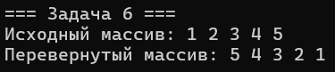

# Лабороторная работа № 1
## 1. Тема работы 
Указатели в языке программирования С
## 2. Постановка каждой задачи
### Задача 1 - упражнения с malloc и сложными однострочными выражениями в C с присваиваниями внутри
Инициализировать указатель `double ***pointer = NULL` так, чтобы он указывал на переменную типа `double`, хранящую значение 2.0. Использовать функции семейства `*alloc` и `free`. Не использовать никаких других идентификаторов, кроме `pointer`.
### Задача 2 - итерация массива с помощью арифметики указателей
Напишите программу, которая создает одномерный динамический массив из чисел с плавающей точкой двойной точности, заполняет его значениями с клавиатуры и выводит все элементы массива, используя арифметику указателей (оператор +), а не оператор доступа к элементам массива [].
### Задача 3 - динамический 2D массив
Выделите память под двумерный динамический массив двумя способами: классическим и непрерывным
### Задача 4 - поменять местами два числа через указатели
Написать программу, которая использует функцию для обмена значениями двух переменных через указатели.
### Задача 5 - поиск максимального элемента массива с помощью указателей
Создать функцию, которая принимает массив целых чисел и его размер, а затем возвращает указатель на максимальный элемент массива.
### Задача 6 - реверс массива через указатели
Реализовать функцию, которая переворачивает массив целых чисел, используя указатели для перемещения по элементам.
### Задача 7 - поиск подстроки в строке через указатели
Реализовать функцию, которая находит первое вхождение одной строки в другую, используя указатели вместо индексов для доступа к символам строки.
### Задача 8 - копирование строки через указатели
Написать функцию, которая копирует одну строку в другую, используя указатели вместо встроенной функции strcpy.
### Задача 9 - подсчет числа пробелов в строке
Написать функцию, которая подсчитывает количество пробелов в строке, используя указатели для перемещения по символам строки.
### Задача 10 - указатель на функцию: сортировка массива
Реализуйте функцию сортировки одномерного массива, которая принимает указатель на функцию сравнения. Эта функция сравнения должна определять порядок сортировки — по возрастанию или по убыванию. Внутри функции сортировки реализуйте обмен элементов массива местами с помощью функции swap, которая работает через указатели.


## 3. Математическая модель
### Задача 1 
Задача сводится к построению цепочки указателей: `pointer` (тип `double***`) -> `double**` -> `double*` -> `double` (значение 2.0)
### Задача 2 
Обращение к элементу массива `arr` с индексом `i` через арифметику указателей: `*(arr + i)`.
### Задача 3 
* **Cпособ 1 (Классический):** Создается массив указателей `ptr_array`. Каждый элемент `ptr_array[i]` указывает на отдельный массив - строку матрицы. Элемент `matrix[i][j]` доступен как `ptr_array[i][j]`.

* **Способ 2 (Непрерывный):** Создается один большой массив `flat_array` размером `rows * columns`. Элемент `matrix[i][j]` доступен как `flat_array[i * columns + j]`.
### Задача 4 
Функция принимает два указателя `a` и `b`. Для обмена используется временная переменная `temp`: `temp = *a; *a = *b; *b = temp;`.
### Задача 5 
Инициализируем указатель `max_ptr` первым элементом массива. Проходим по массиву, сравнивая каждый элемент с текущим максимумом. Если находим больший, обновляем `max_ptr`.
### Задача 6 
Используем два указателя: `start` (на начало массива) и `end` (на конец массива). Меняем местами значения, на которые они указывают, затем сдвигаем `start` вперед, а `end` назад. Процесс продолжается, пока `start < end`.
### Задача 7 
Для каждого символа основной строки (`haystack`) проверяем, начинается ли с этой позиции искомая подстрока (`needle`). Для этого используем вложенный цикл, сравнивающий символы через указатели.
### Задача 8 
Последовательно копируем каждый символ из строки-источника (`src`) в строку-назначение (`dest`), пока не встретим терминальный ноль `\0`. Затем добавляем `\0` в конец строки-назначения.
### Задача 9 
Проходим по строке с помощью указателя. Для каждого символа проверяем, является ли он пробелом. Если да, увеличиваем счетчик.
### Задача 10 
Используется алгоритм пузырьковой сортировки. Функция `sort` принимает массив, его размер и указатель на функцию сравнения `compare`. Внутри цикла сортировки для сравнения элементов используется вызов `compare(a, b)`.

## 4. Список идентификаторов
### Задача 1
|Имя переменной|Тип данных|Описание|
|-----|-----|-----|
|pointer|double ***|Корневой указатель на цепочку указателей|
### Задача 2
|Имя переменной	|Тип данных	|Описание|
|-----|-----|-----|
|arr|double *|Указатель на начало массива|
|n|int|Количество элементов в массиве|
|i	|int	|Счетчик цикла|
### Задача 3
|Имя переменной|Тип данных|Описание|
|---|---|---|
|ptr_array|int **|Указатель на массив указателей|
|rows, cols|int|Количество строк и столбцов|
|i, j|int|Счетчики циклов|
### Задача 4
|Имя переменной|Тип данных|Описание|
|-|---|---|
|x, y|int|Исходные переменные|
|a, b|int *|Параметры функции swap|
|temp|int|Временная переменная|
### Задача 5
|Имя переменной|Тип данных|Описание|
|-|---|---|
|arr|int *|Указатель на начало массива|
|size	int|Размер массива|
|max_ptr|int *|Указатель на текущий максимальный элемент|
|i|int|Счетчик цикла|
### Задача 6
|Имя переменной|Тип данных|Описание|
|-|---|---|
|start|	int *	|Указатель на начало массива|
|end|	int *	|Указатель на конец массива|
|temp|	int	|Временная переменная для обмена|
### Задача 7
|Имя переменной|Тип данных|Описание|
|-|---|---|
|haystack|	char *|	Указатель на основную строку|
|needle	|char *|	Указатель на искомую подстроку|
|h_ptr	|char *	|Текущий указатель в основной строке|
|n_ptr	|char *|	Текущий указатель в подстроке|
### Задача 8
|Имя переменной|Тип данных|Описание|
|-|---|---|
|dest|	char *	|Указатель на строку-назначение|
|src	|char *	|Указатель на строку-источник|
### Задача 9
|Имя переменной|Тип данных|Описание|
|-|---|---|
|str	|char *	|Указатель на строку|
|count|	int	|Счетчик пробелов|
### Задача 10
|Имя переменной|Тип данных|Описание|
|-|---|---|
|arr|	int *	|Указатель на массив|
|size	|int	|Размер массива|
|compare|	int (*)(int, int)	|Указатель на функцию сравнения|
|i, j	|int	|Счетчики циклов|
## 5. Код программы
### Задача 1
```c
#include <windows.h>
#include <stdio.h>
#include <stdlib.h>

int main(void) {
    SetConsoleOutputCP(1251);
    SetConsoleCP(1251);
    printf("=== Задача 1 ===\n");

    double*** pointer = NULL;

    pointer = (double***)malloc(sizeof(double**));
    *pointer = (double**)malloc(sizeof(double*));
    **pointer = (double*)malloc(sizeof(double));
    ***pointer = 2.0;

    printf("Результат: %.1f\n", ***pointer);

    free(**pointer);
    free(*pointer);
    free(pointer);
    return 0;
}
```
### Задача 2 
```c
#include <windows.h>
#include <stdio.h>
#include <stdlib.h>

int main() {
    SetConsoleOutputCP(1251);
    SetConsoleCP(1251);
    printf("=== Задача 2 ===\n");
    
    int n;
    printf("Введите размер массива: ");
    scanf_s("%d", &n);

    double *arr = (double*)malloc(n * sizeof(double));


    for (int i = 0; i < n; i++) {
        printf("Элемент %d = ", i+1);
        scanf_s("%lf", arr + i);
    }

    printf("Введенный массив:\n");
    for (int i = 0; i < n; i++) {
        printf("%.2lf ", *(arr + i));
    }
    printf("\n");

    free(arr);
    return 0;
}
```
### Задача 3 
```c
#include <stdio.h>
#include <stdlib.h>
#include <Windows.h>

int main(void) {
    SetConsoleOutputCP(1251);
    SetConsoleCP(1251);
    printf("=== Задача 3 ===\n");

    printf("Способ 1: Классический (массив указателей)\n");
    int rows = 2, cols = 3;
    int i, j;

    int** ptr_array = (int**)malloc(rows * sizeof(int*));
    for (i = 0; i < rows; i++) {
        ptr_array[i] = (int*)malloc(cols * sizeof(int));
    }

    for (i = 0; i < rows; i++) {
        for (j = 0; j < cols; j++) {
            ptr_array[i][j] = i * cols + j;
            printf("ptr_array[%d][%d] = %d\n", i, j, ptr_array[i][j]);
        }
    }

    for (i = 0; i < rows; i++) {
        free(ptr_array[i]);
    }
    free(ptr_array);

    printf("\nСпособ 2: Непрерывный (один блок памяти)\n");

    int* flat_array = (int*)malloc(rows * cols * sizeof(int));

    for (i = 0; i < rows; i++) {
        for (j = 0; j < cols; j++) {
            flat_array[i * cols + j] = i * cols + j + 10; // +10 для различия
            printf("flat_array[%d][%d] = %d\n", i, j, flat_array[i * cols + j]);
        }
    }

    free(flat_array);
    return 0;
}
```
### Задача 4 
```c
#include <stdio.h>
#include <Windows.h>

void swap(int* a, int* b) {
    int temp = *a;
    *a = *b;
    *b = temp;
}

int main(void) {
    SetConsoleOutputCP(1251);
    SetConsoleCP(1251);
    printf("=== Задача 4 ===\n");

    printf("Введите две переменные: ");
    int a, b;
    scanf_s("%d%d", &a, &b);

    swap(&a, &b);
    printf("После обмена: a = %d, b = %d\n", a, b);
    return 0;
}
```
### Задача 5 
```c
#include <stdio.h>
#include <Windows.h>

int* findMax(int* arr, int size) {
    if (size <= 0) return NULL;

    int* max_ptr = arr;
    for (int i = 1; i < size; i++) {
        if (*(arr + i) > *max_ptr) {
            max_ptr = arr + i;
        }
    }
    return max_ptr;
}

int main(void) {
    SetConsoleOutputCP(1251);
    SetConsoleCP(1251);
    printf("=== Задача 5 ===\n");

    int array[] = { 3, 1, 7, 5, 9, 2 };
    int size = sizeof(array) / sizeof(array[0]);

    int* max = findMax(array, size);
    if (max != NULL) {
        printf("Максимальный элемент: %d\n", *max);
    }
    return 0;
}
```
### Задача 6 
```c
#include <stdio.h>
#include <Windows.h>

void reverseArray(int* arr, int size) {
    int* start = arr;
    int* end = arr + size - 1;
    int temp;

    while (start < end) {
        temp = *start;
        *start = *end;
        *end = temp;

        start++;
        end--;
    }
}

int main(void) {
    SetConsoleOutputCP(1251);
    SetConsoleCP(1251);
    printf("=== Задача 6 ===\n");

    int array[] = { 1, 2, 3, 4, 5 };
    int size = sizeof(array) / sizeof(array[0]);

    printf("Исходный массив: ");
    for (int i = 0; i < size; i++) {
        printf("%d ", array[i]);
    }
    printf("\n");

    reverseArray(array, size);

    printf("Перевернутый массив: ");
    for (int i = 0; i < size; i++) {
        printf("%d ", array[i]);
    }
    printf("\n");

    return 0;
}
```
### Задача 7 
```c
#include <stdio.h>
#include <Windows.h>

char* findSubstring(char* haystack, char* needle) {
    if (*needle == '\0') return haystack;

    char* h_ptr, * n_ptr;
    for (; *haystack != '\0'; haystack++) {
        h_ptr = haystack;
        n_ptr = needle;

        while (*h_ptr != '\0' && *n_ptr != '\0' && *h_ptr == *n_ptr) {
            h_ptr++;
            n_ptr++;
        }
        if (*n_ptr == '\0') {
            return haystack;
        }
    }
    return NULL;
}

int main(void) {
    SetConsoleOutputCP(1251);
    SetConsoleCP(1251);
    printf("=== Задача 7 ===\n");

    char str[] = "Hello, World!";
    char sub[] = "World";

    char* result = findSubstring(str, sub);
    if (result != NULL) {
        printf("Подстрока найдена по индексу: %ld\n", result - str);
    }
    else {
        printf("Подстрока не найдена.\n");
    }

    return 0;
}
```
### Задача 8 
```c
#include <stdio.h>
#include <Windows.h>

void myStrcpy(char* dest, const char* src) {
    while (*src != '\0') {
        *dest = *src;
        dest++;
        src++;
    }
    *dest = '\0';
}

int main(void) {
    SetConsoleOutputCP(1251);
    SetConsoleCP(1251);
    printf("=== Задача 8 ===\n");

    char source[] = "zolotaya chasha zolotaya";
    char destination[50];

    myStrcpy(destination, source);
    printf("Скопированная строка: %s\n", destination);

    return 0;
}
```
### Задача 9 
```c
#include <stdio.h>
#include <Windows.h>

int countSpaces(const char* str) {
    int count = 0;
    while (*str != '\0') {
        if (*str == ' ') {
            count++;
        }
        str++;
    }
    return count;
}

int main(void) {
    SetConsoleOutputCP(1251);
    SetConsoleCP(1251);
    printf("=== Задача 9 ===\n");

    char text[] = "This is a polnii trash.";

    int spaces = countSpaces(text);
    printf("Количество пробелов в строке: %d\n", spaces);

    return 0;
}
```
### Задача 10
```c
#include <stdio.h>
#include <Windows.h>

void swap(int *a, int *b) {
    int temp = *a;
    *a = *b;
    *b = temp;
}

int compare_ascending(int a, int b) {
    return a > b;
}

int compare_descending(int a, int b) {
    return a < b;
}

void sort(int *arr, int size, int (*compare)(int, int)) {
    for (int i = 0; i < size - 1; i++) {
        for (int j = 0; j < size - i - 1; j++) {
            if (compare(arr[j], arr[j + 1])) {
                swap(&arr[j], &arr[j + 1]);
            }
        }
    }
}

int main(void) {
    SetConsoleOutputCP(1251);
    SetConsoleCP(1251);
    printf("=== Задача 10 ===\n");

    int array[] = {5, 2, 9, 1, 5, 6};
    int size = sizeof(array) / sizeof(array[0]);

    printf("Исходный массив: ");
    for (int i = 0; i < size; i++) printf("%d ", array[i]);
    printf("\n");

    sort(array, size, compare_ascending);
    printf("По возрастанию: ");
    for (int i = 0; i < size; i++) printf("%d ", array[i]);
    printf("\n");

    sort(array, size, compare_descending);
    printf("По убыванию: ");
    for (int i = 0; i < size; i++) printf("%d ", array[i]);
    printf("\n");

    return 0;
}
```
## 6. Результат выполнения





## 7. Информация о студенте
Сидоренко Алеся, 1 курс, ПОО
