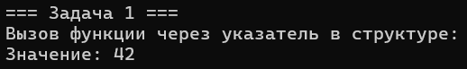
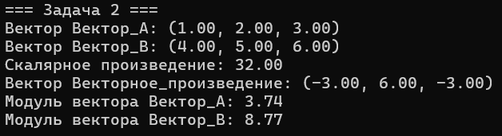
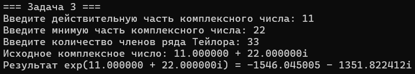
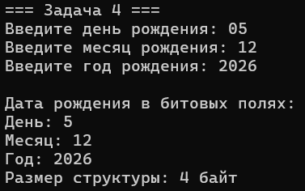
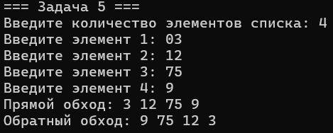

# Лабороторная работа № 2
## 1. Тема работы
Структуры
## 2. Постановка каждой задачи
### Задача 1 - создать структуру с указателем на функцию
Создайте структуру, одно из полей которой является указателем на функцию. Вызовите эту функцию через имя переменной структуры и поле указателя на функцию.
### Задача 2 - структура для вектора в трёхмерном пространстве
Реализуйте структуру для вектора в 3D пространстве и добавьте следующие функции: 

* Скалярное умножение векторов; 
* Векторное произведение; 
* Модуль вектора; 
* Распечатка вектора. 

В структуре также должно быть поле для хранения имени вектора.

### Задача 3 - вычисление комплексной экспоненты
Используя структуру для представления комплексного числа, вычислите комплексную экспоненту 𝑒^𝑧 для числа 𝑧 ∈ ℂ
### Задача 4 - Структура с битовыми полями для даты
Используя битовые поля в структуре C, создайте структуру для хранения даты (например, даты рождения).
### Задача 5 - реализация двусвязного списка
Реализуйте структуру и функции для создания и наполнения двусвязного списка, а также функции для его обхода и распечатки: 
* Прямой обход списка с выводом значений;
* Обратный обход списка с выводом значений.

## 3. Математическая модель
### Задача 1 
Структура содержит указатель на функции, что позволяет хранить и вызывать функции через поля структуры.
### Задача 2 
* Скалярное умножение векторов: $A*B = A_x * B_x + A_y * B_y + A_z * B_z$
* Векторное произведение: $A*B=(A_y * B_z - A_z * B_y, A_z * B_x - A_x * B_z, A_x * B_y - A_y * B_x)$
* Модуль вектора: $|A|=sqrt{(A_{x^2} + A_{y^2} + A_{z^2})}$
### Задача 3 
Для комплексного числа $𝑧 = 𝑎+𝑏i$
* Сложение: $𝑧_1 + 𝑧_2 = (𝑎_1 + 𝑎_2 ) + (𝑏_1 + 𝑏_2 )i$
* Умножение: $𝑧_1 × 𝑧_2 = (𝑎_1 𝑎_2 − 𝑏_1 𝑏_2 ) + (𝑎_1 𝑏_2 + 𝑎_2 𝑏_1 )i$
* Экспонента: $exp(z) = sum_(z^n/n!)$ для n от 0 до ∞
### Задача 4 
Битовые поля позволяют эффективно хранить данные, используя минимальное количество памяти:
* День: 5 бит (1-31)
* Месяц: 4 бита (1-12)
* Год: 12 бит (0-4095)
### Задача 5 
Двусвязный список: каждый узел содержит указатели на предыдущий и следующий узлы, что позволяет обход в обоих направлениях
## 4. Список идентификаторов
### Задача 1
|Имя переменной|Тип данных|Описание|
|---|-|-|
|value|	int	|Целочисленное значение|
|func|	void (*)(int)	|Указатель на функцию вывода|
|holder|	FunctionHolder	|Экземпляр структуры|
### Задача 2
|Имя переменной|Тип данных|Описание|
|---|-|-|
|Vector3D|	struct|	Структура для 3D вектора|
|name|	char[20]	|Имя вектора|
|x, y, z|	double	|Координаты вектора|
|scal|	double function	|Скалярное произведение|
|vek|	Vector3D function	|Векторное произведение|
|vekmod|	double function	|Модуль вектора|
|prvek|	void function	|Печать вектора|
### Задача 3
|Имя переменной|Тип данных|Описание|
|---|-|-|
|Complex|	struct	|Структура комплексного числа|
|real, imag|	double	|Действительная и мнимая части|
|sumcom|	Complex function|	Сложение комплексных чисел|
|umcom|	Complex function|	Умножение комплексных чисел|
|delcom|	Complex function|	Деление на вещественное число|
|factorial	double function|	Вычисление факториала|
|expp|	Complex function|	Вычисление экспоненты|
### Задача 4
|Имя переменной|Тип данных|Описание|
|---|-|-|
|Date|	struct|	Структура даты с битовыми полями|
|day|	unsigned int : 5	|День месяца (5 бит)|
|month|	unsigned int : 4	|Месяц (4 бита)|
|year|	unsigned int : 12	|Год (12 бит)|
|birth_date|	Date	|Экземпляр структуры даты|
### Задача 5
|Имя переменной|Тип данных|Описание|
|---|-|-|
|data|	void*	|Указатель на данные|
|next, prev|	Node*	|Указатели на соседние узлы|
|create_node|	Node* function	|Создание нового узла|
|append_node|	void function	|Добавление узла в конец|
|pram|	void function	|Прямой обход для целых чисел|
|obrat|	void function	|Обратный обход для целых чисел|
|free_list|	void function	|Освобождение памяти|
## 5. Код программы
### Задача 1
```c
#include <stdio.h>
#include <Windows.h>

struct FunctionHolder {
    int value;
    void (*func)(int);
};

void num(int num) {
    printf("Значение: %d\n", num);
}

int main() {
    SetConsoleOutputCP(1251);
    SetConsoleCP(1251);
    printf("=== Задача 1 ===\n");

    struct FunctionHolder holder;
    holder.value = 42;
    holder.func = num;

    printf("Вызов функции через указатель в структуре:\n");
    holder.func(holder.value);

    return 0;
}
```
### Задача 2 
```c
#include <stdio.h>
#include <math.h>
#include <Windows.h>
#include <string.h>

struct Vector3D {
    char name[50];
    double x;
    double y;
    double z;
};

double scal(struct Vector3D v1, struct Vector3D v2) {
    return v1.x * v2.x + v1.y * v2.y + v1.z * v2.z;
}

struct Vector3D vek(struct Vector3D v1, struct Vector3D v2) {
    struct Vector3D result;
    strcpy_s(result.name, sizeof(result.name), "Векторное_произведение");
    result.x = v1.y * v2.z - v1.z * v2.y;
    result.y = v1.z * v2.x - v1.x * v2.z;
    result.z = v1.x * v2.y - v1.y * v2.x;
    return result;
}

double vekmod(struct Vector3D v) {
    return sqrt(v.x * v.x + v.y * v.y + v.z * v.z);
}

void prvek(struct Vector3D v) {
    printf("Вектор %s: (%.2f, %.2f, %.2f)\n", v.name, v.x, v.y, v.z);
}

int main() {
    SetConsoleOutputCP(1251);
    SetConsoleCP(1251);
    printf("=== Задача 2 ===\n");

    struct Vector3D vec1 = { "Вектор_A", 1.0, 2.0, 3.0 };
    struct Vector3D vec2 = { "Вектор_B", 4.0, 5.0, 6.0 };

    prvek(vec1);
    prvek(vec2);

    double dot = scal(vec1, vec2);
    printf("Скалярное произведение: %.2f\n", dot);

    struct Vector3D cross = vek(vec1, vec2);
    prvek(cross);

    printf("Модуль вектора %s: %.2f\n", vec1.name, vekmod(vec1));
    printf("Модуль вектора %s: %.2f\n", vec2.name, vekmod(vec2));

    return 0;
}
```
### Задача 3 
```c
#include <stdio.h>
#include <math.h>
#include <Windows.h>

struct Complex {
    double real;
    double imag;
};

struct Complex sumcom(struct Complex a, struct Complex b) {
    struct Complex result;
    result.real = a.real + b.real;
    result.imag = a.imag + b.imag;
    return result;
}

struct Complex umcom(struct Complex a, struct Complex b) {
    struct Complex result;
    result.real = a.real * b.real - a.imag * b.imag;
    result.imag = a.real * b.imag + a.imag * b.real;
    return result;
}

struct Complex delcom(struct Complex a, double divisor) {
    struct Complex result;
    result.real = a.real / divisor;
    result.imag = a.imag / divisor;
    return result;
}

double factorial(int n) {
    double result = 1.0;
    for (int i = 2; i <= n; i++) {
        result *= i;
    }
    return result;
}

struct Complex expp(struct Complex z, int terms) {
    struct Complex result = { 1.0, 0.0 };
    struct Complex term = { 1.0, 0.0 };

    for (int n = 1; n <= terms; n++) {
        term = umcom(term, z);
        term = delcom(term, factorial(n));
        result = sumcom(result, term);
    }

    return result;
}

void print_complex(struct Complex c) {
    if (c.imag >= 0) {
        printf("%.6f + %.6fi", c.real, c.imag);
    }
    else {
        printf("%.6f - %.6fi", c.real, -c.imag);
    }
}

int main() {
    SetConsoleOutputCP(1251);
    SetConsoleCP(1251);
    printf("=== Задача 3 ===\n");

    struct Complex z;
    printf("Введите действительную часть комплексного числа: ");
    scanf_s("%lf", &z.real);
    printf("Введите мнимую часть комплексного числа: ");
    scanf_s("%lf", &z.imag);

    int terms;
    printf("Введите количество членов ряда Тейлора: ");
    scanf_s("%d", &terms);

    printf("Исходное комплексное число: ");
    print_complex(z);
    printf("\n");

    struct Complex exp_z = expp(z, terms);

    printf("Результат exp(");
    print_complex(z);
    printf(") = ");
    print_complex(exp_z);
    printf("\n");

    return 0;
}
```
### Задача 4 
```c
#include <stdio.h>
#include <Windows.h>

struct Date {
    unsigned int day : 5;
    unsigned int month : 4;
    unsigned int year : 12;
};

int main() {
    SetConsoleOutputCP(1251);
    SetConsoleCP(1251);
    printf("=== Задача 4 ===\n");

    struct Date birth_date;
    int day, month, year;

    printf("Введите день рождения: ");
    scanf_s("%d", &day);
    printf("Введите месяц рождения: ");
    scanf_s("%d", &month);
    printf("Введите год рождения: ");
    scanf_s("%d", &year);

    birth_date.day = day;
    birth_date.month = month;
    birth_date.year = year;

    printf("\nДата рождения в битовых полях:\n");
    printf("День: %d\n", birth_date.day);
    printf("Месяц: %d\n", birth_date.month);
    printf("Год: %d\n", birth_date.year);

    printf("Размер структуры: %zu байт\n", sizeof(struct Date));

    return 0;
}
```
### Задача 5 
```c
#include <stdio.h>
#include <stdlib.h>
#include <Windows.h>
#include <string.h>

struct Node {
    void* data;
    struct Node* next;
    struct Node* prev;
};

struct Node* create_node(void* data, size_t data_size) {
    struct Node* new_node = (struct Node*)malloc(sizeof(struct Node));
    new_node->data = malloc(data_size);
    memcpy(new_node->data, data, data_size);
    new_node->next = NULL;
    new_node->prev = NULL;
    return new_node;
}

void append_node(struct Node** head, void* data, size_t data_size) {
    struct Node* new_node = create_node(data, data_size);

    if (*head == NULL) {
        *head = new_node;
        return;
    }

    struct Node* current = *head;
    while (current->next != NULL) {
        current = current->next;
    }

    current->next = new_node;
    new_node->prev = current;
}

void pram(struct Node* head) {
    printf("Прямой обход: ");
    struct Node* current = head;
    while (current != NULL) {
        printf("%d ", *(int*)(current->data));
        current = current->next;
    }
    printf("\n");
}

void obrat(struct Node* head) {
    if (head == NULL) return;

    struct Node* current = head;
    while (current->next != NULL) {
        current = current->next;
    }

    printf("Обратный обход: ");
    while (current != NULL) {
        printf("%d ", *(int*)(current->data));
        current = current->prev;
    }
    printf("\n");
}

void free_list(struct Node* head) {
    struct Node* current = head;
    while (current != NULL) {
        struct Node* next = current->next;
        free(current->data);
        free(current);
        current = next;
    }
}

int main() {
    SetConsoleOutputCP(1251);
    SetConsoleCP(1251);
    printf("=== Задача 5 ===\n");

    struct Node* head = NULL;
    int n;

    printf("Введите количество элементов списка: ");
    scanf_s("%d", &n);

    for (int i = 0; i < n; i++) {
        int value;
        printf("Введите элемент %d: ", i + 1);
        scanf_s("%d", &value);
        append_node(&head, &value, sizeof(int));
    }

    pram(head);
    obrat(head);

    free_list(head);

    return 0;
}
```
## 6. Результат выполнения









## 7. Информация о студенте
Сидоренко Алеся, 1 курс, ПОО
