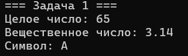
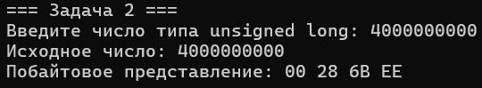
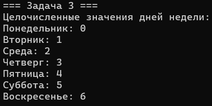
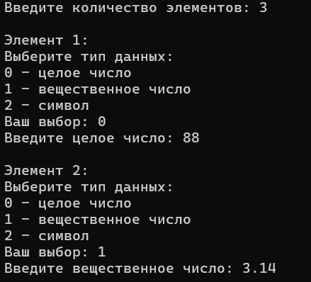
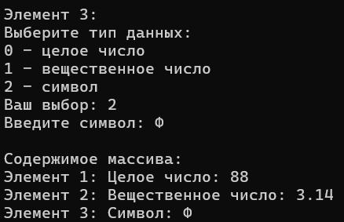
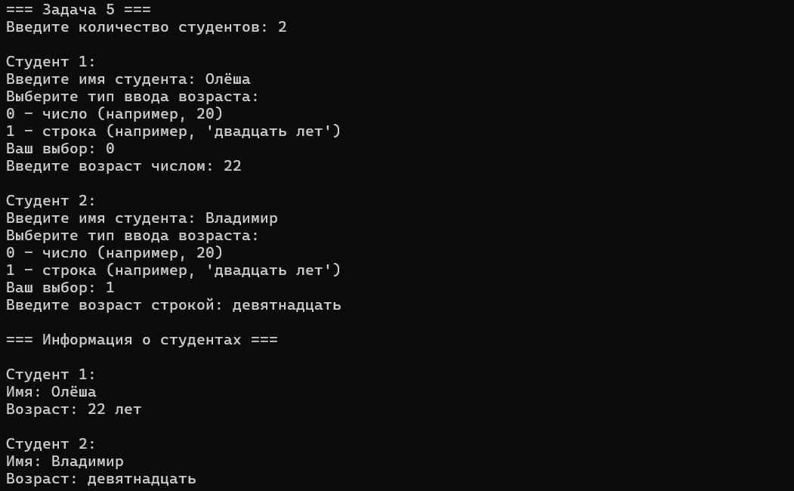
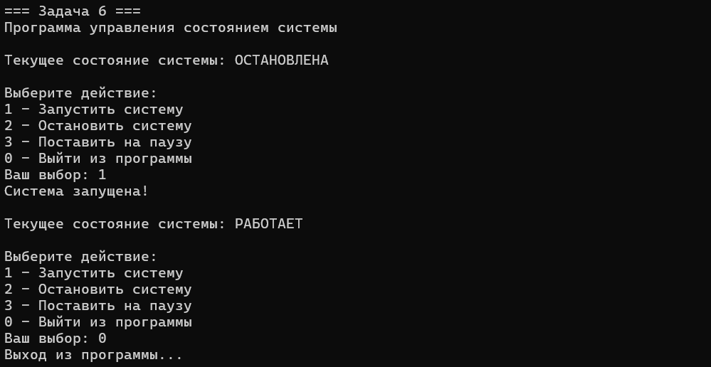
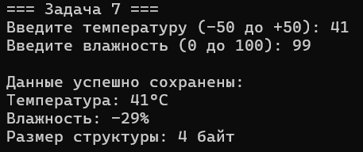
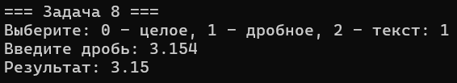

# Лабороторная работа № 3
## 1. Тема работы
Объединения и перечисления
## 2. Постановка каждой задачи
### Задача 1 - указатель на объединение
Напишите программу, которая использует указатель на некоторое объединение (union). Создайте и проинициализируйте переменные в объединении через указатель, затем выведите их значения на экран.
### Задача 2 - побайтовая распечатка числа
Напишите программу, которая использует объединение (union) для побайтовой распечатки значения переменной типа unsigned long. Каждый байт должен быть выведен отдельно через указатель на char.
### Задача 3 - перечисление дней недели
Создайте перечислимый тип данных (enum) для семи дней недели. Реализуйте программу, которая выводит на экран значения каждого дня недели как целое число.
### Задача 4 - размеченное объединение
Создайте размеченное объединение (union), которое заключено в структуру. Структура должна также содержать перечисление (enum), служащее индикатором того, какой тип данных хранится в объединении на текущий момент. Создайте динамический массив таких структур и реализуйте функцию для распечатки их содержимого на экран.
### Задача 5 - ввод и хранение данных о студентах
Создайте структуру, в которой используется объединение для хранения различных типов данных: например, структура с отдельным полем для имени студента и отдельное поле – целое число для его возраста либо строка его возраста словами. Реализуйте программу для динамического ввода данных о студентах и вывода их на экран.
### Задача 6 - управление состояниями системы через enum
Используйте перечисление (enum) для управления состояниями некоторой условной системы, например, старт, стоп, пауза. Напишите программу, которая изменяет состояние системы и выводит текущее состояние на экран.
### Задача 7 - оптимизация памяти для хранения данных о температуре и влажности
Создайте структуру с битовыми полями для хранения показаний температуры (в градусах Цельсия) и влажности (в процентах). Реализуйте ввод данных с клавиатуры и их корректное хранение в структуре с минимальным потреблением памяти. 
* Температура может быть от -50 до +50 градусов Цельсия (нужно выделить минимальное количество бит).
* Влажность может быть от 0 до 100%.
### Задача 8 - ввод и вывод через enum и union
Создайте программу, которая позволяет пользователю вводить и выводить информацию с различными типами данных через перечисления и объединения. Например, пользователь может выбрать ввод данных как числа или строки, и программа корректно сохранит и отобразит эти данные.
## 3. Математическая модель
### Задача 2 
Число типа unsigned long занимает 4 байта в памяти. Объединение позволяет получить доступ к этим байтам индивидуально через массив char.
### Задача 7 
* Температура: от -50 до +50°C → диапазон 100 значений → 7 бит (2⁷ = 128)
* Влажность: от 0 до 100% → диапазон 101 значение → 7 бит (2⁷ = 128)
## 4. Список идентификаторов
### Задача 1
|Имя переменной|Тип данных|Описание|
|---|-|-|
|DataUnion|	union	|Объединение для хранения разных типов данных|
|integer|	int	|Целочисленное значение|
|floating|	float	|Вещественное значение|
|character|	char	|Символьное значение|
|data|	DataUnion	|Экземпляр объединения|
|ptr|	DataUnion*|	Указатель на объединение|
### Задача 2
|Имя переменной|Тип данных|Описание|
|---|-|-|
|ByteUnion|	union	|Объединение для побайтового доступа|
|number|	unsigned long	|Исходное число|
|bytes|	char[4]	|Массив байтов числа|
|byte_union|	ByteUnion	|Экземпляр объединения|
### Задача 3
|Имя переменной|Тип данных|Описание|
|---|-|-|
|WeekDay|	enum|	Перечисление дней недели|
|day|	int|	Текущий день недели|
### Задача 4
|Имя переменной|Тип данных|Описание|
|---|-|-|
|DataType|	enum|	Тип данных в объединении|
|VariantData|	union|	Объединение для разных типов данных|
|TaggedUnion|	struct|	Структура с объединением и меткой|
|type|	DataType|	Метка текущего типа данных|
|data|	VariantData	|Объединение с данными|
|array|	TaggedUnion*	|Динамический массив структур|
|n|	int	|Количество элементов|
### Задача 5
|Имя переменной|Тип данных|Описание|
|---|-|-|
|AgeType|	enum	|Тип представления возраста|
|Student|	struct	|Структура студента|
|name|	char[50]	|Имя студента|
|age_type|	AgeType	|Тип возраста (число/строка)|
|age_data|	union	|Объединение для возраста|
|students|	Student*	|Динамический массив студентов|
|n|	int|	Количество студентов|
### Задача 6
|Имя переменной|Тип данных|Описание|
|---|-|-|
|SystemState|	enum	|Состояния системы|
|current_state|	SystemState|	Текущее состояние системы|
|choice|	int|	Выбор пользователя|
### Задача 7
|Имя переменной|Тип данных|Описание|
|---|-|-|
|SensorData|	struct|	Структура с битовыми полями|
|temperature|	int|	Температура (7 бит)|
|humidity|	int |	Влажность (7 бит)|
|sensor|	SensorData|	Экземпляр структуры|
|temp_input|	int	|Введенная температура|
|hum_input|	int	|Введенная влажность|
### Задача 8
|Имя переменной|Тип данных|Описание|
|---|-|-|
|Tip|	enum	|Тип вводимых данных|
|Data|	union|	Хранилище данных|
|t|	Tip|	Выбранный тип|
|d|	Data|	Введенные данные|
|v|	int|	Выбор типа|
|buf|	char|	Буфер ввода|
## 5. Код программы
### Задача 1
```c
#include <stdio.h>
#include <Windows.h>

union DataUnion {
    int integer;
    float floating;
    char character;
};

int main() {
    SetConsoleOutputCP(1251);
    SetConsoleCP(1251);
    printf("=== Задача 1 ===\n");

    union DataUnion data;
    union DataUnion* ptr = &data;

    ptr->integer = 65;
    printf("Целое число: %d\n", ptr->integer);

    ptr->floating = 3.14f;
    printf("Вещественное число: %.2f\n", ptr->floating);

    ptr->character = 'A';
    printf("Символ: %c\n", ptr->character);

    return 0;
}
```
### Задача 2 
```c
#include <stdio.h>
#include <Windows.h>

union ByteUnion {
    unsigned long number;
    char bytes[4];
};

int main() {
    SetConsoleOutputCP(1251);
    SetConsoleCP(1251);
    printf("=== Задача 2 ===\n");
    
    union ByteUnion byte_union;
    
    printf("Введите число типа unsigned long: ");
    scanf_s("%lu", &byte_union.number);
    
    printf("Исходное число: %lu\n", byte_union.number);
    printf("Побайтовое представление: ");
    
    for (int i = 0; i < 4; i++) {
        printf("%02X ", (unsigned char)byte_union.bytes[i]);
    }
    printf("\n");
    
    return 0;
}
```
### Задача 3 
```c
#include <stdio.h>
#include <Windows.h>

enum WeekDay {
    MONDAY,
    TUESDAY,
    WEDNESDAY,
    THURSDAY,
    FRIDAY,
    SATURDAY,
    SUNDAY
};

int main() {
    SetConsoleOutputCP(1251);
    SetConsoleCP(1251);
    printf("=== Задача 3 ===\n");

    printf("Целочисленные значения дней недели:\n");
    printf("Понедельник: %d\n", MONDAY);
    printf("Вторник: %d\n", TUESDAY);
    printf("Среда: %d\n", WEDNESDAY);
    printf("Четверг: %d\n", THURSDAY);
    printf("Пятница: %d\n", FRIDAY);
    printf("Суббота: %d\n", SATURDAY);
    printf("Воскресенье: %d\n", SUNDAY);

    return 0;
}
```
### Задача 4 
```c
#include <stdio.h>
#include <stdlib.h>
#include <Windows.h>

enum DataType {
    TYPE_INT,      
    TYPE_FLOAT,    
    TYPE_CHAR   
};

union VariantData {
    int int_value;
    float float_value;
    char char_value;
};

struct TaggedUnion {
    enum DataType type;        
    union VariantData data;    
};

void print_data(struct TaggedUnion* element) {
    if (element->type == TYPE_INT) {
        printf("Целое число: %d\n", element->data.int_value);
    }
    else if (element->type == TYPE_FLOAT) {
        printf("Вещественное число: %.2f\n", element->data.float_value);
    }
    else if (element->type == TYPE_CHAR) {
        printf("Символ: %c\n", element->data.char_value);
    }
}

int main() {
    SetConsoleOutputCP(1251);
    SetConsoleCP(1251);
    printf("=== Задача 4 ===\n");

    int n;
    printf("Введите количество элементов: ");
    scanf_s("%d", &n);

    struct TaggedUnion* array = (struct TaggedUnion*)malloc(n * sizeof(struct TaggedUnion));

    for (int i = 0; i < n; i++) {
        printf("\nЭлемент %d:\n", i + 1);

        int type_choice;
        printf("Выберите тип данных:\n");
        printf("0 - целое число\n");
        printf("1 - вещественное число\n");
        printf("2 - символ\n");
        printf("Ваш выбор: ");
        scanf_s("%d", &type_choice);

        array[i].type = (enum DataType)type_choice;

        if (array[i].type == TYPE_INT) {
            printf("Введите целое число: ");
            scanf_s("%d", &array[i].data.int_value);
        }
        else if (array[i].type == TYPE_FLOAT) {
            printf("Введите вещественное число: ");
            scanf_s("%f", &array[i].data.float_value);
        }
        else if (array[i].type == TYPE_CHAR) {
            printf("Введите символ: ");
            scanf_s(" %c", &array[i].data.char_value);
        }
    }

    printf("\nСодержимое массива:\n");
    for (int i = 0; i < n; i++) {
        printf("Элемент %d: ", i + 1);
        print_data(&array[i]);
    }

    free(array);
    return 0;
}
```
### Задача 5 
```c
#include <stdio.h>
#include <stdlib.h>
#include <string.h>
#include <Windows.h>

enum AgeType {
    AGE_NUMBER,    
    AGE_STRING     
};

struct Student {
    char name[50];      
    enum AgeType age_type;  

    union {
        int age_number;         
        char age_string[20];    
    } age_data;
};

int main() {
    SetConsoleOutputCP(1251);
    SetConsoleCP(1251);
    printf("=== Задача 5 ===\n");

    int n;
    printf("Введите количество студентов: ");
    scanf_s("%d", &n);

    while (getchar() != '\n');

    struct Student* students = (struct Student*)malloc(n * sizeof(struct Student));

    for (int i = 0; i < n; i++) {
        printf("\nСтудент %d:\n", i + 1);

        printf("Введите имя студента: ");
        fgets(students[i].name, 50, stdin);
        students[i].name[strcspn(students[i].name, "\n")] = 0;

        int age_choice;
        printf("Выберите тип ввода возраста:\n");
        printf("0 - число (например, 20)\n");
        printf("1 - строка (например, 'двадцать лет')\n");
        printf("Ваш выбор: ");
        scanf_s("%d", &age_choice);

        students[i].age_type = (enum AgeType)age_choice;

        while (getchar() != '\n');

        if (students[i].age_type == AGE_NUMBER) {
            printf("Введите возраст числом: ");
            scanf_s("%d", &students[i].age_data.age_number);
            while (getchar() != '\n'); 
        }
        else {
            printf("Введите возраст строкой: ");
            fgets(students[i].age_data.age_string, 20, stdin);
            students[i].age_data.age_string[strcspn(students[i].age_data.age_string, "\n")] = 0;
        }
    }

    printf("\n=== Информация о студентах ===\n");
    for (int i = 0; i < n; i++) {
        printf("\nСтудент %d:\n", i + 1);
        printf("Имя: %s\n", students[i].name);

        if (students[i].age_type == AGE_NUMBER) {
            printf("Возраст: %d лет\n", students[i].age_data.age_number);
        }
        else {
            printf("Возраст: %s\n", students[i].age_data.age_string);
        }
    }

    free(students);
    return 0;
}
```
### Задача 6 
```c
#include <stdio.h>
#include <Windows.h>

enum SystemState {
    STATE_STOP, 
    STATE_RUN,     
    STATE_PAUSE  
};

int main() {
    SetConsoleOutputCP(1251);
    SetConsoleCP(1251);
    printf("=== Задача 6 ===\n");

    enum SystemState current_state = STATE_STOP;
    int choice;

    printf("Программа управления состоянием системы\n");

    do {
        printf("\nТекущее состояние системы: ");
        if (current_state == STATE_STOP) {
            printf("ОСТАНОВЛЕНА\n");
        }
        else if (current_state == STATE_RUN) {
            printf("РАБОТАЕТ\n");
        }
        else if (current_state == STATE_PAUSE) {
            printf("НА ПАУЗЕ\n");
        }

        printf("\nВыберите действие:\n");
        printf("1 - Запустить систему\n");
        printf("2 - Остановить систему\n");
        printf("3 - Поставить на паузу\n");
        printf("0 - Выйти из программы\n");
        printf("Ваш выбор: ");
        scanf_s("%d", &choice);

        if (choice == 1) {
            current_state = STATE_RUN;
            printf("Система запущена!\n");
        }
        else if (choice == 2) {
            current_state = STATE_STOP;
            printf("Система остановлена!\n");
        }
        else if (choice == 3) {
            current_state = STATE_PAUSE;
            printf("Система поставлена на паузу!\n");
        }
        else if (choice == 0) {
            printf("Выход из программы...\n");
        }
        else {
            printf("Неверный выбор! Попробуйте снова.\n");
        }

    } while (choice != 0); 

    return 0;
}
```
### Задача 7 
```c
#include <stdio.h>
#include <Windows.h>

struct SensorData {
    int temperature : 7;   
    int humidity : 7;     
};

int main() {
    SetConsoleOutputCP(1251);
    SetConsoleCP(1251);
    printf("=== Задача 7 ===\n");

    struct SensorData sensor;
    int temp_input, hum_input;

    printf("Введите температуру (-50 до +50): ");
    scanf_s("%d", &temp_input);

    if (temp_input < -50 || temp_input > 50) {
        printf("Ошибка: температура должна быть от -50 до +50\n");
        return 1;
    }

    printf("Введите влажность (0 до 100): ");
    scanf_s("%d", &hum_input);

    if (hum_input < 0 || hum_input > 100) {
        printf("Ошибка: влажность должна быть от 0 до 100\n");
        return 1;
    }

    sensor.temperature = temp_input;
    sensor.humidity = hum_input;

    printf("\nДанные успешно сохранены:\n");
    printf("Температура: %d°C\n", sensor.temperature);
    printf("Влажность: %d%%\n", sensor.humidity);
    printf("Размер структуры: %zu байт\n", sizeof(struct SensorData));

    return 0;
}
```
### Задача 8 
```c
#include <stdio.h>
#include <string.h>
#include <ctype.h>
#include <Windows.h>

enum Tip { CELOE, DROB, TEXT };

union Data {
    int celoe;
    float drob;
    char text[100];
};

int proverkaCifr(char* s) {
    int i = 0;
    if (s[i] == '+' || s[i] == '-') i++;
    for (; s[i]; i++)
        if (!isdigit(s[i])) return 0;
    return 1;
}

int proverkaDrob(char* s) {
    int i = 0, dot = 0;
    if (s[i] == '+' || s[i] == '-') i++;
    for (; s[i]; i++) {
        if (s[i] == '.') {
            dot++;
            if (dot > 1) return 0;
        }
        else if (!isdigit(s[i])) return 0;
    }
    return 1;
}

int main() {
    SetConsoleOutputCP(1251);
    SetConsoleCP(1251);
    printf("=== Задача 8 ===\n");

    enum Tip t;
    union Data d;
    int v;
    char buf[100];

    printf("Выберите: 0 - целое, 1 - дробное, 2 - текст: ");
    scanf_s("%d", &v);
    while (getchar() != '\n');

    t = (enum Tip)v;

    if (t == CELOE) {
        printf("Введите число: ");
        fgets(buf, 100, stdin);
        buf[strcspn(buf, "\n")] = 0;
        if (!proverkaCifr(buf)) {
            printf("Ошибка!\n");
            return 1;
        }
        d.celoe = atoi(buf);
        printf("Результат: %d\n", d.celoe);
    }
    else if (t == DROB) {
        printf("Введите дробь: ");
        fgets(buf, 100, stdin);
        buf[strcspn(buf, "\n")] = 0;
        if (!proverkaDrob(buf)) {
            printf("Ошибка!\n");
            return 1;
        }
        d.drob = (float)atof(buf);
        printf("Результат: %.2f\n", d.drob);
    }
    else if (t == TEXT) {
        printf("Введите текст: ");
        fgets(d.text, 100, stdin);
        d.text[strcspn(d.text, "\n")] = 0;
        printf("Результат: %s\n", d.text);
    }

    return 0;
}
```
## 6. Результат выполнения



###### === Задача 4 ===






## 7. Информация о студенте
Сидоренко Алеся, 1 курс, ПОО