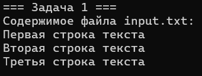
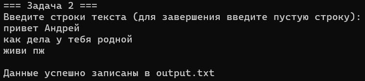
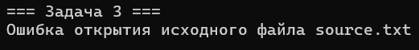
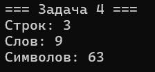
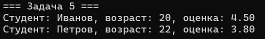
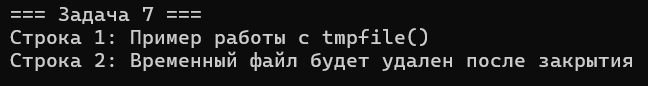

# Лабороторная работа № 5
## Тема работы
Файловый ввод-вывод

## Постановка задачи 1
### Чтение и вывод содержимого текстового файла
Напишите программу, которая открывает текстовый файл (например, “input.txt”) для чтения, считывает его построчно с помощью функции fgets() и выводит каждую строку на стандартный вывод. Программа должна проверять, успешно ли открыт файл, и корректно закрывать его после чтения.
## Список идентификаторов
|Имя переменной|Тип данных|Описание|
|---|-|-|
|fp|	FILE*|	Указатель на файл|
|buffer|	char|	Буфер для чтения строк|
## Код программы
```c
#include <stdio.h>
#include <stdlib.h>
#include <Windows.h>

void readAndPrintFile() {
    FILE* fp;
    fopen_s(&fp, "input.txt", "r");
    if (fp == NULL) {
        printf("Ошибка открытия файла input.txt\n");
        printf("Создайте файл input.txt в папке с программой\n");
        return;
    }

    char buffer[256];
    printf("Содержимое файла input.txt:\n");
    while (fgets(buffer, sizeof(buffer), fp) != NULL) {
        printf("%s", buffer);
    }
    fclose(fp);
}

int main() {
    SetConsoleOutputCP(1251);
    SetConsoleCP(1251);
    printf("=== Задача 1 ===\n");
    readAndPrintFile();
    return 0;
}
```
## Результат выполнения



## Постановка задачи 2
### Запись пользовательского ввода в текстовый файл
Создайте программу, которая запрашивает у пользователя несколько строк текста, а затем записывает введённые данные в файл “output.txt”. Используйте режим записи "w". После завершения записи файл закрывается, а программа выводит сообщение об успешном завершении.
## Список идентификаторов
|Имя переменной|Тип данных|Описание|
|---|-|-|
|fp|	FILE*|	Указатель на файл|
|line|	char|	Буфер для ввода строки|
## Код программы
```c
#include <stdio.h>
#include <stdlib.h>
#include <Windows.h>

void writeUserInputToFile() {
    FILE* fp;
    fopen_s(&fp, "output.txt", "w");
    if (fp == NULL) {
        printf("Ошибка создания файла\n");
        return;
    }

    char line[256];
    printf("Введите строки текста (для завершения введите пустую строку):\n");

    while (1) {
        if (fgets(line, sizeof(line), stdin) == NULL) {
            break;
        }

        // Проверяем пустую строку (только символ новой строки)
        if (line[0] == '\n') {
            break;
        }

        fputs(line, fp);
    }

    fclose(fp);
    printf("Данные успешно записаны в output.txt\n");
}

int main() {
    SetConsoleOutputCP(1251);
    SetConsoleCP(1251);
    printf("=== Задача 2 ===\n");
    writeUserInputToFile();
    return 0;
}
```
## Результат выполнения



## Постановка задачи 3
### Копирование содержимого одного файла в другой
Напишите программу, которая копирует содержимое файла “source.txt” в новый файл “destination.txt”. Программа должна открывать исходный файл в режиме чтения, а целевой — в режиме записи. Содержимое копируется блоками (например, по 256 байт) с использованием функций fread() и fwrite().
## Список идентификаторов
|Имя переменной|Тип данных|Описание|
|---|-|-|
|src	|FILE*|	Исходный файл|
|dest|	FILE*	|Целевой файл|
|buffer|	|char|	Буфер для копирования|
|bytes|	size_t|	Количество прочитанных байт|
## Код программы
```c
#include <stdio.h>
#include <stdlib.h>
#include <Windows.h>

void copyFile(const char* source, const char* destination) {
    FILE* src, * dest;
    fopen_s(&src, source, "rb");
    if (src == NULL) {
        printf("Ошибка открытия исходного файла %s\n", source);
        return;
    }

    fopen_s(&dest, destination, "wb");
    if (dest == NULL) {
        printf("Ошибка создания файла назначения %s\n", destination);
        fclose(src);
        return;
    }

    char buffer[256];
    size_t bytes;
    while ((bytes = fread(buffer, 1, sizeof(buffer), src)) > 0) {
        fwrite(buffer, 1, bytes, dest);
    }

    fclose(src);
    fclose(dest);
    printf("Файл успешно скопирован из %s в %s\n", source, destination);
}

int main() {
    SetConsoleOutputCP(1251);
    SetConsoleCP(1251);
    printf("=== Задача 3 ===\n");
    copyFile("source.txt", "destination.txt");
    return 0;
}
```
## Результат выполнения



## Постановка задачи 4
### Подсчет строк, слов и символов в текстовом файле
Разработайте программу, которая открывает текстовый файл (например, “input.txt”) и подсчитывает: - количество строк (по числу символов новой строки), - количество слов (слова разделены пробелами и знаками препинания), - количество символов (включая пробелы). После подсчета программа выводит результаты.
## Математическая модель
* Строки = количество '\n'
* Слова = последовательности символов между пробелами
* Символы = все символы файла
## Список идентификаторов
|Имя переменной|Тип данных|Описание|
|-|-|-|
|fp	|FILE*	|Указатель на файл|
|lines	|int	|Счетчик строк|
|words	|int	|Счетчик слов|
|chars	|int	|Счетчик символов|
|inWord|	int	|Флаг нахождения внутри слова|
|ch|	int|	Текущий символ|
## Код программы
```c
#include <stdio.h>
#include <stdlib.h>
#include <ctype.h>
#include <Windows.h>

void countFileStats(const char* filename) {
    FILE* fp;
    fopen_s(&fp, filename, "r");
    if (fp == NULL) {
        printf("Ошибка открытия файла %s\n", filename);
        return;
    }

    int lines = 0, words = 0, chars = 0;
    int inWord = 0;
    int ch;

    while ((ch = fgetc(fp)) != EOF) {
        chars++;
        if (ch == '\n')
            lines++;
        if (isspace(ch))
            inWord = 0;
        else if (!inWord) {
            inWord = 1;
            words++;
        }
    }

    fclose(fp);
    printf("Строк: %d\nСлов: %d\nСимволов: %d\n", lines, words, chars);
}

int main() {
    SetConsoleOutputCP(1251);
    SetConsoleCP(1251);
    printf("=== Задача 4 ===\n");
    countFileStats("input.txt");
    return 0;
}
```
## Результат выполнения



## Постановка задачи 5
### Запись и чтение структур в бинарном файле
Определите структуру (например, struct Student с полями name, age и grade). Создайте массив таких структур, затем запишите его в бинарный файл с помощью fwrite(). После этого откройте файл для чтения и восстановите массив с помощью fread(), после чего выведите данные на экран.
## Список идентификаторов
|Имя переменной|Тип данных|Описание|
|-|-|-|
|Student	|struct	|Структура студента|
|studentsToWrite|	Student|	Массив для записи|
|studentsRead|	Student|	Массив для чтения|
|fp|	FILE*|	Указатель на файл|
## Код программы
```c
#include <stdio.h>
#include <stdlib.h>
#include <string.h>
#include <Windows.h>

struct Student {
    char name[50];
    int age;
    float grade;
};

void writeStudents(const char *filename, struct Student students[], int count) {
    FILE *fp;
    fopen_s(&fp, filename, "wb");
    if (fp == NULL) {
        perror("Ошибка создания бинарного файла");
        exit(EXIT_FAILURE);
    }
    fwrite(students, sizeof(struct Student), count, fp);
    fclose(fp);
}

void readStudents(const char *filename, struct Student students[], int count) {
    FILE *fp;
    fopen_s(&fp, filename, "rb");
    if (fp == NULL) {
        perror("Ошибка открытия бинарного файла");
        exit(EXIT_FAILURE);
    }
    fread(students, sizeof(struct Student), count, fp);
    fclose(fp);
}

int main() {
    SetConsoleOutputCP(1251);
    SetConsoleCP(1251);
    printf("=== Задача 5 ===\n");
    
    struct Student studentsToWrite[2] = {
        {"Иванов", 20, 4.5f},
        {"Петров", 22, 3.8f}
    };
    
    writeStudents("students.bin", studentsToWrite, 2);

    struct Student studentsRead[2];
    readStudents("students.bin", studentsRead, 2);

    for (int i = 0; i < 2; i++) {
        printf("Студент: %s, возраст: %d, оценка: %.2f\n",
            studentsRead[i].name, studentsRead[i].age, studentsRead[i].grade);
    }
    
    return 0;
}
```
## Результат выполнения



## Постановка задачи 6
### Произвольный доступ к файлу с использованием fseek()
Напишите программу, которая открывает бинарный файл с записями (например, структура из задачи 5). С помощью функции fseek() переместитесь к определённой записи (например, к записи с индексом 1), измените её данные и запишите изменения в файл. Затем прочитайте файл заново и выведите изменённую запись.
## Список идентификаторов
|Имя переменной|Тип данных|Описание|
|-|-|-|
|Student|	struct|	Структура студента|
|fp	|FILE*	|Указатель на файл|
|students|	Student|	Массив студентов|
|newRecord|	Student|	Новая запись|
## Код программы
```c
#include <stdio.h>
#include <stdlib.h>
#include <string.h>
#include <Windows.h>

struct Student {
    char name[50];
    int age;
    float grade;
};

void updateStudentRecord(const char *filename, int index, struct Student newData) {
    FILE *fp;
    fopen_s(&fp, filename, "rb+");
    if (fp == NULL) {
        perror("Ошибка открытия файла");
        exit(EXIT_FAILURE);
    }
    
    fseek(fp, index * sizeof(struct Student), SEEK_SET);
    fwrite(&newData, sizeof(struct Student), 1, fp);
    fclose(fp);
}

void printStudentRecord(const char *filename, int index) {
    FILE *fp;
    fopen_s(&fp, filename, "rb");
    if (fp == NULL) {
        perror("Ошибка открытия файла");
        exit(EXIT_FAILURE);
    }
    
    struct Student s;
    fseek(fp, index * sizeof(struct Student), SEEK_SET);
    fread(&s, sizeof(struct Student), 1, fp);
    fclose(fp);
    printf("Обновлённая запись: %s, %d, %.2f\n", s.name, s.age, s.grade);
}

int main() {
    SetConsoleOutputCP(1251);
    SetConsoleCP(1251);
    printf("=== Задача 6 ===\n");
    
    struct Student students[2] = {
        {"Иванов", 20, 4.5f},
        {"Петров", 22, 3.8f}
    };
    
    FILE *fp;
    fopen_s(&fp, "students.bin", "wb");
    if (fp == NULL) {
        perror("Ошибка создания файла");
        exit(EXIT_FAILURE);
    }
    
    fwrite(students, sizeof(struct Student), 2, fp);
    fclose(fp);

    struct Student newRecord = {"Петров", 23, 4.2f};
    updateStudentRecord("students.bin", 1, newRecord);

    printStudentRecord("students.bin", 1);
    
    return 0;
}
```
## Результат выполнения


## Постановка задачи 7
### Использование временного файла (temporary file)
Разработайте программу, которая создает временный файл с помощью функции tmpfile(), записывает в него несколько строк (например, результаты промежуточных вычислений или лог), затем перемещается в начало файла с помощью fseek(), считывает содержимое и выводит его на экран. Временный файл автоматически удаляется после закрытия.
## Список идентификаторов
|Имя переменной|Тип данных|Описание|
|-|-|-|
|fp	|FILE*	|Указатель на временный файл|
|buffer	|char|	Буфер для чтения|
## Код программы
```c
#include <stdio.h>
#include <stdlib.h>
#include <Windows.h>

void tempFileDemo() {
    FILE* fp;
    errno_t err = tmpfile_s(&fp);
    if (err != 0) {
        printf("Ошибка создания временного файла\n");
        return;
    }

    fprintf(fp, "Строка 1: Пример работы с tmpfile()\n");
    fprintf(fp, "Строка 2: Временный файл будет удален после закрытия\n");

    fseek(fp, 0, SEEK_SET);

    char buffer[256];
    while (fgets(buffer, sizeof(buffer), fp) != NULL) {
        printf("%s", buffer);
    }
    fclose(fp);
}

int main() {
    SetConsoleOutputCP(1251);
    SetConsoleCP(1251);
    printf("=== Задача 7 ===\n");
    tempFileDemo();
    return 0;
}
```
## Результат выполнения



## Информация о студенте
Сидоренко Алеся, 1 курс, ПОО