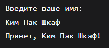
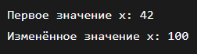
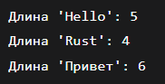
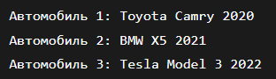
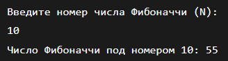
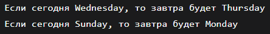
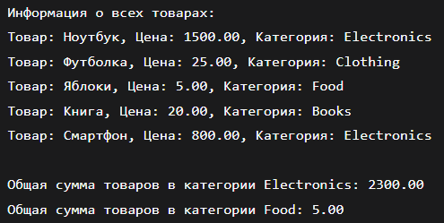
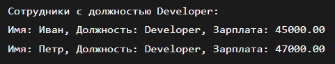

# Лабороторная работа № 1

## Постановка задачи 1
Напишите программу, которая запрашивает у пользователя имя и выводит на экран приветственное сообщение с использованием этого имени.
## Список идентификаторов
|Имя переменной|Тип данных|Описание|
|-|-|-
|name|	String	|Хранит введённое пользователем имя|
|input|	String	|Буфер для ввода строки|
## Код программы
```c
use std::io;

fn main() {
    println!("Введите ваше имя:");
    let mut name = String::new();
    io::stdin()
        .read_line(&mut name)
        .expect("Ошибка чтения строки");
    let name = name.trim(); // Убираем символы перевода строки
    println!("Привет, {}!", name);
}
```
## Результат выполнения


## Постановка задачи 2
Создайте переменную типа целое беззнаковое число и выведите ее значение на экран. Явно укажите тип переменной. Затем измените значение переменной и снова выведите его.
## Список идентификаторов
|Имя переменной|Тип данных|Описание|
|-|-|-
|x|	u32	|Переменная для хранения целого беззнакового числа|
## Код программы
```c
fn main() {
    let mut x: u32 = 42;
    println!("Первое значение x: {}", x);
    
    x = 100;
    println!("Изменённое значение x: {}", x);
}
```
## Результат выполнения


## Постановка задачи 3
Напишите функцию, которая принимает строку и возвращает ее длину (количество символов). Затем вызовите эту функцию с различными строками.
## Список идентификаторов
|Имя переменной|Тип данных|Описание|
|-|-|-
|s|	&str	|Входная строка для вычисления длины|
|len|	usize	|Длина строки|
|test_str1|	&str	|Первая тестовая строка|
|test_str2|	String	|Вторая тестовая строка|
|test_str3|	&str	|Третья тестовая строка|
|len1, len2, len3|	usize	|Длины соответствующих тестовых строк|
## Код программы
```c
fn string_length(s: &str) -> usize {
    s.chars().count()
}

fn main() {
    let test_str1 = "Hello";
    let test_str2 = String::from("Rust");
    let test_str3 = "Привет";
    
    let len1 = string_length(test_str1);
    let len2 = string_length(&test_str2);
    let len3 = string_length(test_str3);
    
    println!("Длина '{}': {}", test_str1, len1);
    println!("Длина '{}': {}", test_str2, len2);
    println!("Длина '{}': {}", test_str3, len3);
}
```
## Результат выполнения


## Постановка задачи 4
Задайте структуру Car с полями brand, model и year, и создайте несколько экземпляров этой структуры. Выведите информацию о каждой машине на экран.
## Список идентификаторов
|Имя переменной|Тип данных|Описание|
|-|-|-
|Car|	struct	|Структура, представляющая автомобиль|
|brand|	String	|Марка автомобиля|
|model|	String	|Модель автомобиля|
|year|	u32	|Год выпуска автомобиля|
|car1|	Car	|Первый экземпляр автомобиля|
|car2|	Car	|Второй экземпляр автомобиля|
|car3|	Car	|Третий экземпляр автомобиля|
## Код программы
```c
struct Car {
    brand: String,
    model: String,
    year: u32,
}

fn main() {
    let car1 = Car {
        brand: String::from("Toyota"),
        model: String::from("Camry"),
        year: 2020,
    };

    let car2 = Car {
        brand: String::from("BMW"),
        model: String::from("X5"),
        year: 2021,
    };

    let car3 = Car {
        brand: String::from("Tesla"),
        model: String::from("Model 3"),
        year: 2022,
    };

    println!("Автомобиль 1: {} {} {}", car1.brand, car1.model, car1.year);
    println!("Автомобиль 2: {} {} {}", car2.brand, car2.model, car2.year);
    println!("Автомобиль 3: {} {} {}", car3.brand, car3.model, car3.year);
}
```
## Результат выполнения


## Постановка задачи 5
Напишите программу, которая запрашивает у пользователя число N и выводит на экран N-ное число Фибоначчи. Используйте рекурсию для решения этой задачи.
## Математическая модель
* F(0) = 0
* F(1) = 1
* F(n) = F(n-1) + F(n-2) для n ≥ 2
## Список идентификаторов
|Имя переменной|Тип данных|Описание|
|-|-|-
|n|	u32	|Номер числа Фибоначчи, введённый пользователем|
|input|	String	|Буфер для ввода строки|
|num|	u32	|Аргумент для функции fibonacci|
|result|	u64	|Результат вычисления числа Фибоначчи|
## Код программы
```c
use std::io;

fn fibonacci(num: u32) -> u64 {
    if num == 0 {
        return 0;
    }
    if num == 1 {
        return 1;
    }
    fibonacci(num - 1) + fibonacci(num - 2)
}

fn main() {
    println!("Введите номер числа Фибоначчи (N):");
    
    let mut input = String::new();
    io::stdin()
        .read_line(&mut input)
        .expect("Ошибка чтения строки");
    
    let n: u32 = input
        .trim()
        .parse()
        .expect("Пожалуйста, введите целое неотрицательное число");
    
    let result = fibonacci(n);
    println!("Число Фибоначчи под номером {}: {}", n, result);
}
```
## Результат выполнения


## Постановка задачи 6
Реализуйте перечисление DayOfWeek для дней недели. Напишите функцию, которая принимает день недели и возвращает следующий день. Обработайте случаи перехода на следующий день недели, если текущий день – воскресенье.
## Список идентификаторов
|Имя переменной|Тип данных|Описание|
|-|-|-
|day|	DayOfWeek	|Текущий день недели|
|next_day|	DayOfWeek	|Следующий день недели|
|today|	DayOfWeek	|Тестовый текущий день|
|tomorrow|	DayOfWeek	|Результат функции next_day|
## Код программы
```c
#[derive(Debug)]
enum DayOfWeek {
    Monday,
    Tuesday,
    Wednesday,
    Thursday,
    Friday,
    Saturday,
    Sunday,
}

fn next_day(day: DayOfWeek) -> DayOfWeek {
    match day {
        DayOfWeek::Monday => DayOfWeek::Tuesday,
        DayOfWeek::Tuesday => DayOfWeek::Wednesday,
        DayOfWeek::Wednesday => DayOfWeek::Thursday,
        DayOfWeek::Thursday => DayOfWeek::Friday,
        DayOfWeek::Friday => DayOfWeek::Saturday,
        DayOfWeek::Saturday => DayOfWeek::Sunday,
        DayOfWeek::Sunday => DayOfWeek::Monday,
    }
}

fn main() {
    let today = DayOfWeek::Wednesday;
    let tomorrow = next_day(today);
    println!("Если сегодня {:?}, то завтра будет {:?}", today, tomorrow);
    
    let today = DayOfWeek::Sunday;
    let tomorrow = next_day(today);
    println!("Если сегодня {:?}, то завтра будет {:?}", today, tomorrow);
}
```
## Результат выполнения


## Постановка задачи 7
Создайте структуру Product с полями name, price и category, а также перечисление (enum) Category для категорий товаров. Напишите метод для вывода информации о продукте и ассоциированную функцию для подсчета общей суммы товаров в заданной категории из массива продуктов.
## Список идентификаторов
|Имя переменной|Тип данных|Описание|
|-|-|-
|products|	Vec<Product>	|Вектор продуктов|
|p|	&Product	|Ссылка на продукт в итераторе|
|category|	Category	|Категория товара|
|target_category|	Category	|Целевая категория для подсчёта суммы|
|total|	f64	|Общая сумма товаров в категории|
|product1, product2, product3, product4|	Product	|Экземпляры продуктов|
## Код программы
```c
#[derive(Debug)]
enum Category {
    Electronics,
    Clothing,
    Food,
    Books,
}

struct Product {
    name: String,
    price: f64,
    category: Category,
}

impl Product {
    fn print_info(&self) {
        println!("Товар: {}, Цена: {:.2}, Категория: {:?}", 
                 self.name, self.price, self.category);
    }
    
    fn total_price_by_category(products: &[Product], category: Category) -> f64 {
        let mut total = 0.0;
        for p in products {
            if let Product { category: cat, .. } = p {
                if std::mem::discriminant(cat) == std::mem::discriminant(&category) {
                    total += p.price;
                }
            }
        }
        total
    }
}

fn main() {
    let products = vec![
        Product {
            name: String::from("Ноутбук"),
            price: 1500.0,
            category: Category::Electronics,
        },
        Product {
            name: String::from("Футболка"),
            price: 25.0,
            category: Category::Clothing,
        },
        Product {
            name: String::from("Яблоки"),
            price: 5.0,
            category: Category::Food,
        },
        Product {
            name: String::from("Книга"),
            price: 20.0,
            category: Category::Books,
        },
        Product {
            name: String::from("Смартфон"),
            price: 800.0,
            category: Category::Electronics,
        },
    ];
    
    println!("Информация о всех товарах:");
    for product in &products {
        product.print_info();
    }
    
    println!("\nОбщая сумма товаров в категории Electronics: {:.2}", 
             Product::total_price_by_category(&products, Category::Electronics));
    println!("Общая сумма товаров в категории Food: {:.2}", 
             Product::total_price_by_category(&products, Category::Food));
}
```
## Результат выполнения


## Постановка задачи 8
Создайте структуру Employee с полями name, position, salary, а также перечисление Position для должностей сотрудников. Напишите функцию, которая принимает вектор сотрудников и возвращает вектор сотрудников заданной должности.
## Список идентификаторов
|Имя переменной|Тип данных|Описание|
|-|-|-
|employees|	Vec<Employee>	|Вектор всех сотрудников|
|filtered_employees|	Vec<Employee>	|Отфильтрованные сотрудники по должности|
|target_position|	Position	|Целевая должность для фильтрации|
|employee|	Employee	|Отдельный сотрудник|
|name|	String	|Имя сотрудника|
|position|	Position	|Должность сотрудника|
|salary|	f64	|Зарплата сотрудника|
|e1, e2, e3, e4, e5|	Employee	|Экземпляры сотрудников|
## Код программы
```c
#[derive(Debug, PartialEq)]
enum Position {
    Manager,
    Developer,
    Designer,
    Analyst,
}

struct Employee {
    name: String,
    position: Position,
    salary: f64,
}

fn filter_by_position(employees: Vec<Employee>, target_position: Position) -> Vec<Employee> {
    employees
        .into_iter()
        .filter(|emp| emp.position == target_position)
        .collect()
}

fn main() {
    let employees = vec![
        Employee {
            name: String::from("Анна"),
            position: Position::Manager,
            salary: 50000.0,
        },
        Employee {
            name: String::from("Иван"),
            position: Position::Developer,
            salary: 45000.0,
        },
        Employee {
            name: String::from("Мария"),
            position: Position::Designer,
            salary: 40000.0,
        },
        Employee {
            name: String::from("Петр"),
            position: Position::Developer,
            salary: 47000.0,
        },
        Employee {
            name: String::from("Ольга"),
            position: Position::Analyst,
            salary: 42000.0,
        },
    ];

    let target_position = Position::Developer;
    let filtered_employees = filter_by_position(employees, target_position);

    println!("Сотрудники с должностью {:?}:", target_position);
    for emp in &filtered_employees {
        println!("Имя: {}, Должность: {:?}, Зарплата: {:.2}", 
                 emp.name, emp.position, emp.salary);
    }
}
```
## Результат выполнения



## Информация о студенте
Сидоренко Алеся, 1 курс, ПОО