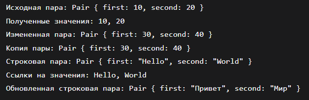
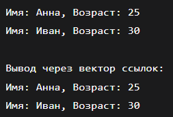
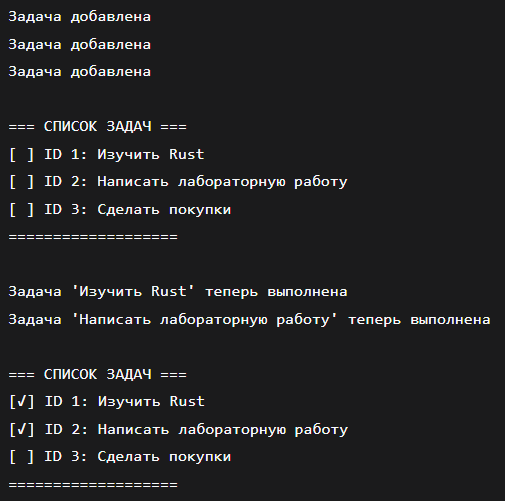
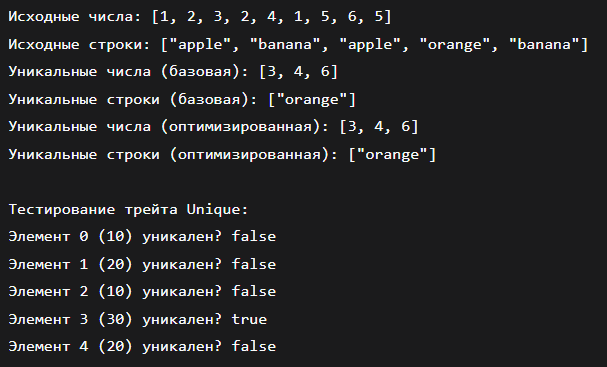
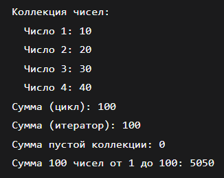
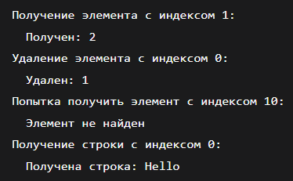
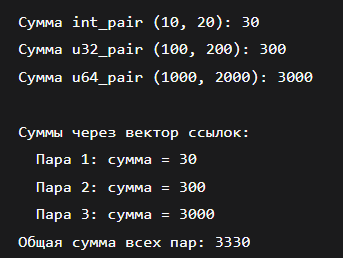

# Лабороторная работа № 2

## Постановка задачи 1
Создайте структуру Pair\<T>, которая хранит два значения одного типа T. Реализуйте методы для получения и изменения значений пары. Убедитесь, что использование ссылок и копирование данных работает корректно.
## Список идентификаторов
|Имя переменной|Тип данных|Описание|
|-|-|-
|pair|	Pair<T>	|Экземпляр структуры Pair|
|first|	T	|Первое значение в паре|
|second|	T	|Второе значение в паре|
|new_pair|	Pair<i32>	|Первый тестовый экземпляр|
|mut_pair|	Pair<String>	|Второй тестовый экземпляр|
|copied_pair|	Pair<i32>	|Копия пары для демонстрации Copy|
|first_val, second_val|	T	|Временные переменные для значений|
## Код программы
```c
#[derive(Debug, Clone)]
struct Pair<T> {
    first: T,
    second: T,
}

impl<T> Pair<T> {
    fn new(first: T, second: T) -> Self {
        Pair { first, second }
    }
    
    fn get_first(&self) -> &T {
        &self.first
    }
    
    fn get_second(&self) -> &T {
        &self.second
    }
    
    fn set_first(&mut self, value: T) {
        self.first = value;
    }
    
    fn set_second(&mut self, value: T) {
        self.second = value;
    }
    
    fn get_both(&self) -> (&T, &T) {
        (&self.first, &self.second)
    }
}

fn main() {
    // Пример с типом, который реализует Copy (i32)
    let mut new_pair = Pair::new(10, 20);
    println!("Исходная пара: {:?}", new_pair);
    
    let first_val = *new_pair.get_first();
    let second_val = *new_pair.get_second();
    println!("Полученные значения: {}, {}", first_val, second_val);
    
    new_pair.set_first(30);
    new_pair.set_second(40);
    println!("Измененная пара: {:?}", new_pair);
    
    let copied_pair = new_pair.clone();
    println!("Копия пары: {:?}", copied_pair);
    
    // Пример с типом, который не реализует Copy (String)
    let mut mut_pair = Pair::new(String::from("Hello"), String::from("World"));
    println!("Строковая пара: {:?}", mut_pair);
    
    let (first_ref, second_ref) = mut_pair.get_both();
    println!("Ссылки на значения: {}, {}", first_ref, second_ref);
    
    mut_pair.set_first(String::from("Привет"));
    mut_pair.set_second(String::from("Мир"));
    println!("Обновленная строковая пара: {:?}", mut_pair);
}
```
## Результат выполнения


## Постановка задачи 2
Определите трейт PrintInfo, который содержит метод print\_info(\&self). Реализуйте этот трейт для структуры Person, чтобы можно было вызвать метод print\_info на объекте Person.
## Список идентификаторов
|Имя переменной|Тип данных|Описание|
|-|-|-
|person|	Person	|Экземпляр структуры Person|
|name|	String	|Имя человека|
|age|	u32	|Возраст человека|
|person1|	Person	|Первый тестовый экземпляр|
|person2|	Person	|Второй тестовый экземпляр|
## Код программы
```c
trait PrintInfo {
    fn print_info(&self);
}

struct Person {
    name: String,
    age: u32,
}

impl PrintInfo for Person {
    fn print_info(&self) {
        println!("Имя: {}, Возраст: {}", self.name, self.age);
    }
}

fn main() {
    let person1 = Person {
        name: String::from("Анна"),
        age: 25,
    };
    
    let person2 = Person {
        name: String::from("Иван"),
        age: 30,
    };
    
    person1.print_info();
    person2.print_info();
    
    let people: Vec<&dyn PrintInfo> = vec![&person1, &person2];
    println!("\nВывод через вектор ссылок:");
    for person in people {
        person.print_info();
    }
}
```
## Результат выполнения


## Постановка задачи 3
Разработайте программу для обработки списка задач (Todo List). Создайте структуру Task с полями id, title и completed, а также методы для добавления, удаления и изменения статуса задачи. Реализуйте вывод информации о всех задачах.
## Список идентификаторов
|Имя переменной|Тип данных|Описание|
|-|-|-
|todo_list|	TodoList	|Экземпляр списка задач|
|tasks|	Vec<Task>	|Вектор задач|
|id|	u32	|Уникальный идентификатор задачи|
|title|	String	|Название задачи|
|completed|	bool	|Статус выполнения задачи|
|next_id|	u32	|Следующий доступный ID|
|task1, task2, task3|	Task	|Тестовые задачи|
|task_id|	u32	|ID задачи для операций|
## Код программы
```c
struct Task {
    id: u32,
    title: String,
    completed: bool,
}

struct TodoList {
    tasks: Vec<Task>,
    next_id: u32,
}

impl TodoList {
    fn new() -> Self {
        TodoList {
            tasks: Vec::new(),
            next_id: 1,
        }
    }
    
    fn add_task(&mut self, title: String) {
        let task = Task {
            id: self.next_id,
            title,
            completed: false,
        };
        self.tasks.push(task);
        self.next_id += 1;
        println!("Задача добавлена");
    }
    
    fn remove_task(&mut self, task_id: u32) -> bool {
        let initial_len = self.tasks.len();
        self.tasks.retain(|task| task.id != task_id);
        let removed = initial_len != self.tasks.len();
        if removed {
            println!("Задача с ID {} удалена", task_id);
        } else {
            println!("Задача с ID {} не найдена", task_id);
        }
        removed
    }
    
    fn toggle_task_status(&mut self, task_id: u32) -> bool {
        for task in &mut self.tasks {
            if task.id == task_id {
                task.completed = !task.completed;
                let status = if task.completed { "выполнена" } else { "не выполнена" };
                println!("Задача '{}' теперь {}", task.title, status);
                return true;
            }
        }
        println!("Задача с ID {} не найдена", task_id);
        false
    }
    
    fn print_all_tasks(&self) {
        println!("\n=== СПИСОК ЗАДАЧ ===");
        if self.tasks.is_empty() {
            println!("Список задач пуст");
        } else {
            for task in &self.tasks {
                let status = if task.completed { "[✓]" } else { "[ ]" };
                println!("{} ID {}: {}", status, task.id, task.title);
            }
        }
        println!("===================\n");
    }
}

fn main() {
    let mut todo_list = TodoList::new();
    
    todo_list.add_task(String::from("Изучить Rust"));
    todo_list.add_task(String::from("Написать лабораторную работу"));
    todo_list.add_task(String::from("Сделать покупки"));
    
    todo_list.print_all_tasks();
    
    todo_list.toggle_task_status(1);
    todo_list.toggle_task_status(2);
    
    todo_list.print_all_tasks();
    
    todo_list.remove_task(2);
    
    todo_list.print_all_tasks();
    
    todo_list.add_task(String::from("Почитать документацию"));
    
    todo_list.print_all_tasks();
}
```
## Результат выполнения


## Постановка задачи 4
Напишите функцию find\_unique\_elements, которая принимает вектор элементов типа T и возвращает вектор уникальных элементов. Определите трейт Unique с методом is\_unique, который проверяет, является ли элемент уникальным.
## Список идентификаторов
|Имя переменной|Тип данных|Описание|
|-|-|-
|elements|	Vec<T>	|Исходный вектор элементов|
|unique_elements|	Vec<T>	|Вектор уникальных элементов|
|element|	T	|Отдельный элемент|
|count|	usize	|Счетчик повторений элемента|
|numbers|	Vec<i32>	|Тестовый вектор чисел|
|strings|	Vec<String>	|Тестовый вектор строк|
|unique_numbers|	Vec<i32>	|Уникальные числа|
|unique_strings|	Vec<String>	|Уникальные строки|
## Код программы
```c
use std::collections::HashMap;

trait Unique {
    fn is_unique(&self, elements: &[Self]) -> bool
    where
        Self: PartialEq + Sized;
}

impl<T> Unique for T
where
    T: PartialEq,
{
    fn is_unique(&self, elements: &[T]) -> bool {
        elements.iter().filter(|&x| x == self).count() == 1
    }
}

fn find_unique_elements<T>(elements: Vec<T>) -> Vec<T>
where
    T: PartialEq + Clone,
{
    let mut unique_elements = Vec::new();
    
    for (i, element) in elements.iter().enumerate() {
        let mut is_unique = true;
        
        for (j, other) in elements.iter().enumerate() {
            if i != j && element == other {
                is_unique = false;
                break;
            }
        }
        
        if is_unique {
            unique_elements.push(element.clone());
        }
    }
    
    unique_elements
}

fn find_unique_elements_optimized<T>(elements: Vec<T>) -> Vec<T>
where
    T: Eq + std::hash::Hash + Clone,
{
    let mut count_map = HashMap::new();
    
    for element in &elements {
        *count_map.entry(element).or_insert(0) += 1;
    }
    
    elements
        .into_iter()
        .filter(|element| *count_map.get(element).unwrap() == 1)
        .collect()
}

fn main() {
    let numbers = vec![1, 2, 3, 2, 4, 1, 5, 6, 5];
    let strings = vec![
        String::from("apple"),
        String::from("banana"),
        String::from("apple"),
        String::from("orange"),
        String::from("banana"),
    ];
    
    println!("Исходные числа: {:?}", numbers);
    println!("Исходные строки: {:?}", strings);
    
    let unique_numbers = find_unique_elements(numbers.clone());
    let unique_strings = find_unique_elements(strings.clone());
    
    println!("Уникальные числа (базовая): {:?}", unique_numbers);
    println!("Уникальные строки (базовая): {:?}", unique_strings);
    
    let unique_numbers_opt = find_unique_elements_optimized(numbers);
    let unique_strings_opt = find_unique_elements_optimized(strings);
    
    println!("Уникальные числа (оптимизированная): {:?}", unique_numbers_opt);
    println!("Уникальные строки (оптимизированная): {:?}", unique_strings_opt);
    
    let test_vec = vec![10, 20, 10, 30, 20];
    println!("\nТестирование трейта Unique:");
    for (i, &num) in test_vec.iter().enumerate() {
        println!("Элемент {} ({}) уникален? {}", i, num, num.is_unique(&test_vec));
    }
}
```
## Результат выполнения


## Постановка задачи 5
Напишите функцию sum\_collection, которая принимает коллекцию элементов типа T и возвращает их сумму. Ограничьте тип T требованием наличия метода addition() в некотором трейте Addable для поддержки суммирования. Просуммируйте затем любую коллекцию структур вида:
```c
struct Number {\
value: u32,\
}
```
## Список идентификаторов
|Имя переменной|Тип данных|Описание|
|-|-|-
|collection|	Vec<T>	|Коллекция элементов|
|sum|	u32	|Сумма элементов|
|element|	T	|Отдельный элемент коллекции|
|acc|	u32	|Аккумулятор для суммирования|
|numbers|	Vec<Number>	|Тестовая коллекция структур Number|
|total|	u32	|Общая сумма|
|n1, n2, n3, n4|	Number	|Экземпляры структур Number|
## Код программы
```c
trait Addable {
    fn addition(&self) -> u32;
}

struct Number {
    value: u32,
}

impl Addable for Number {
    fn addition(&self) -> u32 {
        self.value
    }
}

fn sum_collection<T: Addable>(collection: &[T]) -> u32 {
    let mut sum = 0;
    for element in collection {
        sum += element.addition();
    }
    sum
}

fn sum_collection_iter<T: Addable>(collection: &[T]) -> u32 {
    collection.iter().map(|x| x.addition()).sum()
}

fn main() {
    let numbers = vec![
        Number { value: 10 },
        Number { value: 20 },
        Number { value: 30 },
        Number { value: 40 },
    ];
    
    println!("Коллекция чисел:");
    for (i, num) in numbers.iter().enumerate() {
        println!("  Число {}: {}", i + 1, num.value);
    }
    
    let total = sum_collection(&numbers);
    println!("Сумма (цикл): {}", total);
    
    let total_iter = sum_collection_iter(&numbers);
    println!("Сумма (итератор): {}", total_iter);
    
    let empty_collection: Vec<Number> = Vec::new();
    let empty_sum = sum_collection(&empty_collection);
    println!("Сумма пустой коллекции: {}", empty_sum);
    
    let large_collection: Vec<Number> = (1..=100).map(|x| Number { value: x }).collect();
    let large_sum = sum_collection(&large_collection);
    println!("Сумма 100 чисел от 1 до 100: {}", large_sum);
}
```
## Результат выполнения


## Постановка задачи 6
Создайте обобщенную структуру Collection\<T>, которая содержит вектор элементов типа T. Реализуйте методы add\_element(), get\_element() и remove\_element(), ограничив тип T traitом Clone.
## Список идентификаторов
|Имя переменной|Тип данных|Описание|
|-|-|-
|collection|	Collection<T>	|Экземпляр коллекции|
|elements|	Vec<T>	|Вектор элементов|
|element|	T	|Добавляемый элемент|
|index|	usize	|Индекс элемента|
|value|	T	|Возвращаемое значение|
|int_collection|	Collection<i32>	|Коллекция целых чисел|
|str_collection|	Collection<String>	|Коллекция строк|
## Код программы
```c
struct Collection<T: Clone> {
    elements: Vec<T>,
}

impl<T: Clone> Collection<T> {
    fn add_element(&mut self, element: T) {
        self.elements.push(element);
    }
    
    fn get_element(&self, index: usize) -> Option<T> {
        if index < self.elements.len() {
            Some(self.elements[index].clone())
        } else {
            None
        }
    }
    
    fn remove_element(&mut self, index: usize) -> Option<T> {
        if index < self.elements.len() {
            Some(self.elements.remove(index))
        } else {
            None
        }
    }
}

fn main() {
    let mut int_collection = Collection { elements: Vec::new() };
    
    int_collection.add_element(1);
    int_collection.add_element(2);
    int_collection.add_element(3);
    
    println!("Получение элемента с индексом 1:");
    if let Some(element) = int_collection.get_element(1) {
        println!("  Получен: {}", element);
    }
    
    println!("Удаление элемента с индексом 0:");
    if let Some(removed) = int_collection.remove_element(0) {
        println!("  Удален: {}", removed);
    }
    
    println!("Попытка получить элемент с индексом 10:");
    match int_collection.get_element(10) {
        Some(element) => println!("  Получен: {}", element),
        None => println!("  Элемент не найден"),
    }
    
    let mut str_collection = Collection { elements: Vec::new() };
    
    str_collection.add_element(String::from("Hello"));
    str_collection.add_element(String::from("World"));
    
    println!("Получение строки с индексом 0:");
    if let Some(element) = str_collection.get_element(0) {
        println!("  Получена строка: {}", element);
    }
}
```
## Результат выполнения


## Постановка задачи 7
Создайте трейт Summable, который требует реализации метода sum(\&self) -> u32 для типов, поддерживающих сложение. Реализуйте этот трейт для структуры Pair\<T>, которая содержит два поля типа T (сумма чисел в этой паре). Добавьте ограничение на тип T для поддержки сложения.
## Список идентификаторов
|Имя переменной|Тип данных|Описание|
|-|-|-
|pair|	Pair<T>	|Экземпляр структуры Pair|
|first|	T	|Первое значение в паре|
|second|	T	|Второе значение в паре|
|int_pair|	Pair<i32>	|Пара целых чисел|
|u32_pair|	Pair<u32>	|Пара беззнаковых целых чисел|
|u64_pair|	Pair<u64>	|Пара 64-битных беззнаковых чисел|
## Код программы
```c
use std::ops::Add;

trait Summable {
    fn sum(&self) -> u32;
}

struct Pair<T> {
    first: T,
    second: T,
}

impl<T> Pair<T> {
    fn new(first: T, second: T) -> Self {
        Pair { first, second }
    }
}

impl<T> Summable for Pair<T>
where
    T: Add<Output = T> + Into<u32> + Copy,
{
    fn sum(&self) -> u32 {
        let result = self.first + self.second;
        result.into()
    }
}

fn main() {
    let int_pair = Pair::new(10, 20);
    let u32_pair = Pair::new(100u32, 200u32);
    let u64_pair = Pair::new(1000u64, 2000u64);
    
    println!("Сумма int_pair (10, 20): {}", int_pair.sum());
    println!("Сумма u32_pair (100, 200): {}", u32_pair.sum());
    println!("Сумма u64_pair (1000, 2000): {}", u64_pair.sum());
    
    let pairs: Vec<&dyn Summable> = vec![&int_pair, &u32_pair, &u64_pair];
    
    println!("\nСуммы через вектор ссылок:");
    for (i, pair) in pairs.iter().enumerate() {
        println!("  Пара {}: сумма = {}", i + 1, pair.sum());
    }
    
    let total_sum: u32 = pairs.iter().map(|p| p.sum()).sum();
    println!("Общая сумма всех пар: {}", total_sum);
}
```
## Результат выполнения


## Информация о студенте
Сидоренко Алеся, 1 курс, ПОО

