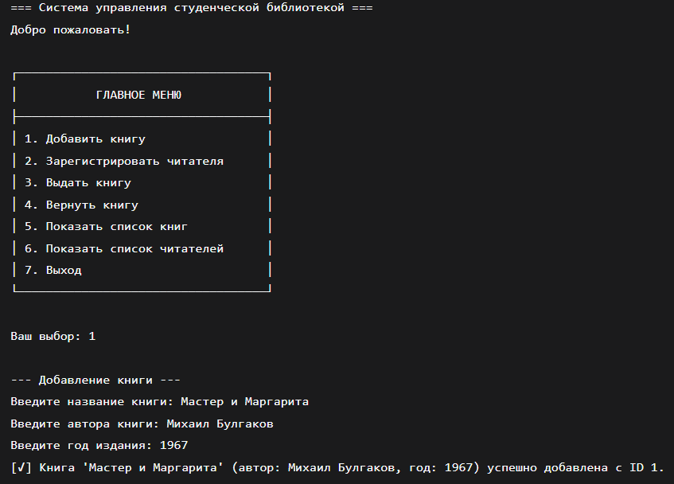
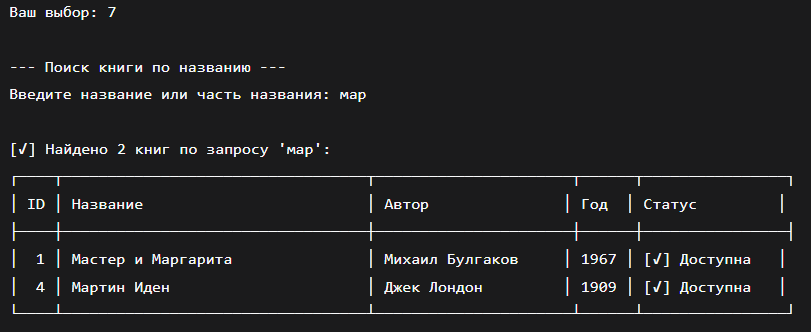
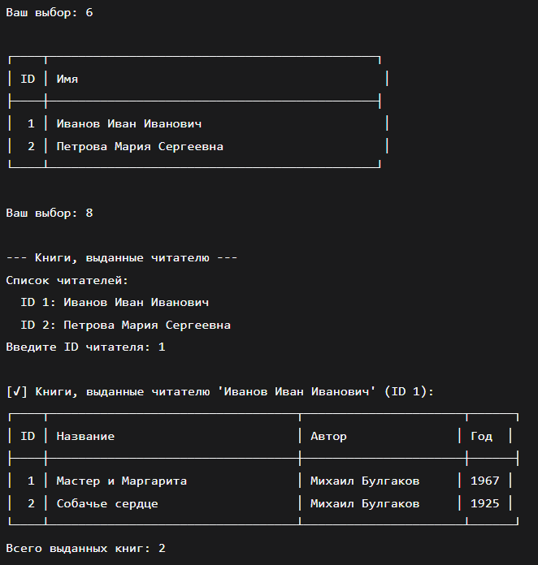
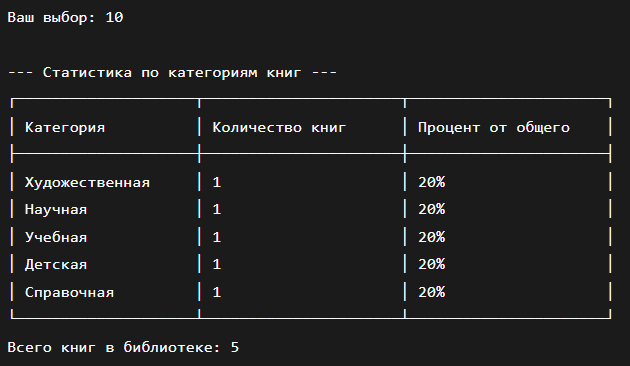
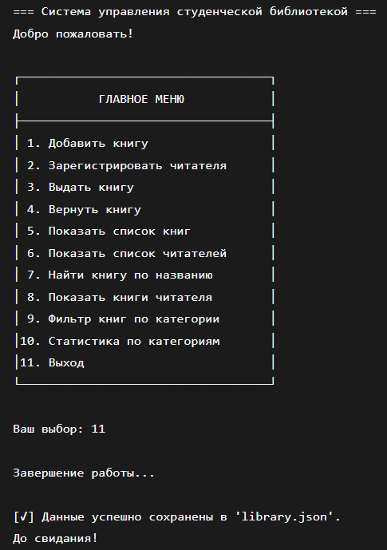

# Лабороторная работа № 3

## Постановка задачи 1
Добавьте поле year: u32 (год издания) в структуру Book и отобразите его в списке книг.
## Список идентификаторов
|Имя переменной|Тип данных|Описание|
|-|-|-
|year|	u32	|Год издания книги|
|year_input|	String	|Ввод года издания пользователем|
|max_len|	usize	|Максимальная длина строки для обрезки|
## Код программы
```c
use serde::{Serialize, Deserialize};

#[derive(Serialize, Deserialize, Debug, Clone)]
pub struct Book {
    pub id: u32,
    pub title: String,
    pub author: String,
    pub year: u32,          // ДОБАВЛЕНО: поле год издания
    pub is_available: bool,
}

#[derive(Serialize, Deserialize, Debug, Clone)]
pub struct Reader {
    pub id: u32,
    pub name: String,
}
```
```c
use std::collections::HashMap;
use std::fmt;
use std::fs::File;
use std::io::{Read, Write};
use serde::{Serialize, Deserialize};

pub mod models;
use models::{Book, Reader};

#[derive(Debug)]
pub enum LibraryError {
    BookNotFound,
    BookNotAvailable,
    ReaderNotFound,
    InvalidInput,
}

impl fmt::Display for LibraryError {
    fn fmt(&self, f: &mut fmt::Formatter) -> fmt::Result {
        match self {
            LibraryError::BookNotFound => write!(f, "Книга не найдена."),
            LibraryError::BookNotAvailable => write!(f, "Книга уже выдана."),
            LibraryError::ReaderNotFound => write!(f, "Читатель не найден."),
            LibraryError::InvalidInput => write!(f, "Некорректный ввод."),
        }
    }
}

#[derive(Serialize, Deserialize)]
pub struct Library {
    books: Vec<Book>,
    readers: HashMap<u32, Reader>,
    next_book_id: u32,
    next_reader_id: u32,
}

impl Library {
    pub fn new() -> Self {
        Self {
            books: Vec::new(),
            readers: HashMap::new(),
            next_book_id: 1,
            next_reader_id: 1,
        }
    }
    
    // ИЗМЕНЕНО: добавлен параметр year
    pub fn add_book(&mut self, title: String, author: String, year: u32) -> &Book {
        let new_book = Book {
            id: self.next_book_id,
            title,
            author,
            year,           // ДОБАВЛЕНО: год издания
            is_available: true,
        };
        self.books.push(new_book);
        self.next_book_id += 1;
        self.books.last().unwrap()
    }
    
    pub fn register_reader(&mut self, name: String) -> &Reader {
        let new_reader = Reader {
            id: self.next_reader_id,
            name,
        };
        self.readers.insert(new_reader.id, new_reader);
        self.next_reader_id += 1;
        self.readers.get(&(self.next_reader_id - 1)).unwrap()
    }
    
    pub fn find_book_by_id(&mut self, id: u32) -> Option<&mut Book> {
        self.books.iter_mut().find(|b| b.id == id)
    }
    
    pub fn borrow_book(&mut self, book_id: u32, reader_id: u32) -> Result<(), LibraryError> {
        if !self.readers.contains_key(&reader_id) {
            return Err(LibraryError::ReaderNotFound);
        }
        
        let book = self.find_book_by_id(book_id).ok_or(LibraryError::BookNotFound)?;
        
        if !book.is_available {
            return Err(LibraryError::BookNotAvailable);
        }
        
        book.is_available = false;
        Ok(())
    }
    
    pub fn return_book(&mut self, book_id: u32) -> Result<(), LibraryError> {
        let book = self.find_book_by_id(book_id).ok_or(LibraryError::BookNotFound)?;
        book.is_available = true;
        Ok(())
    }
    
    pub fn list_books(&self) -> &Vec<Book> {
        &self.books
    }
    
    pub fn list_readers(&self) -> Vec<&Reader> {
        self.readers.values().collect()
    }
    
    pub fn save_to_file(&self, path: &str) -> Result<(), std::io::Error> {
        let data = serde_json::to_string_pretty(self)?;
        let mut file = File::create(path)?;
        file.write_all(data.as_bytes())?;
        Ok(())
    }
    
    pub fn load_from_file(path: &str) -> Result<Self, std::io::Error> {
        let mut file = File::open(path)?;
        let mut data = String::new();
        file.read_to_string(&mut data)?;
        let library = serde_json::from_str(&data)?;
        Ok(library)
    }
}
```
```c
use std::io::{self, Write};
use library_manager::Library;

const DB_FILE: &str = "library.json";

fn main() {
    let mut library = Library::load_from_file(DB_FILE).unwrap_or_else(|_| {
        println!("Файл данных не найден. Создана новая библиотека.");
        Library::new()
    });

    println!("=== Система управления студенческой библиотекой ===");
    println!("Добро пожаловать!\n");

    loop {
        print_menu();
        let choice = read_line().trim().to_string();

        match choice.as_str() {
            "1" => add_book(&mut library),
            "2" => register_reader(&mut library),
            "3" => borrow_book(&mut library),
            "4" => return_book(&mut library),
            "5" => list_books(&library),
            "6" => list_readers(&library),
            "7" => {
                println!("\nЗавершение работы...");
                break;
            }
            _ => println!("\n[!] Неверный выбор. Пожалуйста, выберите пункт от 1 до 7."),
        }

        match library.save_to_file(DB_FILE) {
            Ok(_) => println!("\n[✓] Данные успешно сохранены в '{}'.", DB_FILE),
            Err(e) => println!("\n[✗] Ошибка при сохранении данных: {}", e),
        }
    }

    println!("До свидания!");
}

fn print_menu() {
    println!("\n┌───────────────────────────────────┐");
    println!("│           ГЛАВНОЕ МЕНЮ            │");
    println!("├───────────────────────────────────┤");
    println!("│ 1. Добавить книгу                 │");
    println!("│ 2. Зарегистрировать читателя      │");
    println!("│ 3. Выдать книгу                   │");
    println!("│ 4. Вернуть книгу                  │");
    println!("│ 5. Показать список книг           │");
    println!("│ 6. Показать список читателей      │");
    println!("│ 7. Выход                          │");
    println!("└───────────────────────────────────┘");
    print!("\nВаш выбор: ");
    io::stdout().flush().unwrap();
}

fn read_line() -> String {
    let mut input = String::new();
    io::stdin()
        .read_line(&mut input)
        .expect("Не удалось прочитать строку");
    input
}

fn add_book(library: &mut Library) {
    println!("\n--- Добавление книги ---");
    
    print!("Введите название книги: ");
    io::stdout().flush().unwrap();
    let title = read_line().trim().to_string();
    
    print!("Введите автора книги: ");
    io::stdout().flush().unwrap();
    let author = read_line().trim().to_string();
    
    // ДОБАВЛЕНО: запрос года издания
    print!("Введите год издания: ");
    io::stdout().flush().unwrap();
    let year_input = read_line().trim().to_string();
    
    if title.is_empty() || author.is_empty() || year_input.is_empty() {
        println!("[✗] Ошибка: все поля обязательны для заполнения.");
        return;
    }
    
    let year: u32 = match year_input.parse() {
        Ok(year) => year,
        Err(_) => {
            println!("[✗] Ошибка: некорректный год издания.");
            return;
        }
    };
    
    let book = library.add_book(title, author, year);
    println!("[✓] Книга '{}' (автор: {}, год: {}) успешно добавлена с ID {}.",  // ИЗМЕНЕНО: вывод с годом
             book.title, book.author, book.year, book.id);
}

fn register_reader(library: &mut Library) {
    println!("\n--- Регистрация читателя ---");
    print!("Введите имя читателя: ");
    io::stdout().flush().unwrap();
    let name = read_line().trim().to_string();

    if name.is_empty() {
        println!("[✗] Ошибка: имя не может быть пустым.");
        return;
    }

    let reader = library.register_reader(name);
    println!("[✓] Читатель '{}' зарегистрирован с ID {}.", reader.name, reader.id);
}

fn borrow_book(library: &mut Library) {
    println!("\n--- Выдача книги ---");
    print!("Введите ID книги: ");
    io::stdout().flush().unwrap();
    let book_id: u32 = match read_line().trim().parse() {
        Ok(id) => id,
        Err(_) => {
            println!("[✗] Ошибка: некорректный ID книги.");
            return;
        }
    };

    print!("Введите ID читателя: ");
    io::stdout().flush().unwrap();
    let reader_id: u32 = match read_line().trim().parse() {
        Ok(id) => id,
        Err(_) => {
            println!("[✗] Ошибка: некорректный ID читателя.");
            return;
        }
    };

    match library.borrow_book(book_id, reader_id) {
        Ok(_) => println!("[✓] Книга успешно выдана."),
        Err(e) => println!("[✗] Ошибка: {}", e),
    }
}

fn return_book(library: &mut Library) {
    println!("\n--- Возврат книги ---");
    print!("Введите ID книги: ");
    io::stdout().flush().unwrap();
    let book_id: u32 = match read_line().trim().parse() {
        Ok(id) => id,
        Err(_) => {
            println!("[✗] Ошибка: некорректный ID книги.");
            return;
        }
    };

    match library.return_book(book_id) {
        Ok(_) => println!("[✓] Книга успешно возвращена."),
        Err(e) => println!("[✗] Ошибка: {}", e),
    }
}

fn list_books(library: &Library) {
    let books = library.list_books();

    if books.is_empty() {
        println!("\n[!] В библиотеке пока нет книг.");
        return;
    }

    println!("\n┌────┬──────────────────────────────────┬──────────────────────┬──────┬────────────────┐");
    println!("│ ID │ Название                         │ Автор               │ Год  │ Статус         │");  // ИЗМЕНЕНО: добавлен столбец Год
    println!("├────┼──────────────────────────────────┼──────────────────────┼──────┼────────────────┤");
    
    for book in books {
        let status = if book.is_available {
            "[✓] Доступна"
        } else {
            "[✗] Выдана"
        };
        println!("│ {:2} │ {:<34} │ {:<22} │ {:<4} │ {:<16} │",  // ИЗМЕНЕНО: форматирование с годом
                 book.id,
                 truncate(&book.title, 34),
                 truncate(&book.author, 22),
                 book.year,  // ДОБАВЛЕНО: вывод года
                 status);
    }
    
    println!("└────┴──────────────────────────────────┴──────────────────────┴──────┴────────────────┘");
}

fn list_readers(library: &Library) {
    let readers = library.list_readers();

    if readers.is_empty() {
        println!("\n[!] Нет зарегистрированных читателей.");
        return;
    }

    println!("\n┌────┬─────────────────────────────────────────────┐");
    println!("│ ID │ Имя                                          │");
    println!("├────┼─────────────────────────────────────────────┤");

    for reader in readers {
        println!("│ {:2} │ {:<43} │", reader.id, truncate(&reader.name, 43));
    }
    
    println!("└────┴─────────────────────────────────────────────┘");
}

fn truncate(s: &str, max_len: usize) -> String {
    if s.len() <= max_len {
        s.to_string()
    } else {
        format!("{}...", &s[..max_len-3])
    }
}
```
```c
[package]
name = "library_manager"
version = "0.1.0"
edition = "2021"

[dependencies]
serde = { version = "1.0", features = ["derive"] }
serde_json = "1.0"
```
## Пример результата выполнения


## Постановка задачи 2
Реализуйте функцию поиска книг по названию (частичное совпадение, без учета регистра).
## Список идентификаторов
|Имя переменной|Тип данных|Описание|
|-|-|-
|search_query|	String	|Поисковый запрос пользователя|
|found_books|	Vec<&Book>	|Найденные книги|
|query_lower|	String	|Поисковый запрос в нижнем регистре|
|title_lower|	String	|Название книги в нижнем регистре|
|lowercase_title|	String	|Временная переменная для преобразования регистра|
## Код программы
```c
impl Library {
    // ... существующие методы ...

    // ДОБАВЛЕНО: функция поиска книг по названию (частичное совпадение, без учета регистра)
    pub fn search_books_by_title(&self, query: &str) -> Vec<&Book> {
        let query_lower = query.to_lowercase();
        let mut found_books = Vec::new();
        
        for book in &self.books {
            let title_lower = book.title.to_lowercase();
            if title_lower.contains(&query_lower) {
                found_books.push(book);
            }
        }
        
        found_books
    }
    
    // ... остальные методы ...
}
```
```c
use std::io::{self, Write};
use library_manager::Library;

const DB_FILE: &str = "library.json";

fn main() {
    let mut library = Library::load_from_file(DB_FILE).unwrap_or_else(|_| {
        println!("Файл данных не найден. Создана новая библиотека.");
        Library::new()
    });

    println!("=== Система управления студенческой библиотекой ===");
    println!("Добро пожаловать!\n");

    loop {
        print_menu();
        let choice = read_line().trim().to_string();

        match choice.as_str() {
            "1" => add_book(&mut library),
            "2" => register_reader(&mut library),
            "3" => borrow_book(&mut library),
            "4" => return_book(&mut library),
            "5" => list_books(&library),
            "6" => list_readers(&library),
            "7" => search_books(&library),  // ДОБАВЛЕНО: поиск книг
            "8" => {
                println!("\nЗавершение работы...");
                break;
            }
            _ => println!("\n[!] Неверный выбор. Пожалуйста, выберите пункт от 1 до 8."),
        }

        match library.save_to_file(DB_FILE) {
            Ok(_) => println!("\n[✓] Данные успешно сохранены в '{}'.", DB_FILE),
            Err(e) => println!("\n[✗] Ошибка при сохранении данных: {}", e),
        }
    }

    println!("До свидания!");
}

fn print_menu() {
    println!("\n┌───────────────────────────────────┐");
    println!("│           ГЛАВНОЕ МЕНЮ            │");
    println!("├───────────────────────────────────┤");
    println!("│ 1. Добавить книгу                 │");
    println!("│ 2. Зарегистрировать читателя      │");
    println!("│ 3. Выдать книгу                   │");
    println!("│ 4. Вернуть книгу                  │");
    println!("│ 5. Показать список книг           │");
    println!("│ 6. Показать список читателей      │");
    println!("│ 7. Найти книгу по названию        │");  // ДОБАВЛЕНО: новый пункт меню
    println!("│ 8. Выход                          │");
    println!("└───────────────────────────────────┘");
    print!("\nВаш выбор: ");
    io::stdout().flush().unwrap();
}

// ДОБАВЛЕНО: функция поиска книг
fn search_books(library: &Library) {
    println!("\n--- Поиск книги по названию ---");
    print!("Введите название или часть названия: ");
    io::stdout().flush().unwrap();
    
    let search_query = read_line().trim().to_string();
    
    if search_query.is_empty() {
        println!("[✗] Ошибка: поисковый запрос не может быть пустым.");
        return;
    }
    
    let found_books = library.search_books_by_title(&search_query);
    
    if found_books.is_empty() {
        println!("[!] Книги по запросу '{}' не найдены.", search_query);
        return;
    }
    
    println!("\n[✓] Найдено {} книг по запросу '{}':", found_books.len(), search_query);
    println!("┌────┬──────────────────────────────────┬──────────────────────┬──────┬────────────────┐");
    println!("│ ID │ Название                         │ Автор               │ Год  │ Статус         │");
    println!("├────┼──────────────────────────────────┼──────────────────────┼──────┼────────────────┤");
    
    for book in found_books {
        let status = if book.is_available {
            "[✓] Доступна"
        } else {
            "[✗] Выдана"
        };
        println!("│ {:2} │ {:<34} │ {:<22} │ {:<4} │ {:<16} │",
                 book.id,
                 truncate(&book.title, 34),
                 truncate(&book.author, 22),
                 book.year,
                 status);
    }
    
    println!("└────┴──────────────────────────────────┴──────────────────────┴──────┴────────────────┘");
}

// ... остальные функции без изменений ...

fn read_line() -> String {
    let mut input = String::new();
    io::stdin()
        .read_line(&mut input)
        .expect("Не удалось прочитать строку");
    input
}

fn add_book(library: &mut Library) {
    println!("\n--- Добавление книги ---");
    
    print!("Введите название книги: ");
    io::stdout().flush().unwrap();
    let title = read_line().trim().to_string();
    
    print!("Введите автора книги: ");
    io::stdout().flush().unwrap();
    let author = read_line().trim().to_string();
    
    print!("Введите год издания: ");
    io::stdout().flush().unwrap();
    let year_input = read_line().trim().to_string();
    
    if title.is_empty() || author.is_empty() || year_input.is_empty() {
        println!("[✗] Ошибка: все поля обязательны для заполнения.");
        return;
    }
    
    let year: u32 = match year_input.parse() {
        Ok(year) => year,
        Err(_) => {
            println!("[✗] Ошибка: некорректный год издания.");
            return;
        }
    };
    
    let book = library.add_book(title, author, year);
    println!("[✓] Книга '{}' (автор: {}, год: {}) успешно добавлена с ID {}.",
             book.title, book.author, book.year, book.id);
}

fn register_reader(library: &mut Library) {
    println!("\n--- Регистрация читателя ---");
    print!("Введите имя читателя: ");
    io::stdout().flush().unwrap();
    let name = read_line().trim().to_string();

    if name.is_empty() {
        println!("[✗] Ошибка: имя не может быть пустым.");
        return;
    }

    let reader = library.register_reader(name);
    println!("[✓] Читатель '{}' зарегистрирован с ID {}.", reader.name, reader.id);
}

fn borrow_book(library: &mut Library) {
    println!("\n--- Выдача книги ---");
    print!("Введите ID книги: ");
    io::stdout().flush().unwrap();
    let book_id: u32 = match read_line().trim().parse() {
        Ok(id) => id,
        Err(_) => {
            println!("[✗] Ошибка: некорректный ID книги.");
            return;
        }
    };

    print!("Введите ID читателя: ");
    io::stdout().flush().unwrap();
    let reader_id: u32 = match read_line().trim().parse() {
        Ok(id) => id,
        Err(_) => {
            println!("[✗] Ошибка: некорректный ID читателя.");
            return;
        }
    };

    match library.borrow_book(book_id, reader_id) {
        Ok(_) => println!("[✓] Книга успешно выдана."),
        Err(e) => println!("[✗] Ошибка: {}", e),
    }
}

fn return_book(library: &mut Library) {
    println!("\n--- Возврат книги ---");
    print!("Введите ID книги: ");
    io::stdout().flush().unwrap();
    let book_id: u32 = match read_line().trim().parse() {
        Ok(id) => id,
        Err(_) => {
            println!("[✗] Ошибка: некорректный ID книги.");
            return;
        }
    };

    match library.return_book(book_id) {
        Ok(_) => println!("[✓] Книга успешно возвращена."),
        Err(e) => println!("[✗] Ошибка: {}", e),
    }
}

fn list_books(library: &Library) {
    let books = library.list_books();

    if books.is_empty() {
        println!("\n[!] В библиотеке пока нет книг.");
        return;
    }

    println!("\n┌────┬──────────────────────────────────┬──────────────────────┬──────┬────────────────┐");
    println!("│ ID │ Название                         │ Автор               │ Год  │ Статус         │");
    println!("├────┼──────────────────────────────────┼──────────────────────┼──────┼────────────────┤");
    
    for book in books {
        let status = if book.is_available {
            "[✓] Доступна"
        } else {
            "[✗] Выдана"
        };
        println!("│ {:2} │ {:<34} │ {:<22} │ {:<4} │ {:<16} │",
                 book.id,
                 truncate(&book.title, 34),
                 truncate(&book.author, 22),
                 book.year,
                 status);
    }
    
    println!("└────┴──────────────────────────────────┴──────────────────────┴──────┴────────────────┘");
}

fn list_readers(library: &Library) {
    let readers = library.list_readers();

    if readers.is_empty() {
        println!("\n[!] Нет зарегистрированных читателей.");
        return;
    }

    println!("\n┌────┬─────────────────────────────────────────────┐");
    println!("│ ID │ Имя                                          │");
    println!("├────┼─────────────────────────────────────────────┤");

    for reader in readers {
        println!("│ {:2} │ {:<43} │", reader.id, truncate(&reader.name, 43));
    }
    
    println!("└────┴─────────────────────────────────────────────┘");
}

fn truncate(s: &str, max_len: usize) -> String {
    if s.len() <= max_len {
        s.to_string()
    } else {
        format!("{}...", &s[..max_len-3])
    }
}
```
## Пример результата выполнения


## Постановка задачи 3
Добавьте отслеживание того, какие книги выданы каждому читателю. Создайте пункт меню “Показать книги читателя”.
## Список идентификаторов
|Имя переменной|Тип данных|Описание|
|-|-|-
|borrowed_books|	HashMap<u32, Vec<u32>>	|Карта выданных книг (ID читателя → список ID книг)|
|reader_borrowed|	&Vec<u32>	|Список ID книг, выданных конкретному читателю|
|book_ids|	Vec<u32>	|Список ID книг для выдачи/возврата|
|reader_id_input|	String	|Ввод ID читателя пользователем|
## Код программы
```c
use serde::{Serialize, Deserialize};

#[derive(Serialize, Deserialize, Debug, Clone)]
pub struct Book {
    pub id: u32,
    pub title: String,
    pub author: String,
    pub year: u32,
    pub is_available: bool,
}

#[derive(Serialize, Deserialize, Debug, Clone)]
pub struct Reader {
    pub id: u32,
    pub name: String,
}
```
```c
use std::collections::HashMap;
use std::fmt;
use std::fs::File;
use std::io::{Read, Write};
use serde::{Serialize, Deserialize};

pub mod models;
use models::{Book, Reader};

#[derive(Debug)]
pub enum LibraryError {
    BookNotFound,
    BookNotAvailable,
    ReaderNotFound,
    InvalidInput,
}

impl fmt::Display for LibraryError {
    fn fmt(&self, f: &mut fmt::Formatter) -> fmt::Result {
        match self {
            LibraryError::BookNotFound => write!(f, "Книга не найдена."),
            LibraryError::BookNotAvailable => write!(f, "Книга уже выдана."),
            LibraryError::ReaderNotFound => write!(f, "Читатель не найден."),
            LibraryError::InvalidInput => write!(f, "Некорректный ввод."),
        }
    }
}

#[derive(Serialize, Deserialize)]
pub struct Library {
    books: Vec<Book>,
    readers: HashMap<u32, Reader>,
    borrowed_books: HashMap<u32, Vec<u32>>,  // ДОБАВЛЕНО: отслеживание выданных книг (ID читателя → список ID книг)
    next_book_id: u32,
    next_reader_id: u32,
}

impl Library {
    pub fn new() -> Self {
        Self {
            books: Vec::new(),
            readers: HashMap::new(),
            borrowed_books: HashMap::new(),  // ДОБАВЛЕНО: инициализация карты выданных книг
            next_book_id: 1,
            next_reader_id: 1,
        }
    }
    
    pub fn add_book(&mut self, title: String, author: String, year: u32) -> &Book {
        let new_book = Book {
            id: self.next_book_id,
            title,
            author,
            year,
            is_available: true,
        };
        self.books.push(new_book);
        self.next_book_id += 1;
        self.books.last().unwrap()
    }
    
    pub fn register_reader(&mut self, name: String) -> &Reader {
        let new_reader = Reader {
            id: self.next_reader_id,
            name,
        };
        self.readers.insert(new_reader.id, new_reader);
        self.borrowed_books.insert(self.next_reader_id, Vec::new());  // ДОБАВЛЕНО: создаем пустой список для нового читателя
        self.next_reader_id += 1;
        self.readers.get(&(self.next_reader_id - 1)).unwrap()
    }
    
    pub fn find_book_by_id(&mut self, id: u32) -> Option<&mut Book> {
        self.books.iter_mut().find(|b| b.id == id)
    }
    
    pub fn borrow_book(&mut self, book_id: u32, reader_id: u32) -> Result<(), LibraryError> {
        if !self.readers.contains_key(&reader_id) {
            return Err(LibraryError::ReaderNotFound);
        }
        
        let book = self.find_book_by_id(book_id).ok_or(LibraryError::BookNotFound)?;
        
        if !book.is_available {
            return Err(LibraryError::BookNotAvailable);
        }
        
        // Помечаем книгу как выданную
        book.is_available = false;
        
        // ДОБАВЛЕНО: добавляем книгу в список выданных читателю
        self.borrowed_books
            .entry(reader_id)
            .or_insert_with(Vec::new)
            .push(book_id);
        
        Ok(())
    }
    
    pub fn return_book(&mut self, book_id: u32) -> Result<(), LibraryError> {
        let book = self.find_book_by_id(book_id).ok_or(LibraryError::BookNotFound)?;
        
        // ДОБАВЛЕНО: находим читателя, у которого была книга
        let mut reader_id_to_remove = None;
        for (reader_id, book_ids) in &mut self.borrowed_books {
            if let Some(pos) = book_ids.iter().position(|&id| id == book_id) {
                book_ids.remove(pos);
                reader_id_to_remove = Some(*reader_id);
                break;
            }
        }
        
        // Помечаем книгу как доступную
        book.is_available = true;
        
        if reader_id_to_remove.is_some() {
            Ok(())
        } else {
            Err(LibraryError::BookNotFound)
        }
    }
    
    // ДОБАВЛЕНО: метод для получения книг, выданных читателю
    pub fn get_reader_borrowed_books(&self, reader_id: u32) -> Option<Vec<&Book>> {
        if !self.readers.contains_key(&reader_id) {
            return None;
        }
        
        let book_ids = self.borrowed_books.get(&reader_id)?;
        let mut reader_books = Vec::new();
        
        for &book_id in book_ids {
            if let Some(book) = self.books.iter().find(|b| b.id == book_id) {
                reader_books.push(book);
            }
        }
        
        Some(reader_books)
    }
    
    pub fn list_books(&self) -> &Vec<Book> {
        &self.books
    }
    
    pub fn list_readers(&self) -> Vec<&Reader> {
        self.readers.values().collect()
    }
    
    pub fn search_books_by_title(&self, query: &str) -> Vec<&Book> {
        let query_lower = query.to_lowercase();
        let mut found_books = Vec::new();
        
        for book in &self.books {
            let title_lower = book.title.to_lowercase();
            if title_lower.contains(&query_lower) {
                found_books.push(book);
            }
        }
        
        found_books
    }
    
    pub fn save_to_file(&self, path: &str) -> Result<(), std::io::Error> {
        let data = serde_json::to_string_pretty(self)?;
        let mut file = File::create(path)?;
        file.write_all(data.as_bytes())?;
        Ok(())
    }
    
    pub fn load_from_file(path: &str) -> Result<Self, std::io::Error> {
        let mut file = File::open(path)?;
        let mut data = String::new();
        file.read_to_string(&mut data)?;
        let library = serde_json::from_str(&data)?;
        Ok(library)
    }
}
```
```c
use std::io::{self, Write};
use library_manager::Library;

const DB_FILE: &str = "library.json";

fn main() {
    let mut library = Library::load_from_file(DB_FILE).unwrap_or_else(|_| {
        println!("Файл данных не найден. Создана новая библиотека.");
        Library::new()
    });

    println!("=== Система управления студенческой библиотекой ===");
    println!("Добро пожаловать!\n");

    loop {
        print_menu();
        let choice = read_line().trim().to_string();

        match choice.as_str() {
            "1" => add_book(&mut library),
            "2" => register_reader(&mut library),
            "3" => borrow_book(&mut library),
            "4" => return_book(&mut library),
            "5" => list_books(&library),
            "6" => list_readers(&library),
            "7" => search_books(&library),
            "8" => show_reader_books(&library),  // ДОБАВЛЕНО: показ книг читателя
            "9" => {
                println!("\nЗавершение работы...");
                break;
            }
            _ => println!("\n[!] Неверный выбор. Пожалуйста, выберите пункт от 1 до 9."),
        }

        match library.save_to_file(DB_FILE) {
            Ok(_) => println!("\n[✓] Данные успешно сохранены в '{}'.", DB_FILE),
            Err(e) => println!("\n[✗] Ошибка при сохранении данных: {}", e),
        }
    }

    println!("До свидания!");
}

fn print_menu() {
    println!("\n┌───────────────────────────────────┐");
    println!("│           ГЛАВНОЕ МЕНЮ            │");
    println!("├───────────────────────────────────┤");
    println!("│ 1. Добавить книгу                 │");
    println!("│ 2. Зарегистрировать читателя      │");
    println!("│ 3. Выдать книгу                   │");
    println!("│ 4. Вернуть книгу                  │");
    println!("│ 5. Показать список книг           │");
    println!("│ 6. Показать список читателей      │");
    println!("│ 7. Найти книгу по названию        │");
    println!("│ 8. Показать книги читателя        │");  // ДОБАВЛЕНО: новый пункт меню
    println!("│ 9. Выход                          │");
    println!("└───────────────────────────────────┘");
    print!("\nВаш выбор: ");
    io::stdout().flush().unwrap();
}

// ДОБАВЛЕНО: функция показа книг, выданных читателю
fn show_reader_books(library: &Library) {
    println!("\n--- Книги, выданные читателю ---");
    
    // Сначала показываем список читателей
    let readers = library.list_readers();
    if readers.is_empty() {
        println!("[!] Нет зарегистрированных читателей.");
        return;
    }
    
    println!("Список читателей:");
    for reader in &readers {
        println!("  ID {}: {}", reader.id, reader.name);
    }
    
    print!("Введите ID читателя: ");
    io::stdout().flush().unwrap();
    
    let reader_id_input = read_line().trim().to_string();
    let reader_id: u32 = match reader_id_input.parse() {
        Ok(id) => id,
        Err(_) => {
            println!("[✗] Ошибка: некорректный ID читателя.");
            return;
        }
    };
    
    match library.get_reader_borrowed_books(reader_id) {
        Some(books) => {
            if books.is_empty() {
                println!("[!] У читателя с ID {} нет выданных книг.", reader_id);
            } else {
                if let Some(reader) = library.list_readers().iter().find(|r| r.id == reader_id) {
                    println!("\n[✓] Книги, выданные читателю '{}' (ID {}):", reader.name, reader.id);
                }
                
                println!("┌────┬──────────────────────────────────┬──────────────────────┬──────┐");
                println!("│ ID │ Название                         │ Автор               │ Год  │");
                println!("├────┼──────────────────────────────────┼──────────────────────┼──────┤");
                
                for book in books {
                    println!("│ {:2} │ {:<34} │ {:<22} │ {:<4} │",
                             book.id,
                             truncate(&book.title, 34),
                             truncate(&book.author, 22),
                             book.year);
                }
                
                println!("└────┴──────────────────────────────────┴──────────────────────┴──────┘");
                println!("Всего выданных книг: {}", books.len());
            }
        }
        None => {
            println!("[✗] Читатель с ID {} не найден.", reader_id);
        }
    }
}

// ... остальные функции без изменений ...

fn read_line() -> String {
    let mut input = String::new();
    io::stdin()
        .read_line(&mut input)
        .expect("Не удалось прочитать строку");
    input
}

fn add_book(library: &mut Library) {
    println!("\n--- Добавление книги ---");
    
    print!("Введите название книги: ");
    io::stdout().flush().unwrap();
    let title = read_line().trim().to_string();
    
    print!("Введите автора книги: ");
    io::stdout().flush().unwrap();
    let author = read_line().trim().to_string();
    
    print!("Введите год издания: ");
    io::stdout().flush().unwrap();
    let year_input = read_line().trim().to_string();
    
    if title.is_empty() || author.is_empty() || year_input.is_empty() {
        println!("[✗] Ошибка: все поля обязательны для заполнения.");
        return;
    }
    
    let year: u32 = match year_input.parse() {
        Ok(year) => year,
        Err(_) => {
            println!("[✗] Ошибка: некорректный год издания.");
            return;
        }
    };
    
    let book = library.add_book(title, author, year);
    println!("[✓] Книга '{}' (автор: {}, год: {}) успешно добавлена с ID {}.",
             book.title, book.author, book.year, book.id);
}

fn register_reader(library: &mut Library) {
    println!("\n--- Регистрация читателя ---");
    print!("Введите имя читателя: ");
    io::stdout().flush().unwrap();
    let name = read_line().trim().to_string();

    if name.is_empty() {
        println!("[✗] Ошибка: имя не может быть пустым.");
        return;
    }

    let reader = library.register_reader(name);
    println!("[✓] Читатель '{}' зарегистрирован с ID {}.", reader.name, reader.id);
}

fn borrow_book(library: &mut Library) {
    println!("\n--- Выдача книги ---");
    print!("Введите ID книги: ");
    io::stdout().flush().unwrap();
    let book_id: u32 = match read_line().trim().parse() {
        Ok(id) => id,
        Err(_) => {
            println!("[✗] Ошибка: некорректный ID книги.");
            return;
        }
    };

    print!("Введите ID читателя: ");
    io::stdout().flush().unwrap();
    let reader_id: u32 = match read_line().trim().parse() {
        Ok(id) => id,
        Err(_) => {
            println!("[✗] Ошибка: некорректный ID читателя.");
            return;
        }
    };

    match library.borrow_book(book_id, reader_id) {
        Ok(_) => println!("[✓] Книга успешно выдана."),
        Err(e) => println!("[✗] Ошибка: {}", e),
    }
}

fn return_book(library: &mut Library) {
    println!("\n--- Возврат книги ---");
    print!("Введите ID книги: ");
    io::stdout().flush().unwrap();
    let book_id: u32 = match read_line().trim().parse() {
        Ok(id) => id,
        Err(_) => {
            println!("[✗] Ошибка: некорректный ID книги.");
            return;
        }
    };

    match library.return_book(book_id) {
        Ok(_) => println!("[✓] Книга успешно возвращена."),
        Err(e) => println!("[✗] Ошибка: {}", e),
    }
}

fn list_books(library: &Library) {
    let books = library.list_books();

    if books.is_empty() {
        println!("\n[!] В библиотеке пока нет книг.");
        return;
    }

    println!("\n┌────┬──────────────────────────────────┬──────────────────────┬──────┬────────────────┐");
    println!("│ ID │ Название                         │ Автор               │ Год  │ Статус         │");
    println!("├────┼──────────────────────────────────┼──────────────────────┼──────┼────────────────┤");
    
    for book in books {
        let status = if book.is_available {
            "[✓] Доступна"
        } else {
            "[✗] Выдана"
        };
        println!("│ {:2} │ {:<34} │ {:<22} │ {:<4} │ {:<16} │",
                 book.id,
                 truncate(&book.title, 34),
                 truncate(&book.author, 22),
                 book.year,
                 status);
    }
    
    println!("└────┴──────────────────────────────────┴──────────────────────┴──────┴────────────────┘");
}

fn list_readers(library: &Library) {
    let readers = library.list_readers();

    if readers.is_empty() {
        println!("\n[!] Нет зарегистрированных читателей.");
        return;
    }

    println!("\n┌────┬─────────────────────────────────────────────┐");
    println!("│ ID │ Имя                                          │");
    println!("├────┼─────────────────────────────────────────────┤");

    for reader in readers {
        println!("│ {:2} │ {:<43} │", reader.id, truncate(&reader.name, 43));
    }
    
    println!("└────┴─────────────────────────────────────────────┘");
}

fn search_books(library: &Library) {
    println!("\n--- Поиск книги по названию ---");
    print!("Введите название или часть названия: ");
    io::stdout().flush().unwrap();
    
    let search_query = read_line().trim().to_string();
    
    if search_query.is_empty() {
        println!("[✗] Ошибка: поисковый запрос не может быть пустым.");
        return;
    }
    
    let found_books = library.search_books_by_title(&search_query);
    
    if found_books.is_empty() {
        println!("[!] Книги по запросу '{}' не найдены.", search_query);
        return;
    }
    
    println!("\n[✓] Найдено {} книг по запросу '{}':", found_books.len(), search_query);
    println!("┌────┬──────────────────────────────────┬──────────────────────┬──────┬────────────────┐");
    println!("│ ID │ Название                         │ Автор               │ Год  │ Статус         │");
    println!("├────┼──────────────────────────────────┼──────────────────────┼──────┼────────────────┤");
    
    for book in found_books {
        let status = if book.is_available {
            "[✓] Доступна"
        } else {
            "[✗] Выдана"
        };
        println!("│ {:2} │ {:<34} │ {:<22} │ {:<4} │ {:<16} │",
                 book.id,
                 truncate(&book.title, 34),
                 truncate(&book.author, 22),
                 book.year,
                 status);
    }
    
    println!("└────┴──────────────────────────────────┴──────────────────────┴──────┴────────────────┘");
}

fn truncate(s: &str, max_len: usize) -> String {
    if s.len() <= max_len {
        s.to_string()
    } else {
        format!("{}...", &s[..max_len-3])
    }
}
```
## Пример результата выполнения


## Постановка задачи 4
Реализуйте систему категорий книг (художественная литература, научная, учебная и т.д.) с возможностью фильтрации.
## Список идентификаторов
|Имя переменной|Тип данных|Описание|
|-|-|-
|category|	Category	|Категория книги|
|filtered_books|	Vec<&Book>	|Отфильтрованные книги по категории|
|category_choice|	String	|Выбор категории пользователем|
|category_input|	String	|Ввод категории пользователем|
## Код программы
```c
use serde::{Serialize, Deserialize};

// ДОБАВЛЕНО: перечисление категорий книг
#[derive(Serialize, Deserialize, Debug, Clone, PartialEq)]
pub enum Category {
    Fiction,        // Художественная литература
    Science,        // Научная литература
    Textbook,       // Учебная литература
    Reference,      // Справочная литература
    Children,       // Детская литература
    Other,          // Другое
}

impl Category {
    // Метод для преобразования строки в категорию
    pub fn from_str(s: &str) -> Option<Self> {
        match s.to_lowercase().as_str() {
            "художественная" | "fiction" | "1" => Some(Category::Fiction),
            "научная" | "science" | "2" => Some(Category::Science),
            "учебная" | "textbook" | "3" => Some(Category::Textbook),
            "справочная" | "reference" | "4" => Some(Category::Reference),
            "детская" | "children" | "5" => Some(Category::Children),
            "другое" | "other" | "6" => Some(Category::Other),
            _ => None,
        }
    }
    
    // Метод для получения строкового представления категории
    pub fn to_string(&self) -> &str {
        match self {
            Category::Fiction => "Художественная",
            Category::Science => "Научная",
            Category::Textbook => "Учебная",
            Category::Reference => "Справочная",
            Category::Children => "Детская",
            Category::Other => "Другое",
        }
    }
}

#[derive(Serialize, Deserialize, Debug, Clone)]
pub struct Book {
    pub id: u32,
    pub title: String,
    pub author: String,
    pub year: u32,
    pub category: Category,  // ДОБАВЛЕНО: поле категории
    pub is_available: bool,
}

#[derive(Serialize, Deserialize, Debug, Clone)]
pub struct Reader {
    pub id: u32,
    pub name: String,
}
```
```c
use std::collections::HashMap;
use std::fmt;
use std::fs::File;
use std::io::{Read, Write};
use serde::{Serialize, Deserialize};

pub mod models;
use models::{Book, Reader, Category};  // ДОБАВЛЕНО: импорт Category

#[derive(Debug)]
pub enum LibraryError {
    BookNotFound,
    BookNotAvailable,
    ReaderNotFound,
    InvalidInput,
    InvalidCategory,  // ДОБАВЛЕНО: ошибка неверной категории
}

impl fmt::Display for LibraryError {
    fn fmt(&self, f: &mut fmt::Formatter) -> fmt::Result {
        match self {
            LibraryError::BookNotFound => write!(f, "Книга не найдена."),
            LibraryError::BookNotAvailable => write!(f, "Книга уже выдана."),
            LibraryError::ReaderNotFound => write!(f, "Читатель не найден."),
            LibraryError::InvalidInput => write!(f, "Некорректный ввод."),
            LibraryError::InvalidCategory => write!(f, "Некорректная категория."),  // ДОБАВЛЕНО
        }
    }
}

#[derive(Serialize, Deserialize)]
pub struct Library {
    books: Vec<Book>,
    readers: HashMap<u32, Reader>,
    borrowed_books: HashMap<u32, Vec<u32>>,
    next_book_id: u32,
    next_reader_id: u32,
}

impl Library {
    pub fn new() -> Self {
        Self {
            books: Vec::new(),
            readers: HashMap::new(),
            borrowed_books: HashMap::new(),
            next_book_id: 1,
            next_reader_id: 1,
        }
    }
    
    // ИЗМЕНЕНО: добавлен параметр category
    pub fn add_book(&mut self, title: String, author: String, year: u32, category: Category) -> &Book {
        let new_book = Book {
            id: self.next_book_id,
            title,
            author,
            year,
            category,  // ДОБАВЛЕНО: категория книги
            is_available: true,
        };
        self.books.push(new_book);
        self.next_book_id += 1;
        self.books.last().unwrap()
    }
    
    pub fn register_reader(&mut self, name: String) -> &Reader {
        let new_reader = Reader {
            id: self.next_reader_id,
            name,
        };
        self.readers.insert(new_reader.id, new_reader);
        self.borrowed_books.insert(self.next_reader_id, Vec::new());
        self.next_reader_id += 1;
        self.readers.get(&(self.next_reader_id - 1)).unwrap()
    }
    
    pub fn find_book_by_id(&mut self, id: u32) -> Option<&mut Book> {
        self.books.iter_mut().find(|b| b.id == id)
    }
    
    pub fn borrow_book(&mut self, book_id: u32, reader_id: u32) -> Result<(), LibraryError> {
        if !self.readers.contains_key(&reader_id) {
            return Err(LibraryError::ReaderNotFound);
        }
        
        let book = self.find_book_by_id(book_id).ok_or(LibraryError::BookNotFound)?;
        
        if !book.is_available {
            return Err(LibraryError::BookNotAvailable);
        }
        
        book.is_available = false;
        
        self.borrowed_books
            .entry(reader_id)
            .or_insert_with(Vec::new)
            .push(book_id);
        
        Ok(())
    }
    
    pub fn return_book(&mut self, book_id: u32) -> Result<(), LibraryError> {
        let book = self.find_book_by_id(book_id).ok_or(LibraryError::BookNotFound)?;
        
        let mut reader_id_to_remove = None;
        for (reader_id, book_ids) in &mut self.borrowed_books {
            if let Some(pos) = book_ids.iter().position(|&id| id == book_id) {
                book_ids.remove(pos);
                reader_id_to_remove = Some(*reader_id);
                break;
            }
        }
        
        book.is_available = true;
        
        if reader_id_to_remove.is_some() {
            Ok(())
        } else {
            Err(LibraryError::BookNotFound)
        }
    }
    
    pub fn get_reader_borrowed_books(&self, reader_id: u32) -> Option<Vec<&Book>> {
        if !self.readers.contains_key(&reader_id) {
            return None;
        }
        
        let book_ids = self.borrowed_books.get(&reader_id)?;
        let mut reader_books = Vec::new();
        
        for &book_id in book_ids {
            if let Some(book) = self.books.iter().find(|b| b.id == book_id) {
                reader_books.push(book);
            }
        }
        
        Some(reader_books)
    }
    
    pub fn list_books(&self) -> &Vec<Book> {
        &self.books
    }
    
    // ДОБАВЛЕНО: фильтрация книг по категории
    pub fn filter_books_by_category(&self, category: &Category) -> Vec<&Book> {
        self.books
            .iter()
            .filter(|book| &book.category == category)
            .collect()
    }
    
    // ДОБАВЛЕНО: статистика по категориям
    pub fn get_category_stats(&self) -> HashMap<Category, usize> {
        let mut stats = HashMap::new();
        
        for book in &self.books {
            *stats.entry(book.category.clone()).or_insert(0) += 1;
        }
        
        stats
    }
    
    pub fn list_readers(&self) -> Vec<&Reader> {
        self.readers.values().collect()
    }
    
    pub fn search_books_by_title(&self, query: &str) -> Vec<&Book> {
        let query_lower = query.to_lowercase();
        let mut found_books = Vec::new();
        
        for book in &self.books {
            let title_lower = book.title.to_lowercase();
            if title_lower.contains(&query_lower) {
                found_books.push(book);
            }
        }
        
        found_books
    }
    
    pub fn save_to_file(&self, path: &str) -> Result<(), std::io::Error> {
        let data = serde_json::to_string_pretty(self)?;
        let mut file = File::create(path)?;
        file.write_all(data.as_bytes())?;
        Ok(())
    }
    
    pub fn load_from_file(path: &str) -> Result<Self, std::io::Error> {
        let mut file = File::open(path)?;
        let mut data = String::new();
        file.read_to_string(&mut data)?;
        let library = serde_json::from_str(&data)?;
        Ok(library)
    }
}
```
```c
use std::io::{self, Write};
use library_manager::{Library, Category};

const DB_FILE: &str = "library.json";

fn main() {
    let mut library = Library::load_from_file(DB_FILE).unwrap_or_else(|_| {
        println!("Файл данных не найден. Создана новая библиотека.");
        Library::new()
    });

    println!("=== Система управления студенческой библиотекой ===");
    println!("Добро пожаловать!\n");

    loop {
        print_menu();
        let choice = read_line().trim().to_string();

        match choice.as_str() {
            "1" => add_book(&mut library),
            "2" => register_reader(&mut library),
            "3" => borrow_book(&mut library),
            "4" => return_book(&mut library),
            "5" => list_books(&library),
            "6" => list_readers(&library),
            "7" => search_books(&library),
            "8" => show_reader_books(&library),
            "9" => filter_books_by_category(&library),  // ДОБАВЛЕНО: фильтрация по категории
            "10" => show_category_stats(&library),      // ДОБАВЛЕНО: статистика по категориям
            "11" => {
                println!("\nЗавершение работы...");
                break;
            }
            _ => println!("\n[!] Неверный выбор. Пожалуйста, выберите пункт от 1 до 11."),
        }

        match library.save_to_file(DB_FILE) {
            Ok(_) => println!("\n[✓] Данные успешно сохранены в '{}'.", DB_FILE),
            Err(e) => println!("\n[✗] Ошибка при сохранении данных: {}", e),
        }
    }

    println!("До свидания!");
}

fn print_menu() {
    println!("\n┌───────────────────────────────────┐");
    println!("│           ГЛАВНОЕ МЕНЮ            │");
    println!("├───────────────────────────────────┤");
    println!("│ 1. Добавить книгу                 │");
    println!("│ 2. Зарегистрировать читателя      │");
    println!("│ 3. Выдать книгу                   │");
    println!("│ 4. Вернуть книгу                  │");
    println!("│ 5. Показать список книг           │");
    println!("│ 6. Показать список читателей      │");
    println!("│ 7. Найти книгу по названию        │");
    println!("│ 8. Показать книги читателя        │");
    println!("│ 9. Фильтр книг по категории       │");  // ДОБАВЛЕНО
    println!("│10. Статистика по категориям       │");  // ДОБАВЛЕНО
    println!("│11. Выход                          │");
    println!("└───────────────────────────────────┘");
    print!("\nВаш выбор: ");
    io::stdout().flush().unwrap();
}

// ИЗМЕНЕНО: добавлен выбор категории при добавлении книги
fn add_book(library: &mut Library) {
    println!("\n--- Добавление книги ---");
    
    print!("Введите название книги: ");
    io::stdout().flush().unwrap();
    let title = read_line().trim().to_string();
    
    print!("Введите автора книги: ");
    io::stdout().flush().unwrap();
    let author = read_line().trim().to_string();
    
    print!("Введите год издания: ");
    io::stdout().flush().unwrap();
    let year_input = read_line().trim().to_string();
    
    // ДОБАВЛЕНО: выбор категории
    println!("\nВыберите категорию книги:");
    println!("1. Художественная литература");
    println!("2. Научная литература");
    println!("3. Учебная литература");
    println!("4. Справочная литература");
    println!("5. Детская литература");
    println!("6. Другое");
    print!("Ваш выбор (1-6): ");
    io::stdout().flush().unwrap();
    
    let category_choice = read_line().trim().to_string();
    
    if title.is_empty() || author.is_empty() || year_input.is_empty() || category_choice.is_empty() {
        println!("[✗] Ошибка: все поля обязательны для заполнения.");
        return;
    }
    
    let year: u32 = match year_input.parse() {
        Ok(year) => year,
        Err(_) => {
            println!("[✗] Ошибка: некорректный год издания.");
            return;
        }
    };
    
    let category = match Category::from_str(&category_choice) {
        Some(cat) => cat,
        None => {
            println!("[✗] Ошибка: некорректная категория.");
            return;
        }
    };
    
    let book = library.add_book(title, author, year, category);
    println!("[✓] Книга '{}' (автор: {}, год: {}, категория: {}) успешно добавлена с ID {}.",
             book.title, book.author, book.year, book.category.to_string(), book.id);
}

// ДОБАВЛЕНО: функция фильтрации книг по категории
fn filter_books_by_category(library: &Library) {
    println!("\n--- Фильтрация книг по категории ---");
    println!("Выберите категорию:");
    println!("1. Художественная литература");
    println!("2. Научная литература");
    println!("3. Учебная литература");
    println!("4. Справочная литература");
    println!("5. Детская литература");
    println!("6. Другое");
    print!("Ваш выбор (1-6): ");
    io::stdout().flush().unwrap();
    
    let category_choice = read_line().trim().to_string();
    
    let category = match Category::from_str(&category_choice) {
        Some(cat) => cat,
        None => {
            println!("[✗] Ошибка: некорректная категория.");
            return;
        }
    };
    
    let filtered_books = library.filter_books_by_category(&category);
    
    if filtered_books.is_empty() {
        println!("[!] Книги в категории '{}' не найдены.", category.to_string());
        return;
    }
    
    println!("\n[✓] Книги в категории '{}' (найдено: {}):", category.to_string(), filtered_books.len());
    println!("┌────┬──────────────────────────────────┬──────────────────────┬──────┬────────────────┬────────────────┐");
    println!("│ ID │ Название                         │ Автор               │ Год  │ Категория      │ Статус         │");
    println!("├────┼──────────────────────────────────┼──────────────────────┼──────┼────────────────┼────────────────┤");
    
    for book in filtered_books {
        let status = if book.is_available {
            "[✓] Доступна"
        } else {
            "[✗] Выдана"
        };
        println!("│ {:2} │ {:<34} │ {:<22} │ {:<4} │ {:<14} │ {:<14} │",
                 book.id,
                 truncate(&book.title, 34),
                 truncate(&book.author, 22),
                 book.year,
                 truncate(book.category.to_string(), 14),
                 status);
    }
    
    println!("└────┴──────────────────────────────────┴──────────────────────┴──────┴────────────────┴────────────────┘");
}

// ДОБАВЛЕНО: функция отображения статистики по категориям
fn show_category_stats(library: &Library) {
    println!("\n--- Статистика по категориям книг ---");
    
    let stats = library.get_category_stats();
    
    if stats.is_empty() {
        println!("[!] В библиотеке пока нет книг.");
        return;
    }
    
    println!("┌────────────────────┬──────────────────────┬──────────────────────┐");
    println!("│ Категория          │ Количество книг      │ Процент от общего    │");
    println!("├────────────────────┼──────────────────────┼──────────────────────┤");
    
    let total_books = library.list_books().len();
    
    // Сортируем по количеству книг (убыванию)
    let mut sorted_stats: Vec<_> = stats.iter().collect();
    sorted_stats.sort_by(|a, b| b.1.cmp(a.1));
    
    for (category, count) in sorted_stats {
        let percentage = if total_books > 0 {
            (*count as f32 / total_books as f32 * 100.0).round() as u32
        } else {
            0
        };
        
        println!("│ {:<18} │ {:<20} │ {:<20}% │",
                 category.to_string(),
                 count,
                 percentage);
    }
    
    println!("└────────────────────┴──────────────────────┴──────────────────────┘");
    println!("Всего книг в библиотеке: {}", total_books);
}

// ИЗМЕНЕНО: обновлен вывод таблицы книг для отображения категории
fn list_books(library: &Library) {
    let books = library.list_books();

    if books.is_empty() {
        println!("\n[!] В библиотеке пока нет книг.");
        return;
    }

    println!("\n┌────┬──────────────────────────────────┬──────────────────────┬──────┬────────────────┬────────────────┐");
    println!("│ ID │ Название                         │ Автор               │ Год  │ Категория      │ Статус         │");
    println!("├────┼──────────────────────────────────┼──────────────────────┼──────┼────────────────┼────────────────┤");
    
    for book in books {
        let status = if book.is_available {
            "[✓] Доступна"
        } else {
            "[✗] Выдана"
        };
        println!("│ {:2} │ {:<34} │ {:<22} │ {:<4} │ {:<14} │ {:<14} │",
                 book.id,
                 truncate(&book.title, 34),
                 truncate(&book.author, 22),
                 book.year,
                 truncate(book.category.to_string(), 14),
                 status);
    }
    
    println!("└────┴──────────────────────────────────┴──────────────────────┴──────┴────────────────┴────────────────┘");
}

// ИЗМЕНЕНО: обновлен вывод найденных книг для отображения категории
fn search_books(library: &Library) {
    println!("\n--- Поиск книги по названию ---");
    print!("Введите название или часть названия: ");
    io::stdout().flush().unwrap();
    
    let search_query = read_line().trim().to_string();
    
    if search_query.is_empty() {
        println!("[✗] Ошибка: поисковый запрос не может быть пустым.");
        return;
    }
    
    let found_books = library.search_books_by_title(&search_query);
    
    if found_books.is_empty() {
        println!("[!] Книги по запросу '{}' не найдены.", search_query);
        return;
    }
    
    println!("\n[✓] Найдено {} книг по запросу '{}':", found_books.len(), search_query);
    println!("┌────┬──────────────────────────────────┬──────────────────────┬──────┬────────────────┬────────────────┐");
    println!("│ ID │ Название                         │ Автор               │ Год  │ Категория      │ Статус         │");
    println!("├────┼──────────────────────────────────┼──────────────────────┼──────┼────────────────┼────────────────┤");
    
    for book in found_books {
        let status = if book.is_available {
            "[✓] Доступна"
        } else {
            "[✗] Выдана"
        };
        println!("│ {:2} │ {:<34} │ {:<22} │ {:<4} │ {:<14} │ {:<14} │",
                 book.id,
                 truncate(&book.title, 34),
                 truncate(&book.author, 22),
                 book.year,
                 truncate(book.category.to_string(), 14),
                 status);
    }
    
    println!("└────┴──────────────────────────────────┴──────────────────────┴──────┴────────────────┴────────────────┘");
}

// ИЗМЕНЕНО: обновлен вывод книг читателя для отображения категории
fn show_reader_books(library: &Library) {
    println!("\n--- Книги, выданные читателю ---");
    
    let readers = library.list_readers();
    if readers.is_empty() {
        println!("[!] Нет зарегистрированных читателей.");
        return;
    }
    
    println!("Список читателей:");
    for reader in &readers {
        println!("  ID {}: {}", reader.id, reader.name);
    }
    
    print!("Введите ID читателя: ");
    io::stdout().flush().unwrap();
    
    let reader_id_input = read_line().trim().to_string();
    let reader_id: u32 = match reader_id_input.parse() {
        Ok(id) => id,
        Err(_) => {
            println!("[✗] Ошибка: некорректный ID читателя.");
            return;
        }
    };
    
    match library.get_reader_borrowed_books(reader_id) {
        Some(books) => {
            if books.is_empty() {
                println!("[!] У читателя с ID {} нет выданных книг.", reader_id);
            } else {
                if let Some(reader) = library.list_readers().iter().find(|r| r.id == reader_id) {
                    println!("\n[✓] Книги, выданные читателю '{}' (ID {}):", reader.name, reader.id);
                }
                
                println!("┌────┬──────────────────────────────────┬──────────────────────┬──────┬────────────────┐");
                println!("│ ID │ Название                         │ Автор               │ Год  │ Категория      │");
                println!("├────┼──────────────────────────────────┼──────────────────────┼──────┼────────────────┤");
                
                for book in books {
                    println!("│ {:2} │ {:<34} │ {:<22} │ {:<4} │ {:<14} │",
                             book.id,
                             truncate(&book.title, 34),
                             truncate(&book.author, 22),
                             book.year,
                             truncate(book.category.to_string(), 14));
                }
                
                println!("└────┴──────────────────────────────────┴──────────────────────┴──────┴────────────────┘");
                println!("Всего выданных книг: {}", books.len());
            }
        }
        None => {
            println!("[✗] Читатель с ID {} не найден.", reader_id);
        }
    }
}

// ... остальные функции без изменений ...

fn read_line() -> String {
    let mut input = String::new();
    io::stdin()
        .read_line(&mut input)
        .expect("Не удалось прочитать строку");
    input
}

fn register_reader(library: &mut Library) {
    println!("\n--- Регистрация читателя ---");
    print!("Введите имя читателя: ");
    io::stdout().flush().unwrap();
    let name = read_line().trim().to_string();

    if name.is_empty() {
        println!("[✗] Ошибка: имя не может быть пустым.");
        return;
    }

    let reader = library.register_reader(name);
    println!("[✓] Читатель '{}' зарегистрирован с ID {}.", reader.name, reader.id);
}

fn borrow_book(library: &mut Library) {
    println!("\n--- Выдача книги ---");
    print!("Введите ID книги: ");
    io::stdout().flush().unwrap();
    let book_id: u32 = match read_line().trim().parse() {
        Ok(id) => id,
        Err(_) => {
            println!("[✗] Ошибка: некорректный ID книги.");
            return;
        }
    };

    print!("Введите ID читателя: ");
    io::stdout().flush().unwrap();
    let reader_id: u32 = match read_line().trim().parse() {
        Ok(id) => id,
        Err(_) => {
            println!("[✗] Ошибка: некорректный ID читателя.");
            return;
        }
    };

    match library.borrow_book(book_id, reader_id) {
        Ok(_) => println!("[✓] Книга успешно выдана."),
        Err(e) => println!("[✗] Ошибка: {}", e),
    }
}

fn return_book(library: &mut Library) {
    println!("\n--- Возврат книги ---");
    print!("Введите ID книги: ");
    io::stdout().flush().unwrap();
    let book_id: u32 = match read_line().trim().parse() {
        Ok(id) => id,
        Err(_) => {
            println!("[✗] Ошибка: некорректный ID книги.");
            return;
        }
    };

    match library.return_book(book_id) {
        Ok(_) => println!("[✓] Книга успешно возвращена."),
        Err(e) => println!("[✗] Ошибка: {}", e),
    }
}

fn list_readers(library: &Library) {
    let readers = library.list_readers();

    if readers.is_empty() {
        println!("\n[!] Нет зарегистрированных читателей.");
        return;
    }

    println!("\n┌────┬─────────────────────────────────────────────┐");
    println!("│ ID │ Имя                                          │");
    println!("├────┼─────────────────────────────────────────────┤");

    for reader in readers {
        println!("│ {:2} │ {:<43} │", reader.id, truncate(&reader.name, 43));
    }
    
    println!("└────┴─────────────────────────────────────────────┘");
}

fn truncate(s: &str, max_len: usize) -> String {
    if s.len() <= max_len {
        s.to_string()
    } else {
        format!("{}...", &s[..max_len-3])
    }
}
```
## Пример результата выполнения


## Постановка задачи 5
Добавьте модульные тесты (#\[cfg(test)]) для проверки основных функций библиотеки.
## Список идентификаторов
|Имя переменной|Тип данных|Описание|
|-|-|-
|test_library|	Library	|Тестовая библиотека|
|test_book|	Book	|Тестовая книга|
|test_reader|	Reader	|Тестовый читатель|
|expected_books|	Vec<&Book>	|Ожидаемый список книг|
|search_results|	Vec<&Book>	|Результаты поиска|
## Код программы
```c
// ДОБАВЛЕНО: модульные тесты
#[cfg(test)]
mod tests {
    use super::*;
    
    // Тест создания новой библиотеки
    #[test]
    fn test_library_new() {
        let library = Library::new();
        assert!(library.books.is_empty());
        assert!(library.readers.is_empty());
        assert!(library.borrowed_books.is_empty());
        assert_eq!(library.next_book_id, 1);
        assert_eq!(library.next_reader_id, 1);
    }
    
    // Тест добавления книги
    #[test]
    fn test_add_book() {
        let mut library = Library::new();
        let book = library.add_book(
            String::from("Тестовая книга"),
            String::from("Тестовый автор"),
            2023,
            Category::Fiction
        );
        
        assert_eq!(book.title, "Тестовая книга");
        assert_eq!(book.author, "Тестовый автор");
        assert_eq!(book.year, 2023);
        assert_eq!(book.category, Category::Fiction);
        assert!(book.is_available);
        assert_eq!(book.id, 1);
        assert_eq!(library.books.len(), 1);
        assert_eq!(library.next_book_id, 2);
    }
    
    // Тест регистрации читателя
    #[test]
    fn test_register_reader() {
        let mut library = Library::new();
        let reader = library.register_reader(String::from("Тестовый читатель"));
        
        assert_eq!(reader.name, "Тестовый читатель");
        assert_eq!(reader.id, 1);
        assert_eq!(library.readers.len(), 1);
        assert_eq!(library.borrowed_books.len(), 1);
        assert!(library.borrowed_books.contains_key(&1));
        assert_eq!(library.next_reader_id, 2);
    }
    
    // Тест поиска книги по ID
    #[test]
    fn test_find_book_by_id() {
        let mut library = Library::new();
        library.add_book(
            String::from("Книга 1"),
            String::from("Автор 1"),
            2020,
            Category::Fiction
        );
        library.add_book(
            String::from("Книга 2"),
            String::from("Автор 2"),
            2021,
            Category::Science
        );
        
        let book = library.find_book_by_id(2);
        assert!(book.is_some());
        let book = book.unwrap();
        assert_eq!(book.title, "Книга 2");
        assert_eq!(book.author, "Автор 2");
        
        let non_existent = library.find_book_by_id(999);
        assert!(non_existent.is_none());
    }
    
    // Тест выдачи книги
    #[test]
    fn test_borrow_book() {
        let mut library = Library::new();
        library.add_book(
            String::from("Книга для выдачи"),
            String::from("Автор"),
            2022,
            Category::Fiction
        );
        library.register_reader(String::from("Читатель"));
        
        // Успешная выдача
        let result = library.borrow_book(1, 1);
        assert!(result.is_ok());
        
        // Книга должна быть отмечена как выданная
        let book = library.find_book_by_id(1).unwrap();
        assert!(!book.is_available);
        
        // Книга должна быть в списке выданных у читателя
        assert!(library.borrowed_books[&1].contains(&1));
        
        // Попытка повторной выдачи той же книги
        let result = library.borrow_book(1, 1);
        assert!(result.is_err());
        assert!(matches!(result.unwrap_err(), LibraryError::BookNotAvailable));
        
        // Попытка выдачи несуществующей книги
        let result = library.borrow_book(999, 1);
        assert!(result.is_err());
        assert!(matches!(result.unwrap_err(), LibraryError::BookNotFound));
        
        // Попытка выдачи книги несуществующему читателю
        let result = library.borrow_book(1, 999);
        assert!(result.is_err());
        assert!(matches!(result.unwrap_err(), LibraryError::ReaderNotFound));
    }
    
    // Тест возврата книги
    #[test]
    fn test_return_book() {
        let mut library = Library::new();
        library.add_book(
            String::from("Книга"),
            String::from("Автор"),
            2022,
            Category::Fiction
        );
        library.register_reader(String::from("Читатель"));
        
        // Выдаем книгу
        library.borrow_book(1, 1).unwrap();
        
        // Возвращаем книгу
        let result = library.return_book(1);
        assert!(result.is_ok());
        
        // Книга должна быть снова доступна
        let book = library.find_book_by_id(1).unwrap();
        assert!(book.is_available);
        
        // Книга должна быть удалена из списка выданных
        assert!(!library.borrowed_books[&1].contains(&1));
        
        // Попытка возврата несуществующей книги
        let result = library.return_book(999);
        assert!(result.is_err());
        assert!(matches!(result.unwrap_err(), LibraryError::BookNotFound));
    }
    
    // Тест получения книг, выданных читателю
    #[test]
    fn test_get_reader_borrowed_books() {
        let mut library = Library::new();
        
        // Добавляем книги
        library.add_book("Книга 1".to_string(), "Автор 1".to_string(), 2020, Category::Fiction);
        library.add_book("Книга 2".to_string(), "Автор 2".to_string(), 2021, Category::Science);
        library.add_book("Книга 3".to_string(), "Автор 3".to_string(), 2022, Category::Textbook);
        
        // Регистрируем читателей
        library.register_reader("Читатель 1".to_string());
        library.register_reader("Читатель 2".to_string());
        
        // Выдаем книги
        library.borrow_book(1, 1).unwrap();
        library.borrow_book(2, 1).unwrap();
        library.borrow_book(3, 2).unwrap();
        
        // Проверяем книги читателя 1
        let books_reader1 = library.get_reader_borrowed_books(1);
        assert!(books_reader1.is_some());
        let books_reader1 = books_reader1.unwrap();
        assert_eq!(books_reader1.len(), 2);
        assert!(books_reader1.iter().any(|b| b.id == 1));
        assert!(books_reader1.iter().any(|b| b.id == 2));
        
        // Проверяем книги читателя 2
        let books_reader2 = library.get_reader_borrowed_books(2);
        assert!(books_reader2.is_some());
        let books_reader2 = books_reader2.unwrap();
        assert_eq!(books_reader2.len(), 1);
        assert!(books_reader2.iter().any(|b| b.id == 3));
        
        // Проверяем несуществующего читателя
        let non_existent = library.get_reader_borrowed_books(999);
        assert!(non_existent.is_none());
    }
    
    // Тест фильтрации книг по категории
    #[test]
    fn test_filter_books_by_category() {
        let mut library = Library::new();
        
        // Добавляем книги разных категорий
        library.add_book("Фантастика".to_string(), "Автор 1".to_string(), 2020, Category::Fiction);
        library.add_book("Научная книга".to_string(), "Автор 2".to_string(), 2021, Category::Science);
        library.add_book("Еще фантастика".to_string(), "Автор 3".to_string(), 2022, Category::Fiction);
        library.add_book("Учебник".to_string(), "Автор 4".to_string(), 2023, Category::Textbook);
        
        // Фильтруем художественную литературу
        let fiction_books = library.filter_books_by_category(&Category::Fiction);
        assert_eq!(fiction_books.len(), 2);
        assert!(fiction_books.iter().all(|b| b.category == Category::Fiction));
        
        // Фильтруем научную литературу
        let science_books = library.filter_books_by_category(&Category::Science);
        assert_eq!(science_books.len(), 1);
        assert!(science_books.iter().all(|b| b.category == Category::Science));
        
        // Фильтруем учебную литературу
        let textbook_books = library.filter_books_by_category(&Category::Textbook);
        assert_eq!(textbook_books.len(), 1);
        assert!(textbook_books.iter().all(|b| b.category == Category::Textbook));
        
        // Фильтруем несуществующую категорию (пустой результат)
        let reference_books = library.filter_books_by_category(&Category::Reference);
        assert_eq!(reference_books.len(), 0);
    }
    
    // Тест поиска книг по названию
    #[test]
    fn test_search_books_by_title() {
        let mut library = Library::new();
        
        library.add_book("Война и мир".to_string(), "Лев Толстой".to_string(), 1869, Category::Fiction);
        library.add_book("Мир и война".to_string(), "Другой автор".to_string(), 2000, Category::Fiction);
        library.add_book("Преступление и наказание".to_string(), "Достоевский".to_string(), 1866, Category::Fiction);
        
        // Поиск по части названия
        let results = library.search_books_by_title("война");
        assert_eq!(results.len(), 2);
        assert!(results.iter().any(|b| b.title == "Война и мир"));
        assert!(results.iter().any(|b| b.title == "Мир и война"));
        
        // Поиск по полному названию
        let results = library.search_books_by_title("Преступление и наказание");
        assert_eq!(results.len(), 1);
        assert_eq!(results[0].title, "Преступление и наказание");
        
        // Поиск без учета регистра
        let results = library.search_books_by_title("ВОЙНА");
        assert_eq!(results.len(), 2);
        
        // Поиск несуществующей книги
        let results = library.search_books_by_title("несуществующая");
        assert_eq!(results.len(), 0);
    }
    
    // Тест статистики по категориям
    #[test]
    fn test_get_category_stats() {
        let mut library = Library::new();
        
        // Добавляем книги
        library.add_book("Книга 1".to_string(), "Автор 1".to_string(), 2020, Category::Fiction);
        library.add_book("Книга 2".to_string(), "Автор 2".to_string(), 2021, Category::Fiction);
        library.add_book("Книга 3".to_string(), "Автор 3".to_string(), 2022, Category::Science);
        library.add_book("Книга 4".to_string(), "Автор 4".to_string(), 2023, Category::Textbook);
        library.add_book("Книга 5".to_string(), "Автор 5".to_string(), 2023, Category::Fiction);
        
        let stats = library.get_category_stats();
        
        assert_eq!(stats.len(), 3);
        assert_eq!(*stats.get(&Category::Fiction).unwrap(), 3);
        assert_eq!(*stats.get(&Category::Science).unwrap(), 1);
        assert_eq!(*stats.get(&Category::Textbook).unwrap(), 1);
        assert!(stats.get(&Category::Reference).is_none());
    }
    
    // Тест сериализации и десериализации
    #[test]
    fn test_save_and_load() {
        let mut library = Library::new();
        
        // Добавляем тестовые данные
        library.add_book("Тестовая книга".to_string(), "Тестовый автор".to_string(), 2023, Category::Fiction);
        library.register_reader("Тестовый читатель".to_string());
        library.borrow_book(1, 1).unwrap();
        
        // Сохраняем во временный файл
        let temp_path = "test_library_temp.json";
        let save_result = library.save_to_file(temp_path);
        assert!(save_result.is_ok());
        
        // Загружаем из файла
        let load_result = Library::load_from_file(temp_path);
        assert!(load_result.is_ok());
        
        let loaded_library = load_result.unwrap();
        
        // Проверяем, что данные загрузились корректно
        assert_eq!(loaded_library.books.len(), 1);
        assert_eq!(loaded_library.readers.len(), 1);
        assert_eq!(loaded_library.borrowed_books.len(), 1);
        assert_eq!(loaded_library.next_book_id, 2);
        assert_eq!(loaded_library.next_reader_id, 2);
        
        // Проверяем книгу
        let book = &loaded_library.books[0];
        assert_eq!(book.title, "Тестовая книга");
        assert_eq!(book.author, "Тестовый автор");
        assert_eq!(book.year, 2023);
        assert_eq!(book.category, Category::Fiction);
        assert!(!book.is_available);
        
        // Проверяем читателя
        let reader = loaded_library.readers.get(&1).unwrap();
        assert_eq!(reader.name, "Тестовый читатель");
        
        // Проверяем выданные книги
        assert!(loaded_library.borrowed_books[&1].contains(&1));
        
        // Удаляем временный файл
        std::fs::remove_file(temp_path).unwrap();
    }
    
    // Тест перечисления категорий
    #[test]
    fn test_category_enum() {
        // Проверяем преобразование строк в категории
        assert_eq!(Category::from_str("1"), Some(Category::Fiction));
        assert_eq!(Category::from_str("художественная"), Some(Category::Fiction));
        assert_eq!(Category::from_str("FICTION"), Some(Category::Fiction));
        
        assert_eq!(Category::from_str("2"), Some(Category::Science));
        assert_eq!(Category::from_str("научная"), Some(Category::Science));
        
        assert_eq!(Category::from_str("3"), Some(Category::Textbook));
        assert_eq!(Category::from_str("учебная"), Some(Category::Textbook));
        
        assert_eq!(Category::from_str("4"), Some(Category::Reference));
        assert_eq!(Category::from_str("справочная"), Some(Category::Reference));
        
        assert_eq!(Category::from_str("5"), Some(Category::Children));
        assert_eq!(Category::from_str("детская"), Some(Category::Children));
        
        assert_eq!(Category::from_str("6"), Some(Category::Other));
        assert_eq!(Category::from_str("другое"), Some(Category::Other));
        
        // Неправильная категория
        assert_eq!(Category::from_str("неправильная"), None);
        
        // Проверяем строковое представление
        assert_eq!(Category::Fiction.to_string(), "Художественная");
        assert_eq!(Category::Science.to_string(), "Научная");
        assert_eq!(Category::Textbook.to_string(), "Учебная");
        assert_eq!(Category::Reference.to_string(), "Справочная");
        assert_eq!(Category::Children.to_string(), "Детская");
        assert_eq!(Category::Other.to_string(), "Другое");
    }
    
    // Тест обработки ошибок
    #[test]
    fn test_error_display() {
        let book_not_found = LibraryError::BookNotFound;
        assert_eq!(format!("{}", book_not_found), "Книга не найдена.");
        
        let book_not_available = LibraryError::BookNotAvailable;
        assert_eq!(format!("{}", book_not_available), "Книга уже выдана.");
        
        let reader_not_found = LibraryError::ReaderNotFound;
        assert_eq!(format!("{}", reader_not_found), "Читатель не найден.");
        
        let invalid_input = LibraryError::InvalidInput;
        assert_eq!(format!("{}", invalid_input), "Некорректный ввод.");
        
        let invalid_category = LibraryError::InvalidCategory;
        assert_eq!(format!("{}", invalid_category), "Некорректная категория.");
    }
    
    // Интеграционный тест: полный цикл работы библиотеки
    #[test]
    fn test_integration() {
        let mut library = Library::new();
        
        // 1. Добавляем книги
        library.add_book("Книга 1".to_string(), "Автор 1".to_string(), 2020, Category::Fiction);
        library.add_book("Книга 2".to_string(), "Автор 2".to_string(), 2021, Category::Science);
        
        // 2. Регистрируем читателей
        library.register_reader("Читатель 1".to_string());
        library.register_reader("Читатель 2".to_string());
        
        // 3. Выдаем книги
        assert!(library.borrow_book(1, 1).is_ok());
        assert!(library.borrow_book(2, 2).is_ok());
        
        // 4. Проверяем состояние
        let book1 = library.find_book_by_id(1).unwrap();
        assert!(!book1.is_available);
        
        let book2 = library.find_book_by_id(2).unwrap();
        assert!(!book2.is_available);
        
        // 5. Возвращаем книги
        assert!(library.return_book(1).is_ok());
        assert!(library.return_book(2).is_ok());
        
        // 6. Проверяем, что книги снова доступны
        let book1 = library.find_book_by_id(1).unwrap();
        assert!(book1.is_available);
        
        let book2 = library.find_book_by_id(2).unwrap();
        assert!(book2.is_available);
        
        // 7. Проверяем статистику
        let stats = library.get_category_stats();
        assert_eq!(*stats.get(&Category::Fiction).unwrap(), 1);
        assert_eq!(*stats.get(&Category::Science).unwrap(), 1);
        
        // 8. Проверяем поиск
        let search_results = library.search_books_by_title("Книга");
        assert_eq!(search_results.len(), 2);
        
        // 9. Проверяем фильтрацию
        let fiction_books = library.filter_books_by_category(&Category::Fiction);
        assert_eq!(fiction_books.len(), 1);
        assert_eq!(fiction_books[0].title, "Книга 1");
    }
}
```
```c
[package]
name = "library_manager"
version = "0.1.0"
edition = "2021"

[dependencies]
serde = { version = "1.0", features = ["derive"] }
serde_json = "1.0"

# ДОБАВЛЕНО: зависимости для тестирования
[dev-dependencies]
tempfile = "3.3"  # Для создания временных файлов в тестах
```
```c
# Запустить все тесты
cargo test

# Запустить тесты с подробным выводом
cargo test -- --nocapture

# Запустить конкретный тест
cargo test test_add_book

# Запустить тесты с именем содержащим "category"
cargo test category

# Запустить тесты и сгенерировать отчет о покрытии
cargo test -- --test-threads=1
```
## Пример результата выполнения


## Информация о студенте
Сидоренко Алеся, 1 курс, ПОО

