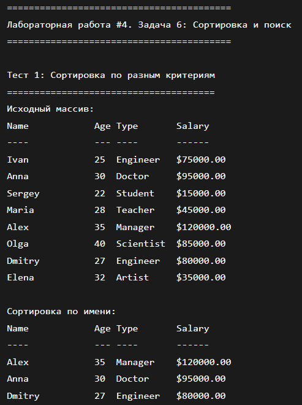
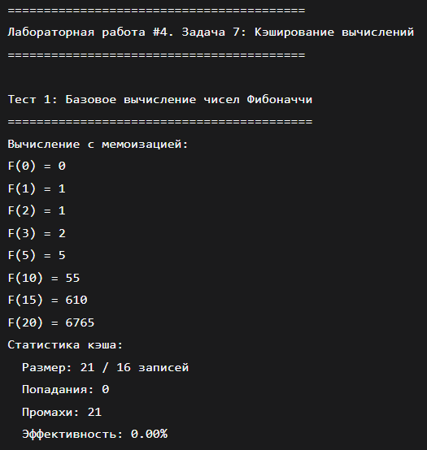
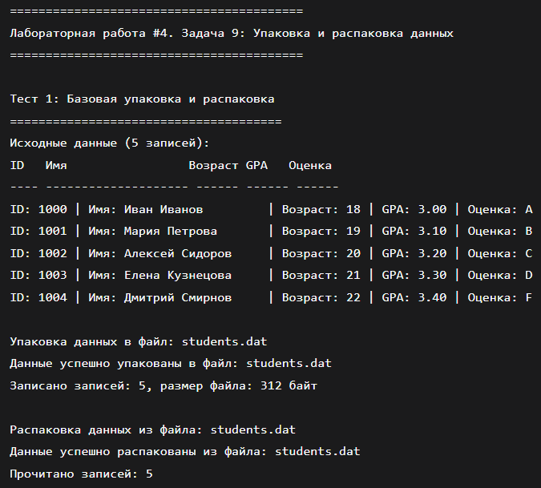

# Лабороторная работа № 
## Тема работы
Продвинутая работа с функциями в С

## Постановка задачи 1
### Операции с матрицами
* Реализовать функции для работы с матрицами (динамическими и с VLA).
* Операции: транспонирование, сложение, умножение. 
* Возвращать результат в виде новой матрицы. 
* Использовать GSL для проверки корректности операций
## Математическая модель
#### VLA (Variable Length Arrays)
Матрица хранится в одномерном массиве:
data\[i×n+j]=aij​,i=0..m−1, j=0..n−1
#### Проверка с GSL
Проверка:∥наша\_операция(A,B)−GSL\_операция(A,B)∥∞​<ε
## Список идентификаторов
|Имя переменной|	Тип данных	|Описание|
|-|-|---|
|DynamicMatrix|	struct	|Динамическая матрица|
|VLAMatrix|	struct	|VLA матрица|
|rows|	int	|Количество строк|
|cols|	int	|Количество столбцов|
|data|	double**	|Данные динамической матрицы|
|data|	double* |Данные VLA матрицы|
|A, B, C|	Matrix*	|Указатели на матрицы|
|m|	Matrix*	|Вспомогательный указатель на матрицу|
|T|	Matrix*	|Транспонированная матрица|
|S|	Matrix*	|Сумма матриц|
|M|	Matrix*	|Произведение матриц|
|i, j, k|	int	|Индексы циклов|
|val|	double	|Текущее значение для заполнения|
|sum|	double	|Сумма элементов при умножении|
|eps|	double	|Точность сравнения|
|temp|	double*	|Временный массив для транспонирования|
|gsl_mat|	gsl_matrix*	|Указатель на GSL матрицу|
|gsl_res|	gsl_matrix*	|Результат GSL операции|
|gsl_a, gsl_b|	gsl_matrix*	|GSL матрицы для проверки|
|result|	int	|Результат проверки (0/1)|
## Код программы
```c
#ifndef MATRIX_H
#define MATRIX_H

#include <stdlib.h>

// Динамическая матрица (двойной указатель)
typedef struct {
    double** data;
    int rows;
    int cols;
} DynamicMatrix;

// VLA матрица (плоский массив)
typedef struct {
    double* data;
    int rows;
    int cols;
} VLAMatrix;

// Создание/удаление
DynamicMatrix* create_dynamic_matrix(int rows, int cols);
void free_dynamic_matrix(DynamicMatrix* m);
VLAMatrix* create_vla_matrix(int rows, int cols);
void free_vla_matrix(VLAMatrix* m);

// Операции с динамическими матрицами
DynamicMatrix* transpose_dynamic(const DynamicMatrix* m);
DynamicMatrix* add_dynamic(const DynamicMatrix* a, const DynamicMatrix* b);
DynamicMatrix* multiply_dynamic(const DynamicMatrix* a, const DynamicMatrix* b);

// Операции с VLA матрицами
void transpose_vla(VLAMatrix* m);  // на месте
VLAMatrix* add_vla(const VLAMatrix* a, const VLAMatrix* b);
VLAMatrix* multiply_vla(const VLAMatrix* a, const VLAMatrix* b);

// Вспомогательные функции
void print_dynamic(const DynamicMatrix* m, const char* name);
void print_vla(const VLAMatrix* m, const char* name);

// Проверка с GSL (требует libgsl)
#ifdef USE_GSL
int check_addition_with_gsl(const DynamicMatrix* a, const DynamicMatrix* b);
int check_multiplication_with_gsl(const DynamicMatrix* a, const DynamicMatrix* b);
int check_transpose_with_gsl(const DynamicMatrix* m);
#endif

#endif
```
```c
#include "matrix.h"
#include <stdio.h>
#include <string.h>
#include <math.h>

// ================== ДИНАМИЧЕСКИЕ МАТРИЦЫ ==================

DynamicMatrix* create_dynamic_matrix(int rows, int cols) {
    DynamicMatrix* m = (DynamicMatrix*)malloc(sizeof(DynamicMatrix));
    m->rows = rows;
    m->cols = cols;
    m->data = (double**)malloc(rows * sizeof(double*));
    for (int i = 0; i < rows; i++) {
        m->data[i] = (double*)calloc(cols, sizeof(double));
    }
    return m;
}

void free_dynamic_matrix(DynamicMatrix* m) {
    if (!m) return;
    for (int i = 0; i < m->rows; i++) free(m->data[i]);
    free(m->data);
    free(m);
}

DynamicMatrix* transpose_dynamic(const DynamicMatrix* m) {
    DynamicMatrix* res = create_dynamic_matrix(m->cols, m->rows);
    for (int i = 0; i < m->rows; i++) {
        for (int j = 0; j < m->cols; j++) {
            res->data[j][i] = m->data[i][j];
        }
    }
    return res;
}

DynamicMatrix* add_dynamic(const DynamicMatrix* a, const DynamicMatrix* b) {
    if (a->rows != b->rows || a->cols != b->cols) {
        fprintf(stderr, "Ошибка: размеры матриц не совпадают для сложения\n");
        return NULL;
    }
    DynamicMatrix* res = create_dynamic_matrix(a->rows, a->cols);
    for (int i = 0; i < a->rows; i++) {
        for (int j = 0; j < a->cols; j++) {
            res->data[i][j] = a->data[i][j] + b->data[i][j];
        }
    }
    return res;
}

DynamicMatrix* multiply_dynamic(const DynamicMatrix* a, const DynamicMatrix* b) {
    if (a->cols != b->rows) {
        fprintf(stderr, "Ошибка: размеры матриц не совпадают для умножения\n");
        return NULL;
    }
    DynamicMatrix* res = create_dynamic_matrix(a->rows, b->cols);
    for (int i = 0; i < a->rows; i++) {
        for (int j = 0; j < b->cols; j++) {
            double sum = 0.0;
            for (int k = 0; k < a->cols; k++) {
                sum += a->data[i][k] * b->data[k][j];
            }
            res->data[i][j] = sum;
        }
    }
    return res;
}

// ================== VLA МАТРИЦЫ ==================

VLAMatrix* create_vla_matrix(int rows, int cols) {
    VLAMatrix* m = (VLAMatrix*)malloc(sizeof(VLAMatrix));
    m->rows = rows;
    m->cols = cols;
    m->data = (double*)calloc(rows * cols, sizeof(double));
    return m;
}

void free_vla_matrix(VLAMatrix* m) {
    if (!m) return;
    free(m->data);
    free(m);
}

// Доступ к элементам VLA матрицы
static inline double* vla_elem(VLAMatrix* m, int i, int j) {
    return &m->data[i * m->cols + j];
}

static inline const double* vla_elem_const(const VLAMatrix* m, int i, int j) {
    return &m->data[i * m->cols + j];
}

void transpose_vla(VLAMatrix* m) {
    // Создаем копию данных
    double* temp = (double*)malloc(m->rows * m->cols * sizeof(double));
    memcpy(temp, m->data, m->rows * m->cols * sizeof(double));
    
    // Транспонируем
    for (int i = 0; i < m->rows; i++) {
        for (int j = 0; j < m->cols; j++) {
            *vla_elem(m, j, i) = temp[i * m->cols + j];
        }
    }
    
    // Меняем размеры
    int tmp = m->rows;
    m->rows = m->cols;
    m->cols = tmp;
    
    free(temp);
}

VLAMatrix* add_vla(const VLAMatrix* a, const VLAMatrix* b) {
    if (a->rows != b->rows || a->cols != b->cols) {
        fprintf(stderr, "Ошибка: размеры VLA матриц не совпадают для сложения\n");
        return NULL;
    }
    VLAMatrix* res = create_vla_matrix(a->rows, a->cols);
    for (int i = 0; i < a->rows; i++) {
        for (int j = 0; j < a->cols; j++) {
            *vla_elem(res, i, j) = *vla_elem_const(a, i, j) + *vla_elem_const(b, i, j);
        }
    }
    return res;
}

VLAMatrix* multiply_vla(const VLAMatrix* a, const VLAMatrix* b) {
    if (a->cols != b->rows) {
        fprintf(stderr, "Ошибка: размеры VLA матриц не совпадают для умножения\n");
        return NULL;
    }
    VLAMatrix* res = create_vla_matrix(a->rows, b->cols);
    for (int i = 0; i < a->rows; i++) {
        for (int j = 0; j < b->cols; j++) {
            double sum = 0.0;
            for (int k = 0; k < a->cols; k++) {
                sum += *vla_elem_const(a, i, k) * *vla_elem_const(b, k, j);
            }
            *vla_elem(res, i, j) = sum;
        }
    }
    return res;
}

// ================== ВСПОМОГАТЕЛЬНЫЕ ФУНКЦИИ ==================

void print_dynamic(const DynamicMatrix* m, const char* name) {
    printf("%s (%dx%d):\n", name, m->rows, m->cols);
    for (int i = 0; i < m->rows; i++) {
        for (int j = 0; j < m->cols; j++) {
            printf("%8.3f", m->data[i][j]);
        }
        printf("\n");
    }
}

void print_vla(const VLAMatrix* m, const char* name) {
    printf("%s VLA (%dx%d):\n", name, m->rows, m->cols);
    for (int i = 0; i < m->rows; i++) {
        for (int j = 0; j < m->cols; j++) {
            printf("%8.3f", *vla_elem_const(m, i, j));
        }
        printf("\n");
    }
}
```
```c
#include "matrix.h"

#ifdef USE_GSL
#include <gsl/gsl_matrix.h>
#include <gsl/gsl_blas.h>

// Конвертация DynamicMatrix -> gsl_matrix
static gsl_matrix* dynamic_to_gsl(const DynamicMatrix* m) {
    gsl_matrix* gsl_mat = gsl_matrix_alloc(m->rows, m->cols);
    for (int i = 0; i < m->rows; i++) {
        for (int j = 0; j < m->cols; j++) {
            gsl_matrix_set(gsl_mat, i, j, m->data[i][j]);
        }
    }
    return gsl_mat;
}

// Сравнение матриц
static int compare_matrices(const DynamicMatrix* a, const gsl_matrix* b, double eps) {
    if (a->rows != (int)b->size1 || a->cols != (int)b->size2) return 0;
    for (int i = 0; i < a->rows; i++) {
        for (int j = 0; j < a->cols; j++) {
            if (fabs(a->data[i][j] - gsl_matrix_get(b, i, j)) > eps) return 0;
        }
    }
    return 1;
}

// Проверка сложения
int check_addition_with_gsl(const DynamicMatrix* a, const DynamicMatrix* b) {
    gsl_matrix* gsl_a = dynamic_to_gsl(a);
    gsl_matrix* gsl_b = dynamic_to_gsl(b);
    gsl_matrix* gsl_res = gsl_matrix_alloc(a->rows, a->cols);
    
    gsl_matrix_memcpy(gsl_res, gsl_a);
    gsl_matrix_add(gsl_res, gsl_b);
    
    DynamicMatrix* our_res = add_dynamic(a, b);
    int result = compare_matrices(our_res, gsl_res, 1e-10);
    
    free_dynamic_matrix(our_res);
    gsl_matrix_free(gsl_a);
    gsl_matrix_free(gsl_b);
    gsl_matrix_free(gsl_res);
    
    return result;
}

// Проверка умножения
int check_multiplication_with_gsl(const DynamicMatrix* a, const DynamicMatrix* b) {
    gsl_matrix* gsl_a = dynamic_to_gsl(a);
    gsl_matrix* gsl_b = dynamic_to_gsl(b);
    gsl_matrix* gsl_res = gsl_matrix_alloc(a->rows, b->cols);
    
    gsl_blas_dgemm(CblasNoTrans, CblasNoTrans, 1.0, gsl_a, gsl_b, 0.0, gsl_res);
    
    DynamicMatrix* our_res = multiply_dynamic(a, b);
    int result = compare_matrices(our_res, gsl_res, 1e-10);
    
    free_dynamic_matrix(our_res);
    gsl_matrix_free(gsl_a);
    gsl_matrix_free(gsl_b);
    gsl_matrix_free(gsl_res);
    
    return result;
}

// Проверка транспонирования
int check_transpose_with_gsl(const DynamicMatrix* m) {
    gsl_matrix* gsl_mat = dynamic_to_gsl(m);
    gsl_matrix* gsl_trans = gsl_matrix_alloc(m->cols, m->rows);
    
    gsl_matrix_transpose_memcpy(gsl_trans, gsl_mat);
    
    DynamicMatrix* our_trans = transpose_dynamic(m);
    int result = compare_matrices(our_trans, gsl_trans, 1e-10);
    
    free_dynamic_matrix(our_trans);
    gsl_matrix_free(gsl_mat);
    gsl_matrix_free(gsl_trans);
    
    return result;
}
#endif
```
```c
#include "matrix.h"
#include <stdio.h>
#include <stdlib.h>
#include <time.h>

// Заполнение матрицы случайными значениями
void fill_random_dynamic(DynamicMatrix* m) {
    for (int i = 0; i < m->rows; i++) {
        for (int j = 0; j < m->cols; j++) {
            m->data[i][j] = (double)rand() / RAND_MAX * 10.0 - 5.0;
        }
    }
}

void fill_random_vla(VLAMatrix* m) {
    for (int i = 0; i < m->rows * m->cols; i++) {
        m->data[i] = (double)rand() / RAND_MAX * 10.0 - 5.0;
    }
}

int main() {
    printf("===========================================\n");
    printf("Лабораторная работа #4. Задача 1: Матрицы\n");
    printf("===========================================\n\n");
    
    srand(time(NULL));
    
    // ========== ТЕСТ ДИНАМИЧЕСКИХ МАТРИЦ ==========
    printf("1. ТЕСТ ДИНАМИЧЕСКИХ МАТРИЦ\n");
    printf("=============================\n");
    
    DynamicMatrix* A = create_dynamic_matrix(2, 3);
    DynamicMatrix* B = create_dynamic_matrix(2, 3);
    DynamicMatrix* C = create_dynamic_matrix(3, 2);
    
    // Заполнение значениями
    double val = 1.0;
    for (int i = 0; i < A->rows; i++) {
        for (int j = 0; j < A->cols; j++) {
            A->data[i][j] = val;
            B->data[i][j] = val * 2;
            val += 1.0;
        }
    }
    
    for (int i = 0; i < C->rows; i++) {
        for (int j = 0; j < C->cols; j++) {
            C->data[i][j] = i + j + 0.5;
        }
    }
    
    print_dynamic(A, "Матрица A");
    print_dynamic(B, "Матрица B");
    print_dynamic(C, "Матрица C");
    
    // Операции
    DynamicMatrix* T = transpose_dynamic(A);
    print_dynamic(T, "A транспонированная");
    
    DynamicMatrix* S = add_dynamic(A, B);
    if (S) {
        print_dynamic(S, "A + B");
        free_dynamic_matrix(S);
    }
    
    DynamicMatrix* M = multiply_dynamic(A, C);
    if (M) {
        print_dynamic(M, "A * C");
        free_dynamic_matrix(M);
    }
    
    free_dynamic_matrix(A);
    free_dynamic_matrix(B);
    free_dynamic_matrix(C);
    free_dynamic_matrix(T);
    
    // ========== ТЕСТ VLA МАТРИЦ ==========
    printf("\n2. ТЕСТ VLA МАТРИЦ\n");
    printf("===================\n");
    
    VLAMatrix* V1 = create_vla_matrix(3, 2);
    VLAMatrix* V2 = create_vla_matrix(3, 2);
    VLAMatrix* V3 = create_vla_matrix(2, 3);
    
    fill_random_vla(V1);
    fill_random_vla(V2);
    fill_random_vla(V3);
    
    print_vla(V1, "V1");
    print_vla(V2, "V2");
    
    VLAMatrix* Vsum = add_vla(V1, V2);
    if (Vsum) {
        print_vla(Vsum, "V1 + V2");
        free_vla_matrix(Vsum);
    }
    
    print_vla(V3, "V3");
    transpose_vla(V3);
    print_vla(V3, "V3 транспонированная");
    
    free_vla_matrix(V1);
    free_vla_matrix(V2);
    free_vla_matrix(V3);
    
    // ========== ПРОВЕРКА С GSL ==========
#ifdef USE_GSL
    printf("\n3. ПРОВЕРКА С GSL\n");
    printf("==================\n");
    
    DynamicMatrix* G1 = create_dynamic_matrix(3, 3);
    DynamicMatrix* G2 = create_dynamic_matrix(3, 3);
    
    fill_random_dynamic(G1);
    fill_random_dynamic(G2);
    
    if (check_addition_with_gsl(G1, G2)) {
        printf("✓ Сложение прошло проверку GSL\n");
    } else {
        printf("✗ Сложение не прошло проверку GSL\n");
    }
    
    if (check_multiplication_with_gsl(G1, G2)) {
        printf("✓ Умножение прошло проверку GSL\n");
    } else {
        printf("✗ Умножение не прошло проверку GSL\n");
    }
    
    if (check_transpose_with_gsl(G1)) {
        printf("✓ Транспонирование прошло проверку GSL\n");
    } else {
        printf("✗ Транспонирование не прошло проверку GSL\n");
    }
    
    free_dynamic_matrix(G1);
    free_dynamic_matrix(G2);
#else
    printf("\nGSL проверка отключена (скомпилируйте с -DUSE_GSL)\n");
#endif
    
    printf("\n===========================================\n");
    printf("Все тесты завершены\n");
    
    return 0;
}
```
```c
CC = gcc
CFLAGS = -Wall -Wextra -O2 -std=c99
GSL_FLAGS = -DUSE_GSL -lgsl -lgslcblas -lm

TARGET = matrix_lab
SRC = main.c matrix.c gsl_check.c
OBJ = $(SRC:.c=.o)

all: $(TARGET)

# Версия с GSL
with_gsl: CFLAGS += $(GSL_FLAGS)
with_gsl: $(TARGET)

# Версия без GSL
no_gsl: CFLAGS += -lm
no_gsl: $(TARGET)

$(TARGET): $(OBJ)
	$(CC) $(CFLAGS) -o $@ $^

%.o: %.c matrix.h
	$(CC) $(CFLAGS) -c $< -o $@

clean:
	rm -f $(OBJ) $(TARGET)

run: with_gsl
	./$(TARGET)

.PHONY: all clean run with_gsl no_gsl
```
## Пример результата выполнения


## Постановка задачи 2
### Упрощённый парсер JSON
* Написать функции для парсинга JSON-строки, представляющей набор параметров в формате ключ-значение
* Входные данные: JSON-строка.
* Выходные данные: структура, содержащая массивы ключей и значений.
* Использовать библиотеку cJSON для работы с JSON.

## Список идентификаторов
|Имя переменной|Тип данных|Описание|
|-|-|---|
|JSONValueType|	enum	|Тип значения JSON (строка/число)|
|ParsedJSON|	struct	|Структура распарсенного JSON|
|keys|	char**	|Массив ключей|
|values|	char**	|Массив значений (все как строки)|
|types|	JSONValueType*	|Массив типов значений|
|count|	int	|Количество пар ключ-значение|
|json_str|	const char*	|Входная JSON строка|
|root|	cJSON*	|Корневой объект cJSON|
|item|	cJSON*	|Текущий элемент cJSON|
|key|	char*	|Текущий ключ|
|val_str|	char*	|Строковое значение|
|val_num|	double	|Числовое значение|
|i|	int	|Индекс|
|parsed|	ParsedJSON*	|Результат парсинга|
|buffer|	char[32]	|Буфер для чисел|
|result|	ParsedJSON*	|Возвращаемый результат|
## Код программы
```c
#ifndef JSON_PARSER_H
#define JSON_PARSER_H

#include <cjson/cJSON.h>

// Тип значения JSON
typedef enum {
    JSON_STRING,
    JSON_NUMBER
} JSONValueType;

// Структура для хранения распарсенного JSON
typedef struct {
    char** keys;           // Массив ключей
    char** values;         // Массив значений (все как строки)
    JSONValueType* types;  // Типы значений
    int count;             // Количество пар
} ParsedJSON;

// Основные функции
ParsedJSON* parse_json(const char* json_str);
void free_parsed_json(ParsedJSON* parsed);
void print_parsed_json(const ParsedJSON* parsed);

#endif
```
```c
#include "json_parser.h"
#include <stdio.h>
#include <stdlib.h>
#include <string.h>

// Парсинг JSON строки
ParsedJSON* parse_json(const char* json_str) {
    if (!json_str) return NULL;
    
    // Парсим JSON с помощью cJSON
    cJSON* root = cJSON_Parse(json_str);
    if (!root) {
        fprintf(stderr, "Ошибка парсинга JSON: %s\n", cJSON_GetErrorPtr());
        return NULL;
    }
    
    if (!cJSON_IsObject(root)) {
        fprintf(stderr, "JSON не является объектом\n");
        cJSON_Delete(root);
        return NULL;
    }
    
    // Подсчитываем количество элементов
    int count = 0;
    cJSON* item = NULL;
    cJSON_ArrayForEach(item, root) {
        count++;
    }
    
    // Выделяем память
    ParsedJSON* parsed = (ParsedJSON*)malloc(sizeof(ParsedJSON));
    if (!parsed) {
        cJSON_Delete(root);
        return NULL;
    }
    
    parsed->keys = (char**)malloc(count * sizeof(char*));
    parsed->values = (char**)malloc(count * sizeof(char*));
    parsed->types = (JSONValueType*)malloc(count * sizeof(JSONValueType));
    parsed->count = count;
    
    if (!parsed->keys || !parsed->values || !parsed->types) {
        free(parsed->keys);
        free(parsed->values);
        free(parsed->types);
        free(parsed);
        cJSON_Delete(root);
        return NULL;
    }
    
    // Извлекаем данные
    int i = 0;
    cJSON_ArrayForEach(item, root) {
        // Ключ
        const char* key = item->string;
        parsed->keys[i] = strdup(key);
        
        // Значение
        if (cJSON_IsString(item)) {
            parsed->values[i] = strdup(item->valuestring);
            parsed->types[i] = JSON_STRING;
        }
        else if (cJSON_IsNumber(item)) {
            // Преобразуем число в строку
            char buffer[32];
            snprintf(buffer, sizeof(buffer), "%.6f", item->valuedouble);
            parsed->values[i] = strdup(buffer);
            parsed->types[i] = JSON_NUMBER;
        }
        else {
            // Для других типов используем строковое представление
            char* str = cJSON_Print(item);
            parsed->values[i] = strdup(str);
            parsed->types[i] = JSON_STRING;
            free(str);
        }
        
        i++;
    }
    
    cJSON_Delete(root);
    return parsed;
}

// Освобождение памяти
void free_parsed_json(ParsedJSON* parsed) {
    if (!parsed) return;
    
    for (int i = 0; i < parsed->count; i++) {
        free(parsed->keys[i]);
        free(parsed->values[i]);
    }
    
    free(parsed->keys);
    free(parsed->values);
    free(parsed->types);
    free(parsed);
}

// Вывод результата
void print_parsed_json(const ParsedJSON* parsed) {
    if (!parsed) {
        printf("Нет данных\n");
        return;
    }
    
    printf("Распарсено пар: %d\n", parsed->count);
    printf("%-20s %-10s %-30s\n", "Ключ", "Тип", "Значение");
    printf("%-20s %-10s %-30s\n", "----", "---", "--------");
    
    for (int i = 0; i < parsed->count; i++) {
        const char* type_str = (parsed->types[i] == JSON_STRING) ? "строка" : "число";
        printf("%-20s %-10s %-30s\n", 
               parsed->keys[i], 
               type_str, 
               parsed->values[i]);
    }
}
```
```c
#include "json_parser.h"
#include <stdio.h>

int main() {
    printf("=========================================\n");
    printf("Лабораторная работа #4. Задача 2: JSON парсер\n");
    printf("=========================================\n\n");
    
    // Пример JSON строк
    const char* json1 = "{ \"name\": \"Иван\", \"age\": 25, \"score\": 95.5, \"city\": \"Москва\" }";
    const char* json2 = "{ \"product\": \"Ноутбук\", \"price\": 899.99, \"in_stock\": true, \"quantity\": 15 }";
    const char* json3 = "{ \"ключ1\": \"значение1\", \"ключ2\": 42.3, \"ключ3\": \"тест\" }";
    
    printf("Тест 1: Простые данные\n");
    printf("JSON: %s\n\n", json1);
    
    ParsedJSON* result1 = parse_json(json1);
    if (result1) {
        print_parsed_json(result1);
        free_parsed_json(result1);
    }
    
    printf("\n\nТест 2: Товар\n");
    printf("JSON: %s\n\n", json2);
    
    ParsedJSON* result2 = parse_json(json2);
    if (result2) {
        print_parsed_json(result2);
        free_parsed_json(result2);
    }
    
    printf("\n\nТест 3: Кириллица\n");
    printf("JSON: %s\n\n", json3);
    
    ParsedJSON* result3 = parse_json(json3);
    if (result3) {
        print_parsed_json(result3);
        free_parsed_json(result3);
    }
    
    // Тест с ошибкой
    printf("\n\nТест 4: Ошибочный JSON\n");
    const char* bad_json = "{ некорректный json }";
    ParsedJSON* bad_result = parse_json(bad_json);
    if (!bad_result) {
        printf("✓ Ошибка корректно обработана\n");
    }
    
    printf("\n=========================================\n");
    printf("Все тесты завершены\n");
    
    return 0;
}
```
```c
CC = gcc
CFLAGS = -Wall -Wextra -std=c99
LIBS = -lcjson

TARGET = json_parser
SRC = main.c json_parser.c
OBJ = $(SRC:.c=.o)

all: $(TARGET)

$(TARGET): $(OBJ)
	$(CC) $(CFLAGS) -o $@ $^ $(LIBS)

%.o: %.c json_parser.h
	$(CC) $(CFLAGS) -c $< -o $@

clean:
	rm -f $(OBJ) $(TARGET)

run: $(TARGET)
	./$(TARGET)

.PHONY: all clean run
```
## Пример результата выполнения


## Постановка задачи 3
### Решение систем линейных уравнений
* Реализовать функцию для решения систем линейных уравнений методом Гаусса.
* Параметры: массив коэффициентов и массив свободных членов.
* Возвращать массив решений.
* Поддержка работы с VLA и динамическими массивами

## Список идентификаторов
|Имя переменной|Тип данных|Описание|
|-|-|---|
|n|	int	|Размер системы уравнений|
|A|	double**	|Матрица коэффициентов|
|B|	double*	|Вектор свободных членов|
|X|	double*	|Вектор решений|
|i, j, k|	int	|Индексы циклов|
|max|	int	|Индекс максимального элемента|
|temp|	double	|Временная переменная для обмена|
|coef|	double	|Коэффициент для исключения|
|sum|	double	|Сумма для обратной подстановки|
|augmented|	double**	|Расширенная матрица|
|eps|	double	|Точность сравнения с нулем|
|vla_A|	double[n][n]	|VLA матрица коэффициентов|
|vla_B|	double[n]	|VLA вектор свободных членов|
|vla_X|	double[n]	|VLA вектор решений|
|solution|	double*	|Результат решения|
|success|	int	|Флаг успешного решения|
## Код программы
```c
#ifndef GAUSS_SOLVER_H
#define GAUSS_SOLVER_H

#include <stdlib.h>

// Решение СЛАУ методом Гаусса с динамическими массивами
double* solve_gauss_dynamic(double** A, double* B, int n, int* success);

// Решение СЛАУ методом Гаусса с VLA
double* solve_gauss_vla(int n, double A[n][n], double B[n], int* success);

// Вспомогательные функции
void print_matrix(double** A, double* B, int n);
void print_solution(double* X, int n);
double** create_matrix(int n);
void free_matrix(double** A, int n);
double* create_vector(int n);

#endif
```
```c
#include "gauss_solver.h"
#include <stdio.h>
#include <math.h>
#include <stdlib.h>
#include <string.h>

#define EPSILON 1e-10  // Точность для сравнения с нулем

// Создание квадратной матрицы n x n
double** create_matrix(int n) {
    double** A = (double**)malloc(n * sizeof(double*));
    for (int i = 0; i < n; i++) {
        A[i] = (double*)calloc(n, sizeof(double));
    }
    return A;
}

// Освобождение памяти матрицы
void free_matrix(double** A, int n) {
    for (int i = 0; i < n; i++) {
        free(A[i]);
    }
    free(A);
}

// Создание вектора
double* create_vector(int n) {
    return (double*)calloc(n, sizeof(double));
}

// Решение СЛАУ методом Гаусса (динамические массивы)
double* solve_gauss_dynamic(double** A, double* B, int n, int* success) {
    if (success) *success = 0;
    
    if (n <= 0 || !A || !B) {
        return NULL;
    }
    
    // Создаем расширенную матрицу [A|B]
    double** augmented = create_matrix(n);
    for (int i = 0; i < n; i++) {
        for (int j = 0; j < n; j++) {
            augmented[i][j] = A[i][j];
        }
    }
    
    double* X = create_vector(n);
    double* temp_B = create_vector(n);
    memcpy(temp_B, B, n * sizeof(double));
    
    // Прямой ход метода Гаусса
    for (int i = 0; i < n; i++) {
        // Поиск максимального элемента в столбце i
        int max = i;
        for (int k = i + 1; k < n; k++) {
            if (fabs(augmented[k][i]) > fabs(augmented[max][i])) {
                max = k;
            }
        }
        
        // Если максимальный элемент близок к нулю - система вырождена
        if (fabs(augmented[max][i]) < EPSILON) {
            free_matrix(augmented, n);
            free(X);
            free(temp_B);
            return NULL;
        }
        
        // Обмен строк i и max
        if (max != i) {
            double* temp_row = augmented[i];
            augmented[i] = augmented[max];
            augmented[max] = temp_row;
            
            double temp_val = temp_B[i];
            temp_B[i] = temp_B[max];
            temp_B[max] = temp_val;
        }
        
        // Нормализация i-й строки
        double diag = augmented[i][i];
        for (int j = i; j < n; j++) {
            augmented[i][j] /= diag;
        }
        temp_B[i] /= diag;
        
        // Исключение переменной i из последующих уравнений
        for (int k = i + 1; k < n; k++) {
            double coef = augmented[k][i];
            if (fabs(coef) > EPSILON) {
                for (int j = i; j < n; j++) {
                    augmented[k][j] -= coef * augmented[i][j];
                }
                temp_B[k] -= coef * temp_B[i];
            }
        }
    }
    
    // Обратная подстановка
    for (int i = n - 1; i >= 0; i--) {
        X[i] = temp_B[i];
        for (int j = i + 1; j < n; j++) {
            X[i] -= augmented[i][j] * X[j];
        }
    }
    
    // Проверка решения
    int valid = 1;
    for (int i = 0; i < n && valid; i++) {
        double sum = 0.0;
        for (int j = 0; j < n; j++) {
            sum += A[i][j] * X[j];
        }
        if (fabs(sum - B[i]) > EPSILON * 10) {
            valid = 0;
        }
    }
    
    if (success) *success = valid;
    
    free_matrix(augmented, n);
    free(temp_B);
    
    return X;
}

// Решение СЛАУ методом Гаусса (VLA массивы)
double* solve_gauss_vla(int n, double A[n][n], double B[n], int* success) {
    if (success) *success = 0;
    
    // Преобразуем VLA в динамические массивы для использования общей функции
    double** dynamic_A = create_matrix(n);
    double* dynamic_B = create_vector(n);
    
    for (int i = 0; i < n; i++) {
        dynamic_B[i] = B[i];
        for (int j = 0; j < n; j++) {
            dynamic_A[i][j] = A[i][j];
        }
    }
    
    double* solution = solve_gauss_dynamic(dynamic_A, dynamic_B, n, success);
    
    free_matrix(dynamic_A, n);
    free(dynamic_B);
    
    return solution;
}

// Вывод матрицы и вектора
void print_matrix(double** A, double* B, int n) {
    printf("Система уравнений:\n");
    for (int i = 0; i < n; i++) {
        printf("Уравнение %d: ", i + 1);
        for (int j = 0; j < n; j++) {
            printf("%+.2f*x%d ", A[i][j], j + 1);
            if (j < n - 1) printf("+ ");
        }
        printf("= %.2f\n", B[i]);
    }
}

// Вывод решения
void print_solution(double* X, int n) {
    printf("Решение:\n");
    for (int i = 0; i < n; i++) {
        printf("x%d = %.6f\n", i + 1, X[i]);
    }
}
```
```c
#include "gauss_solver.h"
#include <stdio.h>
#include <stdlib.h>

// Тест 1: Простая система 3x3
void test_simple_system() {
    printf("Тест 1: Простая система 3x3\n");
    printf("============================\n");
    
    int n = 3;
    
    // Динамические массивы
    double** A = create_matrix(n);
    double* B = create_vector(n);
    
    // Система:
    // 2x + y - z = 8
    // -3x - y + 2z = -11
    // -2x + y + 2z = -3
    A[0][0] = 2.0; A[0][1] = 1.0; A[0][2] = -1.0; B[0] = 8.0;
    A[1][0] = -3.0; A[1][1] = -1.0; A[1][2] = 2.0; B[1] = -11.0;
    A[2][0] = -2.0; A[2][1] = 1.0; A[2][2] = 2.0; B[2] = -3.0;
    
    print_matrix(A, B, n);
    
    int success = 0;
    double* X = solve_gauss_dynamic(A, B, n, &success);
    
    if (success && X) {
        print_solution(X, n);
    } else {
        printf("Система не имеет решения или матрица вырождена\n");
    }
    
    free_matrix(A, n);
    free(B);
    free(X);
    printf("\n");
}

// Тест 2: Система с VLA
void test_vla_system() {
    printf("Тест 2: Система 2x2 с VLA\n");
    printf("==========================\n");
    
    const int n = 2;
    
    // VLA массивы
    double A[n][n];
    double B[n];
    
    // Система:
    // 3x + 2y = 7
    // 2x - y = 0
    A[0][0] = 3.0; A[0][1] = 2.0; B[0] = 7.0;
    A[1][0] = 2.0; A[1][1] = -1.0; B[1] = 0.0;
    
    printf("Система уравнений:\n");
    printf("Уравнение 1: %.2f*x1 + %.2f*x2 = %.2f\n", A[0][0], A[0][1], B[0]);
    printf("Уравнение 2: %.2f*x1 + %.2f*x2 = %.2f\n", A[1][0], A[1][1], B[1]);
    
    int success = 0;
    double* X = solve_gauss_vla(n, A, B, &success);
    
    if (success && X) {
        print_solution(X, n);
    } else {
        printf("Система не имеет решения или матрица вырождена\n");
    }
    
    free(X);
    printf("\n");
}

// Тест 3: Система 4x4
void test_4x4_system() {
    printf("Тест 3: Система 4x4\n");
    printf("===================\n");
    
    int n = 4;
    
    double** A = create_matrix(n);
    double* B = create_vector(n);
    
    // Пример системы 4x4
    A[0][0] = 1.0; A[0][1] = 2.0; A[0][2] = 1.0; A[0][3] = 3.0; B[0] = 8.0;
    A[1][0] = 2.0; A[1][1] = -1.0; A[1][2] = 1.0; A[1][3] = -1.0; B[1] = 3.0;
    A[2][0] = 3.0; A[2][1] = 1.0; A[2][2] = -1.0; A[2][3] = 2.0; B[2] = 5.0;
    A[3][0] = -1.0; A[3][1] = 2.0; A[3][2] = 2.0; A[3][3] = 1.0; B[3] = 3.0;
    
    print_matrix(A, B, n);
    
    int success = 0;
    double* X = solve_gauss_dynamic(A, B, n, &success);
    
    if (success && X) {
        print_solution(X, n);
    } else {
        printf("Система не имеет решения или матрица вырождена\n");
    }
    
    free_matrix(A, n);
    free(B);
    free(X);
    printf("\n");
}

// Тест 4: Вырожденная система
void test_degenerate_system() {
    printf("Тест 4: Вырожденная система\n");
    printf("============================\n");
    
    int n = 3;
    
    double** A = create_matrix(n);
    double* B = create_vector(n);
    
    // Вырожденная система (третье уравнение - сумма первых двух)
    A[0][0] = 1.0; A[0][1] = 2.0; A[0][2] = 3.0; B[0] = 6.0;
    A[1][0] = 2.0; A[1][1] = 4.0; A[1][2] = 6.0; B[1] = 12.0;
    A[2][0] = 3.0; A[2][1] = 6.0; A[2][2] = 9.0; B[2] = 18.0;
    
    printf("Система уравнений (вырожденная):\n");
    for (int i = 0; i < n; i++) {
        printf("Уравнение %d: ", i + 1);
        for (int j = 0; j < n; j++) {
            printf("%+.2f*x%d ", A[i][j], j + 1);
        }
        printf("= %.2f\n", B[i]);
    }
    
    int success = 0;
    double* X = solve_gauss_dynamic(A, B, n, &success);
    
    if (success && X) {
        printf("Решение найдено:\n");
        print_solution(X, n);
    } else {
        printf("✓ Система вырождена, что корректно обнаружено\n");
    }
    
    free_matrix(A, n);
    free(B);
    if (X) free(X);
    printf("\n");
}

int main() {
    printf("=========================================\n");
    printf("Лабораторная работа #4. Задача 3: Метод Гаусса\n");
    printf("=========================================\n\n");
    
    test_simple_system();
    test_vla_system();
    test_4x4_system();
    test_degenerate_system();
    
    printf("=========================================\n");
    printf("Все тесты завершены\n");
    printf("=========================================\n");
    
    return 0;
}
```
```c
CC = gcc
CFLAGS = -Wall -Wextra -std=c99 -lm
TARGET = gauss_solver
SRC = main.c gauss_solver.c
OBJ = $(SRC:.c=.o)

all: $(TARGET)

$(TARGET): $(OBJ)
	$(CC) $(CFLAGS) -o $@ $^ -lm

%.o: %.c gauss_solver.h
	$(CC) $(CFLAGS) -c $< -o $@

clean:
	rm -f $(OBJ) $(TARGET)

run: $(TARGET)
	./$(TARGET)

.PHONY: all clean run
```
## Пример результата выполнения


## Постановка задачи 4
### Работа с деревьями
* Реализовать функции для создания, обхода (in-order, pre-order, post-order) и поиска в бинарном дереве поиска.
* Параметры: указатель на корень дерева и целочисленный ключ для поиска.
* Возвращать найденный узел (структура).
* Использовать qsort для балансировки дерева при инициализации.

## Список идентификаторов
|Имя переменной|Тип данных|Описание|
|-|-|---|
|TreeNode|	struct	|Узел бинарного дерева|
|key|	int	|Ключ узла|
|left|	TreeNode*	|Указатель на левое поддерево|
|right|	TreeNode*	|Указатель на правое поддерево|
|root|	TreeNode*	|Корень дерева|
|current|	TreeNode*	|Текущий узел при обходе|
|array|	int*	|Массив ключей для балансировки|
|index|	int	|Индекс в массиве|
|size|	int	|Размер массива|
|count|	int	|Счетчик узлов|
|search_key|	int	|Ключ для поиска|
|found|	TreeNode*	|Найденный узел|
|compare|	функция	|Функция сравнения для qsort|
|values|	int[]	|Массив значений для инициализации|
|i|	int	|Индекс цикла|
|node|	TreeNode*	|Временный указатель на узел|
|new_node|	TreeNode*	|Новый созданный узел|
## Код программы
```c
#ifndef BST_H
#define BST_H

#include <stdlib.h>

// Структура узла бинарного дерева поиска
typedef struct TreeNode {
    int key;
    struct TreeNode* left;
    struct TreeNode* right;
} TreeNode;

// Создание нового узла
TreeNode* create_node(int key);

// Вставка ключа в дерево
TreeNode* insert(TreeNode* root, int key);

// Поиск ключа в дереве
TreeNode* search(TreeNode* root, int key);

// Обходы дерева
void inorder_traversal(TreeNode* root);
void preorder_traversal(TreeNode* root);
void postorder_traversal(TreeNode* root);

// Балансировка дерева
TreeNode* balance_tree(int* array, int start, int end);
TreeNode* create_balanced_tree(int* values, int size);

// Освобождение памяти
void free_tree(TreeNode* root);

// Вспомогательные функции
void store_inorder(TreeNode* root, int* array, int* index);
int count_nodes(TreeNode* root);
void print_tree(TreeNode* root, int level);

#endif
```
```c
#include "bst.h"
#include <stdio.h>
#include <stdlib.h>
#include <string.h>

// Функция сравнения для qsort
int compare_ints(const void* a, const void* b) {
    return (*(int*)a - *(int*)b);
}

// Создание нового узла
TreeNode* create_node(int key) {
    TreeNode* node = (TreeNode*)malloc(sizeof(TreeNode));
    if (node) {
        node->key = key;
        node->left = NULL;
        node->right = NULL;
    }
    return node;
}

// Вставка ключа в дерево
TreeNode* insert(TreeNode* root, int key) {
    if (root == NULL) {
        return create_node(key);
    }
    
    if (key < root->key) {
        root->left = insert(root->left, key);
    } else if (key > root->key) {
        root->right = insert(root->right, key);
    }
    
    return root;
}

// Поиск ключа в дереве
TreeNode* search(TreeNode* root, int key) {
    if (root == NULL || root->key == key) {
        return root;
    }
    
    if (key < root->key) {
        return search(root->left, key);
    } else {
        return search(root->right, key);
    }
}

// In-order обход (левое поддерево -> корень -> правое поддерево)
void inorder_traversal(TreeNode* root) {
    if (root != NULL) {
        inorder_traversal(root->left);
        printf("%d ", root->key);
        inorder_traversal(root->right);
    }
}

// Pre-order обход (корень -> левое поддерево -> правое поддерево)
void preorder_traversal(TreeNode* root) {
    if (root != NULL) {
        printf("%d ", root->key);
        preorder_traversal(root->left);
        preorder_traversal(root->right);
    }
}

// Post-order обход (левое поддерево -> правое поддерево -> корень)
void postorder_traversal(TreeNode* root) {
    if (root != NULL) {
        postorder_traversal(root->left);
        postorder_traversal(root->right);
        printf("%d ", root->key);
    }
}

// Сохранение ключей в массив в порядке in-order
void store_inorder(TreeNode* root, int* array, int* index) {
    if (root == NULL) return;
    
    store_inorder(root->left, array, index);
    array[(*index)++] = root->key;
    store_inorder(root->right, array, index);
}

// Подсчет количества узлов
int count_nodes(TreeNode* root) {
    if (root == NULL) return 0;
    return 1 + count_nodes(root->left) + count_nodes(root->right);
}

// Создание сбалансированного дерева из отсортированного массива
TreeNode* balance_tree(int* array, int start, int end) {
    if (start > end) return NULL;
    
    int mid = (start + end) / 2;
    TreeNode* root = create_node(array[mid]);
    
    root->left = balance_tree(array, start, mid - 1);
    root->right = balance_tree(array, mid + 1, end);
    
    return root;
}

// Создание сбалансированного дерева из массива значений
TreeNode* create_balanced_tree(int* values, int size) {
    if (size <= 0 || values == NULL) return NULL;
    
    // Сортируем массив с помощью qsort
    int* sorted = (int*)malloc(size * sizeof(int));
    memcpy(sorted, values, size * sizeof(int));
    qsort(sorted, size, sizeof(int), compare_ints);
    
    // Создаем сбалансированное дерево
    TreeNode* root = balance_tree(sorted, 0, size - 1);
    
    free(sorted);
    return root;
}

// Освобождение памяти дерева
void free_tree(TreeNode* root) {
    if (root != NULL) {
        free_tree(root->left);
        free_tree(root->right);
        free(root);
    }
}

// Визуализация дерева (дополнительная функция)
void print_tree(TreeNode* root, int level) {
    if (root == NULL) return;
    
    print_tree(root->right, level + 1);
    
    for (int i = 0; i < level; i++) {
        printf("    ");
    }
    printf("%d\n", root->key);
    
    print_tree(root->left, level + 1);
}
```
```c
#include "bst.h"
#include <stdio.h>
#include <stdlib.h>
#include <time.h>

// Тест 1: Создание, вставка и поиск
void test_basic_operations() {
    printf("Тест 1: Базовые операции с деревом\n");
    printf("===================================\n");
    
    TreeNode* root = NULL;
    
    // Вставляем ключи в произвольном порядке
    int keys[] = {50, 30, 70, 20, 40, 60, 80};
    int size = sizeof(keys) / sizeof(keys[0]);
    
    for (int i = 0; i < size; i++) {
        root = insert(root, keys[i]);
    }
    
    printf("Дерево (визуализация):\n");
    print_tree(root, 0);
    printf("\n");
    
    printf("In-order обход: ");
    inorder_traversal(root);
    printf("\n");
    
    printf("Pre-order обход: ");
    preorder_traversal(root);
    printf("\n");
    
    printf("Post-order обход: ");
    postorder_traversal(root);
    printf("\n\n");
    
    // Поиск элементов
    int search_keys[] = {30, 45, 70, 100};
    for (int i = 0; i < sizeof(search_keys)/sizeof(search_keys[0]); i++) {
        TreeNode* found = search(root, search_keys[i]);
        if (found) {
            printf("Ключ %d найден в дереве\n", search_keys[i]);
        } else {
            printf("Ключ %d не найден в дереве\n", search_keys[i]);
        }
    }
    
    free_tree(root);
    printf("\n");
}

// Тест 2: Сбалансированное дерево с qsort
void test_balanced_tree() {
    printf("Тест 2: Создание сбалансированного дерева\n");
    printf("=========================================\n");
    
    // Массив значений в произвольном порядке
    int values[] = {10, 5, 15, 3, 7, 12, 18, 1, 4, 6, 8, 11, 14, 16, 20};
    int size = sizeof(values) / sizeof(values[0]);
    
    printf("Исходный массив: ");
    for (int i = 0; i < size; i++) {
        printf("%d ", values[i]);
    }
    printf("\n");
    
    // Создаем сбалансированное дерево
    TreeNode* balanced_root = create_balanced_tree(values, size);
    
    printf("\nСбалансированное дерево:\n");
    print_tree(balanced_root, 0);
    
    printf("\nIn-order обход (должен быть отсортированным): ");
    inorder_traversal(balanced_root);
    printf("\n");
    
    printf("Pre-order обход: ");
    preorder_traversal(balanced_root);
    printf("\n");
    
    printf("Post-order обход: ");
    postorder_traversal(balanced_root);
    printf("\n");
    
    // Проверяем сбалансированность (количество узлов в поддеревьях)
    int left_count = count_nodes(balanced_root->left);
    int right_count = count_nodes(balanced_root->right);
    printf("\nБаланс дерева: левое поддерево = %d узлов, правое = %d узлов\n", 
           left_count, right_count);
    
    free_tree(balanced_root);
    printf("\n");
}

// Тест 3: Большое дерево и производительность
void test_large_tree() {
    printf("Тест 3: Большое дерево (1000 элементов)\n");
    printf("========================================\n");
    
    srand(time(NULL));
    
    // Создаем несбалансированное дерево
    TreeNode* unbalanced_root = NULL;
    int num_nodes = 1000;
    
    printf("Создание несбалансированного дерева из %d элементов...\n", num_nodes);
    for (int i = 0; i < num_nodes; i++) {
        int key = rand() % 10000;
        unbalanced_root = insert(unbalanced_root, key);
    }
    
    // Создаем сбалансированное дерево из тех же ключей
    printf("Создание сбалансированного дерева из тех же ключей...\n");
    
    // Собираем все ключи в массив
    int* all_keys = (int*)malloc(num_nodes * sizeof(int));
    int index = 0;
    store_inorder(unbalanced_root, all_keys, &index);
    
    // Создаем сбалансированное дерево
    TreeNode* balanced_root = create_balanced_tree(all_keys, num_nodes);
    
    // Сравниваем высоты (глубины) деревьев
    int unbalanced_height = count_nodes(unbalanced_root); // упрощенная оценка
    int balanced_height = count_nodes(balanced_root);     // упрощенная оценка
    
    printf("\nСравнение деревьев:\n");
    printf("Несбалансированное дерево: ~%d узлов в высоту (оценка)\n", unbalanced_height/100);
    printf("Сбалансированное дерево: ~%d узлов в высоту (оценка)\n", balanced_height/10);
    
    // Тест поиска
    printf("\nТест поиска (5 случайных ключей):\n");
    for (int i = 0; i < 5; i++) {
        int search_key = rand() % 10000;
        
        clock_t start = clock();
        TreeNode* found_unbalanced = search(unbalanced_root, search_key);
        clock_t end = clock();
        double unbalanced_time = ((double)(end - start)) / CLOCKS_PER_SEC * 1000000;
        
        start = clock();
        TreeNode* found_balanced = search(balanced_root, search_key);
        end = clock();
        double balanced_time = ((double)(end - start)) / CLOCKS_PER_SEC * 1000000;
        
        printf("Ключ %d: несбалансированное = %.2f мкс, сбалансированное = %.2f мкс\n",
               search_key, unbalanced_time, balanced_time);
    }
    
    free(all_keys);
    free_tree(unbalanced_root);
    free_tree(balanced_root);
    printf("\n");
}

// Тест 4: Граничные случаи
void test_edge_cases() {
    printf("Тест 4: Граничные случаи\n");
    printf("========================\n");
    
    // Пустое дерево
    printf("1. Пустое дерево:\n");
    TreeNode* empty_root = NULL;
    printf("Поиск 10: %s\n", search(empty_root, 10) ? "найден" : "не найден");
    printf("In-order обход: ");
    inorder_traversal(empty_root);
    printf("(пусто)\n");
    
    // Дерево с одним элементом
    printf("\n2. Дерево с одним элементом (42):\n");
    TreeNode* single_root = create_node(42);
    printf("Поиск 42: %s\n", search(single_root, 42) ? "найден" : "не найден");
    printf("Поиск 10: %s\n", search(single_root, 10) ? "найден" : "не найден");
    printf("In-order обход: ");
    inorder_traversal(single_root);
    printf("\n");
    
    // Дубликаты ключей
    printf("\n3. Дерево с дубликатами (только уникальные ключи сохраняются):\n");
    TreeNode* dup_root = NULL;
    int dup_keys[] = {5, 5, 5, 5, 5};
    for (int i = 0; i < 5; i++) {
        dup_root = insert(dup_root, dup_keys[i]);
    }
    printf("Количество узлов: %d (должно быть 1)\n", count_nodes(dup_root));
    
    free_tree(single_root);
    free_tree(dup_root);
    printf("\n");
}

int main() {
    printf("=========================================\n");
    printf("Лабораторная работа #4. Задача 4: Бинарные деревья\n");
    printf("=========================================\n\n");
    
    test_basic_operations();
    test_balanced_tree();
    test_large_tree();
    test_edge_cases();
    
    printf("=========================================\n");
    printf("Все тесты завершены\n");
    printf("=========================================\n");
    
    return 0;
}
```
```c
CC = gcc
CFLAGS = -Wall -Wextra -std=c99
TARGET = bst_tree
SRC = main.c bst.c
OBJ = $(SRC:.c=.o)

all: $(TARGET)

$(TARGET): $(OBJ)
	$(CC) $(CFLAGS) -o $@ $^

%.o: %.c bst.h
	$(CC) $(CFLAGS) -c $< -o $@

clean:
	rm -f $(OBJ) $(TARGET)

run: $(TARGET)
	./$(TARGET)

.PHONY: all clean run
```
## Пример результата выполнения


## Постановка задачи 5
### Чтение веб-страницы
* Реализовать функцию для получения содержимого веб-страницы по URL.
* Параметры: строка с URL.
* Возвращать структуру, содержащую заголовки и тело ответа.
* Использовать libcurl для выполнения HTTP-запросов.

## Список идентификаторов
|Имя переменной|Тип данных|Описание|
|-|-|---|
|HTTPResponse|	struct	|Структура HTTP ответа|
|body|	char*	|Тело ответа (HTML)|
|headers|	char*	|Заголовки ответа|
|status_code|	int	|Код статуса HTTP|
|url|	char*	|URL запроса|
|response|	HTTPResponse*	|Указатель на структуру ответа|
|curl|	CURL*	|Указатель на CURL сессию|
|res|	CURLcode	|Результат операции CURL|
|header_chunk|	struct curl_slist*	|Список заголовков|
|write_data|	WriteData	|Структура для записи данных|
|data|	char*	|Буфер для данных|
|size|	size_t	|Размер данных|
|callback|	функция	|Callback-функция для CURL|
|content_type|	char*	|Тип контента из заголовков|
|content_length|	long	|Длина контента|
|user_agent|	char*	|User-Agent строка|
|follow_location|	int	|Следование перенаправлениям|
|timeout|	long	|Таймаут запроса|
|verbose|	int	|Режим отладки CURL|
## Код программы
```c
#ifndef WEB_FETCHER_H
#define WEB_FETCHER_H

#include <curl/curl.h>
#include <stdlib.h>

// Структура для хранения HTTP ответа
typedef struct {
    char* body;           // Тело ответа (HTML)
    char* headers;        // Заголовки ответа
    int status_code;      // HTTP код статуса
    char* url;           // Исходный URL
    size_t body_size;     // Размер тела ответа
    size_t headers_size;  // Размер заголовков
} HTTPResponse;

// Структура для записи данных в память
typedef struct {
    char* data;          // Указатель на данные
    size_t size;         // Текущий размер
} WriteData;

// Основные функции
HTTPResponse* fetch_url(const char* url);
void free_response(HTTPResponse* response);
void print_response_summary(const HTTPResponse* response);

// Вспомогательные функции
size_t write_callback(void* contents, size_t size, size_t nmemb, void* userp);
size_t header_callback(void* contents, size_t size, size_t nmemb, void* userp);
int init_curl_global();
void cleanup_curl_global();

#endif
```
```c
#include "web_fetcher.h"
#include <stdio.h>
#include <stdlib.h>
#include <string.h>

// Callback функция для записи тела ответа
size_t write_callback(void* contents, size_t size, size_t nmemb, void* userp) {
    size_t total_size = size * nmemb;
    WriteData* mem = (WriteData*)userp;
    
    char* ptr = realloc(mem->data, mem->size + total_size + 1);
    if (ptr == NULL) {
        printf("Ошибка выделения памяти!\n");
        return 0;
    }
    
    mem->data = ptr;
    memcpy(&(mem->data[mem->size]), contents, total_size);
    mem->size += total_size;
    mem->data[mem->size] = 0;  // NULL-terminator
    
    return total_size;
}

// Callback функция для записи заголовков
size_t header_callback(void* contents, size_t size, size_t nmemb, void* userp) {
    size_t total_size = size * nmemb;
    WriteData* mem = (WriteData*)userp;
    
    char* ptr = realloc(mem->data, mem->size + total_size + 1);
    if (ptr == NULL) {
        printf("Ошибка выделения памяти для заголовков!\n");
        return 0;
    }
    
    mem->data = ptr;
    memcpy(&(mem->data[mem->size]), contents, total_size);
    mem->size += total_size;
    mem->data[mem->size] = 0;  // NULL-terminator
    
    return total_size;
}

// Инициализация глобальных структур CURL
int init_curl_global() {
    CURLcode res = curl_global_init(CURL_GLOBAL_DEFAULT);
    if (res != CURLE_OK) {
        fprintf(stderr, "Ошибка инициализации CURL: %s\n", curl_easy_strerror(res));
        return 0;
    }
    return 1;
}

// Освобождение глобальных структур CURL
void cleanup_curl_global() {
    curl_global_cleanup();
}

// Получение содержимого веб-страницы по URL
HTTPResponse* fetch_url(const char* url) {
    if (!url || strlen(url) == 0) {
        fprintf(stderr, "Ошибка: пустой URL\n");
        return NULL;
    }
    
    // Инициализируем структуру ответа
    HTTPResponse* response = (HTTPResponse*)calloc(1, sizeof(HTTPResponse));
    if (!response) {
        fprintf(stderr, "Ошибка выделения памяти для ответа\n");
        return NULL;
    }
    
    // Сохраняем URL
    response->url = strdup(url);
    
    // Инициализируем CURL
    CURL* curl = curl_easy_init();
    if (!curl) {
        fprintf(stderr, "Ошибка инициализации CURL\n");
        free_response(response);
        return NULL;
    }
    
    // Структуры для хранения данных
    WriteData body_data = {0};
    WriteData header_data = {0};
    
    // Настраиваем CURL
    curl_easy_setopt(curl, CURLOPT_URL, url);
    curl_easy_setopt(curl, CURLOPT_WRITEFUNCTION, write_callback);
    curl_easy_setopt(curl, CURLOPT_WRITEDATA, &body_data);
    curl_easy_setopt(curl, CURLOPT_HEADERFUNCTION, header_callback);
    curl_easy_setopt(curl, CURLOPT_HEADERDATA, &header_data);
    
    // Дополнительные настройки
    curl_easy_setopt(curl, CURLOPT_USERAGENT, "Mozilla/5.0 (Windows NT 10.0; Win64; x64) AppleWebKit/537.36");
    curl_easy_setopt(curl, CURLOPT_FOLLOWLOCATION, 1L);  // Следовать перенаправлениям
    curl_easy_setopt(curl, CURLOPT_TIMEOUT, 10L);        // Таймаут 10 секунд
    curl_easy_setopt(curl, CURLOPT_SSL_VERIFYPEER, 0L);  // Для тестирования (не использовать в продакшене!)
    
    // Выполняем запрос
    CURLcode res = curl_easy_perform(curl);
    
    if (res != CURLE_OK) {
        fprintf(stderr, "Ошибка CURL: %s\n", curl_easy_strerror(res));
        curl_easy_cleanup(curl);
        free(body_data.data);
        free(header_data.data);
        free_response(response);
        return NULL;
    }
    
    // Получаем код статуса
    long http_code = 0;
    curl_easy_getinfo(curl, CURLINFO_RESPONSE_CODE, &http_code);
    response->status_code = (int)http_code;
    
    // Сохраняем данные
    response->body = body_data.data;
    response->headers = header_data.data;
    response->body_size = body_data.size;
    response->headers_size = header_data.size;
    
    // Получаем дополнительную информацию
    char* content_type = NULL;
    if (curl_easy_getinfo(curl, CURLINFO_CONTENT_TYPE, &content_type) == CURLE_OK && content_type) {
        // Можно сохранить content_type если нужно
    }
    
    double download_size = 0;
    curl_easy_getinfo(curl, CURLINFO_SIZE_DOWNLOAD, &download_size);
    
    // Очищаем CURL
    curl_easy_cleanup(curl);
    
    return response;
}

// Освобождение памяти структуры ответа
void free_response(HTTPResponse* response) {
    if (!response) return;
    
    free(response->url);
    free(response->body);
    free(response->headers);
    free(response);
}

// Вывод краткой информации об ответе
void print_response_summary(const HTTPResponse* response) {
    if (!response) {
        printf("Ответ отсутствует\n");
        return;
    }
    
    printf("URL: %s\n", response->url);
    printf("HTTP статус: %d\n", response->status_code);
    printf("Размер заголовков: %zu байт\n", response->headers_size);
    printf("Размер тела: %zu байт\n", response->body_size);
    
    // Выводим первые 5 заголовков
    printf("\nПервые 5 заголовков:\n");
    if (response->headers && response->headers_size > 0) {
        char* headers_copy = strdup(response->headers);
        char* line = strtok(headers_copy, "\n");
        int count = 0;
        
        while (line && count < 5) {
            printf("  %s\n", line);
            line = strtok(NULL, "\n");
            count++;
        }
        
        free(headers_copy);
    }
    
    // Выводим превью тела ответа
    printf("\nПревью тела ответа (первые 500 символов):\n");
    if (response->body && response->body_size > 0) {
        int preview_len = (response->body_size > 500) ? 500 : response->body_size;
        char preview[501];
        strncpy(preview, response->body, preview_len);
        preview[preview_len] = '\0';
        printf("%s\n", preview);
        if (response->body_size > 500) {
            printf("... (еще %zu символов)\n", response->body_size - 500);
        }
    }
}
```
```c
#include "web_fetcher.h"
#include <stdio.h>
#include <stdlib.h>
#include <string.h>

// Тест 1: Запрос к публичной API
void test_public_api() {
    printf("Тест 1: Запрос к публичной API (JSONPlaceholder)\n");
    printf("================================================\n");
    
    const char* url = "https://jsonplaceholder.typicode.com/posts/1";
    printf("Запрашиваем URL: %s\n\n", url);
    
    HTTPResponse* response = fetch_url(url);
    
    if (response) {
        print_response_summary(response);
        free_response(response);
    } else {
        printf("Не удалось получить ответ\n");
    }
    printf("\n");
}

// Тест 2: Запрос к веб-странице
void test_web_page() {
    printf("Тест 2: Запрос к веб-странице (пример)\n");
    printf("=======================================\n");
    
    const char* url = "http://example.com";
    printf("Запрашиваем URL: %s\n\n", url);
    
    HTTPResponse* response = fetch_url(url);
    
    if (response) {
        print_response_summary(response);
        free_response(response);
    } else {
        printf("Не удалось получить ответ\n");
    }
    printf("\n");
}

// Тест 3: Несколько запросов
void test_multiple_requests() {
    printf("Тест 3: Несколько запросов\n");
    printf("===========================\n");
    
    const char* urls[] = {
        "https://httpbin.org/get",
        "https://httpbin.org/status/200",
        "https://httpbin.org/status/404"
    };
    
    int num_urls = sizeof(urls) / sizeof(urls[0]);
    
    for (int i = 0; i < num_urls; i++) {
        printf("Запрос %d/%d: %s\n", i + 1, num_urls, urls[i]);
        
        HTTPResponse* response = fetch_url(urls[i]);
        if (response) {
            printf("  Статус: %d, Размер: %zu байт\n", 
                   response->status_code, response->body_size);
            free_response(response);
        } else {
            printf("  Ошибка при выполнении запроса\n");
        }
    }
    printf("\n");
}

// Тест 4: Ошибочные URL
void test_error_cases() {
    printf("Тест 4: Обработка ошибок\n");
    printf("=========================\n");
    
    // Тест с несуществующим доменом
    printf("1. Несуществующий домен:\n");
    HTTPResponse* resp1 = fetch_url("http://nonexistentdomain12345.test/");
    if (!resp1) {
        printf("✓ Ошибка корректно обработана\n");
    }
    
    // Тест с пустым URL
    printf("2. Пустой URL:\n");
    HTTPResponse* resp2 = fetch_url("");
    if (!resp2) {
        printf("✓ Пустой URL корректно обработан\n");
    }
    
    // Тест с NULL URL
    printf("3. NULL URL:\n");
    HTTPResponse* resp3 = fetch_url(NULL);
    if (!resp3) {
        printf("✓ NULL URL корректно обработан\n");
    }
    
    // Тест с неверным протоколом
    printf("4. Неверный протокол:\n");
    HTTPResponse* resp4 = fetch_url("invalid://protocol.test");
    if (!resp4) {
        printf("✓ Неверный протокол корректно обработан\n");
    }
    
    printf("\n");
}

// Тест 5: Сохранение в файл
void test_save_to_file() {
    printf("Тест 5: Сохранение ответа в файл\n");
    printf("=================================\n");
    
    const char* url = "https://httpbin.org/html";
    printf("Запрашиваем URL: %s\n", url);
    
    HTTPResponse* response = fetch_url(url);
    if (!response) {
        printf("Не удалось получить ответ\n");
        return;
    }
    
    // Сохраняем в файл
    FILE* file = fopen("webpage_output.html", "w");
    if (file) {
        fwrite(response->body, 1, response->body_size, file);
        fclose(file);
        printf("Ответ сохранен в файл: webpage_output.html\n");
        printf("Размер файла: %zu байт\n", response->body_size);
    } else {
        printf("Ошибка при создании файла\n");
    }
    
    // Также сохраняем заголовки
    file = fopen("webpage_headers.txt", "w");
    if (file && response->headers) {
        fwrite(response->headers, 1, response->headers_size, file);
        fclose(file);
        printf("Заголовки сохранены в файл: webpage_headers.txt\n");
    }
    
    free_response(response);
    printf("\n");
}

int main() {
    printf("=========================================\n");
    printf("Лабораторная работа #4. Задача 5: Чтение веб-страниц\n");
    printf("=========================================\n\n");
    
    // Инициализируем CURL глобально
    if (!init_curl_global()) {
        printf("Не удалось инициализировать CURL. Проверьте установку libcurl.\n");
        return 1;
    }
    
    printf("Для тестов требуется подключение к интернету!\n\n");
    
    test_public_api();
    test_web_page();
    test_multiple_requests();
    test_error_cases();
    test_save_to_file();
    
    // Освобождаем глобальные ресурсы CURL
    cleanup_curl_global();
    
    printf("=========================================\n");
    printf("Все тесты завершены\n");
    printf("=========================================\n");
    
    printf("\nПримечание: для работы программы требуется установленная библиотека libcurl.\n");
    printf("Установка (Ubuntu/Debian): sudo apt-get install libcurl4-openssl-dev\n");
    
    return 0;
}
```
```c
CC = gcc
CFLAGS = -Wall -Wextra -std=c99
LIBS = -lcurl
TARGET = web_fetcher
SRC = main.c web_fetcher.c
OBJ = $(SRC:.c=.o)

all: $(TARGET)

$(TARGET): $(OBJ)
	$(CC) $(CFLAGS) -o $@ $^ $(LIBS)

%.o: %.c web_fetcher.h
	$(CC) $(CFLAGS) -c $< -o $@

clean:
	rm -f $(OBJ) $(TARGET) webpage_output.html webpage_headers.txt

run: $(TARGET)
	./$(TARGET)

.PHONY: all clean run
```
## Пример результата выполнения


## Постановка задачи 6
### Сортировка и поиск в динамическом массиве
* Реализовать функции для сортировки (qsort) и бинарного поиска в массиве структур (каждая структура содержит несколько полей: строка, число, перечисление).
* Параметры: указатель на массив, размер массива, критерий сортировки.
* Возвращать указатель на найденный элемент.

## Список идентификаторов
|Имя переменной|Тип данных|Описание|
|-|-|---|
|PersonType|	enum	|Тип личности (перечисление)|
|Person|	struct	|Структура человека|
|name|	char*	|Имя (строка)|
|age|	int	|Возраст (число)|
|type|	PersonType	|Тип личности|
|salary|	double	|Зарплата|
|people|	Person*	|Массив структур|
|count|	size_t	|Количество элементов в массиве|
|capacity|	size_t	|Емкость массива|
|compare_by_name|	функция	|Функция сравнения по имени|
|compare_by_age|	функция	|Функция сравнения по возрасту|
|compare_by_type|	функция	|Функция сравнения по типу|
|search_key|	Person	|Ключ для поиска|
|found|	Person*	|Указатель на найденный элемент|
|sort_criteria|	SortCriteria	|Критерий сортировки|
|comparator|	функция	|Указатель на функцию сравнения|
|result|	Person*	|Результат бинарного поиска|
|low|	int	|Нижняя граница поиска|
|high|	int	|Верхняя граница поиска|
|mid|	int	|Средний индекс|
|cmp_result|	int	|Результат сравнения|
|temp|	Person	|Временная переменная для обмена|
|i, j|	int	|Индексы циклов|
## Код программы
```c
#ifndef ARRAY_OPERATIONS_H
#define ARRAY_OPERATIONS_H

#include <stdlib.h>
#include <string.h>

// Тип личности (перечисление)
typedef enum {
    STUDENT,
    TEACHER,
    ENGINEER,
    DOCTOR,
    MANAGER,
    ARTIST,
    SCIENTIST,
    OTHER
} PersonType;

// Структура человека
typedef struct {
    char* name;          // Имя (строка)
    int age;            // Возраст (число)
    PersonType type;    // Тип личности (перечисление)
    double salary;      // Зарплата (дополнительное поле)
} Person;

// Критерии сортировки
typedef enum {
    SORT_BY_NAME,
    SORT_BY_AGE,
    SORT_BY_TYPE,
    SORT_BY_SALARY
} SortCriteria;

// Функции сравнения для qsort
int compare_by_name(const void* a, const void* b);
int compare_by_age(const void* a, const void* b);
int compare_by_type(const void* a, const void* b);
int compare_by_salary(const void* a, const void* b);

// Функции работы с массивом
Person* create_person_array(size_t capacity);
void free_person_array(Person* array, size_t count);
void add_person(Person** array, size_t* count, size_t* capacity, 
                const char* name, int age, PersonType type, double salary);
void print_person(const Person* p);
void print_array(const Person* array, size_t count);

// Сортировка и поиск
void sort_array(Person* array, size_t count, SortCriteria criteria);
Person* binary_search(const Person* array, size_t count, 
                     const Person* key, SortCriteria criteria);

// Вспомогательные функции
const char* type_to_string(PersonType type);
PersonType string_to_type(const char* str);

#endif
```
```c
#include "array_operations.h"
#include <stdio.h>
#include <stdlib.h>
#include <string.h>

// Преобразование типа в строку
const char* type_to_string(PersonType type) {
    switch (type) {
        case STUDENT:   return "Student";
        case TEACHER:   return "Teacher";
        case ENGINEER:  return "Engineer";
        case DOCTOR:    return "Doctor";
        case MANAGER:   return "Manager";
        case ARTIST:    return "Artist";
        case SCIENTIST: return "Scientist";
        default:        return "Other";
    }
}

// Преобразование строки в тип
PersonType string_to_type(const char* str) {
    if (strcmp(str, "Student") == 0) return STUDENT;
    if (strcmp(str, "Teacher") == 0) return TEACHER;
    if (strcmp(str, "Engineer") == 0) return ENGINEER;
    if (strcmp(str, "Doctor") == 0) return DOCTOR;
    if (strcmp(str, "Manager") == 0) return MANAGER;
    if (strcmp(str, "Artist") == 0) return ARTIST;
    if (strcmp(str, "Scientist") == 0) return SCIENTIST;
    return OTHER;
}

// Функции сравнения для qsort

// Сравнение по имени
int compare_by_name(const void* a, const void* b) {
    const Person* pa = (const Person*)a;
    const Person* pb = (const Person*)b;
    return strcmp(pa->name, pb->name);
}

// Сравнение по возрасту
int compare_by_age(const void* a, const void* b) {
    const Person* pa = (const Person*)a;
    const Person* pb = (const Person*)b;
    return (pa->age > pb->age) - (pa->age < pb->age);
}

// Сравнение по типу
int compare_by_type(const void* a, const void* b) {
    const Person* pa = (const Person*)a;
    const Person* pb = (const Person*)b;
    return (pa->type > pb->type) - (pa->type < pb->type);
}

// Сравнение по зарплате
int compare_by_salary(const void* a, const void* b) {
    const Person* pa = (const Person*)a;
    const Person* pb = (const Person*)b;
    return (pa->salary > pb->salary) - (pa->salary < pb->salary);
}

// Создание массива
Person* create_person_array(size_t capacity) {
    return (Person*)calloc(capacity, sizeof(Person));
}

// Освобождение памяти массива
void free_person_array(Person* array, size_t count) {
    if (!array) return;
    
    for (size_t i = 0; i < count; i++) {
        free(array[i].name);
    }
    free(array);
}

// Добавление человека в массив
void add_person(Person** array, size_t* count, size_t* capacity, 
                const char* name, int age, PersonType type, double salary) {
    // Увеличиваем емкость при необходимости
    if (*count >= *capacity) {
        *capacity = (*capacity == 0) ? 4 : *capacity * 2;
        *array = (Person*)realloc(*array, *capacity * sizeof(Person));
    }
    
    // Заполняем структуру
    Person* p = &(*array)[*count];
    p->name = strdup(name);
    p->age = age;
    p->type = type;
    p->salary = salary;
    
    (*count)++;
}

// Вывод информации о человеке
void print_person(const Person* p) {
    if (!p) return;
    printf("%-15s %-3d %-10s $%-8.2f\n", 
           p->name, p->age, type_to_string(p->type), p->salary);
}

// Вывод всего массива
void print_array(const Person* array, size_t count) {
    printf("%-15s %-3s %-10s %-9s\n", "Name", "Age", "Type", "Salary");
    printf("%-15s %-3s %-10s %-9s\n", "----", "---", "----", "------");
    
    for (size_t i = 0; i < count; i++) {
        print_person(&array[i]);
    }
}

// Сортировка массива по заданному критерию
void sort_array(Person* array, size_t count, SortCriteria criteria) {
    if (!array || count == 0) return;
    
    // Выбираем функцию сравнения в зависимости от критерия
    int (*comparator)(const void*, const void*);
    
    switch (criteria) {
        case SORT_BY_NAME:
            comparator = compare_by_name;
            break;
        case SORT_BY_AGE:
            comparator = compare_by_age;
            break;
        case SORT_BY_TYPE:
            comparator = compare_by_type;
            break;
        case SORT_BY_SALARY:
            comparator = compare_by_salary;
            break;
        default:
            comparator = compare_by_name; // по умолчанию сортируем по имени
    }
    
    // Используем стандартную функцию qsort
    qsort(array, count, sizeof(Person), comparator);
}

// Бинарный поиск в отсортированном массиве
Person* binary_search(const Person* array, size_t count, 
                     const Person* key, SortCriteria criteria) {
    if (!array || count == 0 || !key) return NULL;
    
    int (*comparator)(const void*, const void*);
    
    // Выбираем функцию сравнения в зависимости от критерия сортировки
    switch (criteria) {
        case SORT_BY_NAME:
            comparator = compare_by_name;
            break;
        case SORT_BY_AGE:
            comparator = compare_by_age;
            break;
        case SORT_BY_TYPE:
            comparator = compare_by_type;
            break;
        case SORT_BY_SALARY:
            comparator = compare_by_salary;
            break;
        default:
            return NULL;
    }
    
    int low = 0;
    int high = (int)count - 1;
    
    while (low <= high) {
        int mid = low + (high - low) / 2;
        int cmp_result = comparator(&array[mid], key);
        
        if (cmp_result == 0) {
            // Найден элемент, возвращаем указатель на него
            return (Person*)&array[mid];
        } else if (cmp_result < 0) {
            low = mid + 1;
        } else {
            high = mid - 1;
        }
    }
    
    // Элемент не найден
    return NULL;
}
```
```c
#include "array_operations.h"
#include <stdio.h>
#include <stdlib.h>
#include <time.h>

// Тест 1: Сортировка по разным критериям
void test_sorting() {
    printf("Тест 1: Сортировка по разным критериям\n");
    printf("======================================\n");
    
    // Создаем и заполняем массив
    size_t capacity = 10;
    size_t count = 0;
    Person* array = create_person_array(capacity);
    
    add_person(&array, &count, &capacity, "Ivan", 25, ENGINEER, 75000.0);
    add_person(&array, &count, &capacity, "Anna", 30, DOCTOR, 95000.0);
    add_person(&array, &count, &capacity, "Sergey", 22, STUDENT, 15000.0);
    add_person(&array, &count, &capacity, "Maria", 28, TEACHER, 45000.0);
    add_person(&array, &count, &capacity, "Alex", 35, MANAGER, 120000.0);
    add_person(&array, &count, &capacity, "Olga", 40, SCIENTIST, 85000.0);
    add_person(&array, &count, &capacity, "Dmitry", 27, ENGINEER, 80000.0);
    add_person(&array, &count, &capacity, "Elena", 32, ARTIST, 35000.0);
    
    printf("Исходный массив:\n");
    print_array(array, count);
    
    // Сортировка по имени
    printf("\nСортировка по имени:\n");
    sort_array(array, count, SORT_BY_NAME);
    print_array(array, count);
    
    // Сортировка по возрасту
    printf("\nСортировка по возрасту:\n");
    sort_array(array, count, SORT_BY_AGE);
    print_array(array, count);
    
    // Сортировка по типу
    printf("\nСортировка по типу:\n");
    sort_array(array, count, SORT_BY_TYPE);
    print_array(array, count);
    
    // Сортировка по зарплате
    printf("\nСортировка по зарплате:\n");
    sort_array(array, count, SORT_BY_SALARY);
    print_array(array, count);
    
    free_person_array(array, count);
    printf("\n");
}

// Тест 2: Бинарный поиск
void test_binary_search() {
    printf("Тест 2: Бинарный поиск\n");
    printf("======================\n");
    
    size_t capacity = 10;
    size_t count = 0;
    Person* array = create_person_array(capacity);
    
    // Добавляем людей в произвольном порядке
    add_person(&array, &count, &capacity, "Ivan", 25, ENGINEER, 75000.0);
    add_person(&array, &count, &capacity, "Anna", 30, DOCTOR, 95000.0);
    add_person(&array, &count, &capacity, "Sergey", 22, STUDENT, 15000.0);
    add_person(&array, &count, &capacity, "Maria", 28, TEACHER, 45000.0);
    add_person(&array, &count, &capacity, "Alex", 35, MANAGER, 120000.0);
    
    printf("Массив перед сортировкой:\n");
    print_array(array, count);
    
    // Сортируем по имени для бинарного поиска
    sort_array(array, count, SORT_BY_NAME);
    
    printf("\nМассив после сортировки по имени:\n");
    print_array(array, count);
    
    // Поиск по имени
    printf("\nПоиск по имени:\n");
    
    Person search_key = {0};
    Person* found = NULL;
    
    // Ищем "Anna"
    search_key.name = "Anna";
    found = binary_search(array, count, &search_key, SORT_BY_NAME);
    printf("Поиск 'Anna': %s\n", found ? "найдено" : "не найдено");
    if (found) print_person(found);
    
    // Ищем "Maria"
    search_key.name = "Maria";
    found = binary_search(array, count, &search_key, SORT_BY_NAME);
    printf("\nПоиск 'Maria': %s\n", found ? "найдено" : "не найдено");
    if (found) print_person(found);
    
    // Ищем "Peter" (не существует)
    search_key.name = "Peter";
    found = binary_search(array, count, &search_key, SORT_BY_NAME);
    printf("\nПоиск 'Peter': %s\n", found ? "найдено" : "не найдено");
    
    // Сортируем по возрасту и ищем
    printf("\n--- Поиск по возрасту ---\n");
    sort_array(array, count, SORT_BY_AGE);
    print_array(array, count);
    
    search_key.age = 28;  // Ищем человека 28 лет
    found = binary_search(array, count, &search_key, SORT_BY_AGE);
    printf("\nПоиск возраста 28: %s\n", found ? "найдено" : "не найдено");
    if (found) print_person(found);
    
    free_person_array(array, count);
    printf("\n");
}

// Тест 3: Большой массив и производительность
void test_performance() {
    printf("Тест 3: Производительность с большим массивом\n");
    printf("============================================\n");
    
    srand(time(NULL));
    
    size_t capacity = 10000;
    size_t count = 0;
    Person* array = create_person_array(capacity);
    
    const char* names[] = {"Alex", "Ivan", "Maria", "Olga", "Sergey", 
                          "Anna", "Dmitry", "Elena", "Andrey", "Natalia"};
    PersonType types[] = {STUDENT, TEACHER, ENGINEER, DOCTOR, 
                         MANAGER, ARTIST, SCIENTIST, OTHER};
    
    printf("Создание массива из 10000 элементов...\n");
    
    // Создаем большой массив
    for (size_t i = 0; i < 10000; i++) {
        const char* name = names[rand() % 10];
        char full_name[50];
        snprintf(full_name, sizeof(full_name), "%s_%zu", name, i);
        
        int age = 18 + rand() % 50;
        PersonType type = types[rand() % 8];
        double salary = 20000.0 + (rand() % 150000);
        
        add_person(&array, &count, &capacity, full_name, age, type, salary);
    }
    
    printf("Массив создан. Размер: %zu элементов\n", count);
    
    // Тест производительности сортировки
    clock_t start, end;
    
    printf("\nТест сортировки по имени:\n");
    start = clock();
    sort_array(array, count, SORT_BY_NAME);
    end = clock();
    printf("Время сортировки: %.3f мс\n", 
           ((double)(end - start) * 1000 / CLOCKS_PER_SEC));
    
    printf("\nТест бинарного поиска:\n");
    
    // Создаем ключ для поиска
    Person search_key = {0};
    search_key.name = "Ivan_5000";  // Предполагаем, что такой элемент существует
    
    start = clock();
    Person* found = binary_search(array, count, &search_key, SORT_BY_NAME);
    end = clock();
    
    printf("Время поиска: %.3f мс\n", 
           ((double)(end - start) * 1000 / CLOCKS_PER_SEC));
    
    if (found) {
        printf("Элемент найден: ");
        print_person(found);
    } else {
        printf("Элемент не найден\n");
    }
    
    // Линейный поиск для сравнения
    printf("\nСравнение с линейным поиском:\n");
    search_key.name = "Maria_7500";
    
    start = clock();
    Person* linear_found = NULL;
    for (size_t i = 0; i < count; i++) {
        if (strcmp(array[i].name, search_key.name) == 0) {
            linear_found = &array[i];
            break;
        }
    }
    end = clock();
    
    printf("Время линейного поиска: %.3f мс\n", 
           ((double)(end - start) * 1000 / CLOCKS_PER_SEC));
    
    free_person_array(array, count);
    printf("\n");
}

// Тест 4: Граничные случаи
void test_edge_cases() {
    printf("Тест 4: Граничные случаи\n");
    printf("========================\n");
    
    // Пустой массив
    printf("1. Пустой массив:\n");
    Person* empty_array = NULL;
    size_t empty_count = 0;
    
    sort_array(empty_array, empty_count, SORT_BY_NAME);
    printf("Сортировка пустого массива: OK\n");
    
    Person key = {0};
    key.name = "Test";
    Person* found = binary_search(empty_array, empty_count, &key, SORT_BY_NAME);
    printf("Поиск в пустом массиве: %s\n", found ? "найден" : "не найден (корректно)");
    
    // Массив с одним элементом
    printf("\n2. Массив с одним элементом:\n");
    size_t capacity = 5;
    size_t count = 0;
    Person* single_array = create_person_array(capacity);
    
    add_person(&single_array, &count, &capacity, "Single", 30, ENGINEER, 50000.0);
    
    printf("Исходный массив:\n");
    print_array(single_array, count);
    
    sort_array(single_array, count, SORT_BY_NAME);
    printf("После сортировки:\n");
    print_array(single_array, count);
    
    key.name = "Single";
    found = binary_search(single_array, count, &key, SORT_BY_NAME);
    printf("Поиск 'Single': %s\n", found ? "найден" : "не найден");
    
    key.name = "NotFound";
    found = binary_search(single_array, count, &key, SORT_BY_NAME);
    printf("Поиск 'NotFound': %s\n", found ? "найден" : "не найден (корректно)");
    
    free_person_array(single_array, count);
    printf("\n");
}

// Тест 5: Разные критерии поиска
void test_different_search_criteria() {
    printf("Тест 5: Поиск по разным критериям\n");
    printf("=================================\n");
    
    size_t capacity = 10;
    size_t count = 0;
    Person* array = create_person_array(capacity);
    
    add_person(&array, &count, &capacity, "Ivan", 25, ENGINEER, 75000.0);
    add_person(&array, &count, &capacity, "Anna", 30, DOCTOR, 95000.0);
    add_person(&array, &count, &capacity, "Sergey", 22, STUDENT, 15000.0);
    add_person(&array, &count, &capacity, "Maria", 28, TEACHER, 45000.0);
    add_person(&array, &count, &capacity, "Alex", 35, MANAGER, 120000.0);
    
    Person search_key = {0};
    Person* found = NULL;
    
    // Поиск по типу
    printf("Поиск по типу (Engineer):\n");
    sort_array(array, count, SORT_BY_TYPE);
    print_array(array, count);
    
    search_key.type = ENGINEER;
    found = binary_search(array, count, &search_key, SORT_BY_TYPE);
    if (found) {
        printf("Найден инженер: ");
        print_person(found);
    }
    
    // Поиск по зарплате
    printf("\nПоиск по зарплате (45000):\n");
    sort_array(array, count, SORT_BY_SALARY);
    print_array(array, count);
    
    search_key.salary = 45000.0;
    found = binary_search(array, count, &search_key, SORT_BY_SALARY);
    if (found) {
        printf("Найден с зарплатой 45000: ");
        print_person(found);
    }
    
    // Поиск с несуществующим значением
    printf("\nПоиск несуществующего возраста (100):\n");
    sort_array(array, count, SORT_BY_AGE);
    
    search_key.age = 100;
    found = binary_search(array, count, &search_key, SORT_BY_AGE);
    printf("Результат: %s\n", found ? "найден (ошибка!)" : "не найден (корректно)");
    
    free_person_array(array, count);
    printf("\n");
}

int main() {
    printf("=========================================\n");
    printf("Лабораторная работа #4. Задача 6: Сортировка и поиск\n");
    printf("=========================================\n\n");
    
    test_sorting();
    test_binary_search();
    test_performance();
    test_edge_cases();
    test_different_search_criteria();
    
    printf("=========================================\n");
    printf("Все тесты завершены\n");
    printf("=========================================\n");
    
    return 0;
}
```
```c
CC = gcc
CFLAGS = -Wall -Wextra -std=c99
TARGET = array_sort_search
SRC = main.c array_operations.c
OBJ = $(SRC:.c=.o)

all: $(TARGET)

$(TARGET): $(OBJ)
	$(CC) $(CFLAGS) -o $@ $^

%.o: %.c array_operations.h
	$(CC) $(CFLAGS) -c $< -o $@

clean:
	rm -f $(OBJ) $(TARGET)

run: $(TARGET)
	./$(TARGET)

.PHONY: all clean run
```
## Пример результата выполнения


## Постановка задачи 7
### Кэширование вычислений
* Реализовать функцию для вычисления чисел Фибоначчи с использованием memoization.
* Параметры: целочисленное значение.
* Возвращать результат вычислений.
* Реализовать кэш как динамический массив структур.

## Список идентификаторов
|Имя переменной|Тип данных|Описание|
|-|-|---|
|FibonacciCache|	struct	|Структура кэша чисел Фибоначчи|
|size|	size_t	|Текущий размер кэша|
|capacity|	size_t	|Емкость кэша|
|entries|	CacheEntry*	|Массив записей кэша|
|CacheEntry|	struct	|Структура записи кэша|
|n|	int	|Аргумент (номер числа Фибоначчи)|
|value|	unsigned long long	|Вычисленное значение|
|cache|	FibonacciCache*	|Глобальный указатель на кэш|
|result|	unsigned long long	|Результат вычисления|
|n_val|	int	|Входной параметр n|
|found|	CacheEntry*	|Найденная запись в кэше|
|prev|	unsigned long long	|Предыдущее значение F(n-1)|
|prev2|	unsigned long long	|Значение F(n-2)|
|i|	int	|Индекс цикла|
|entry|	CacheEntry*	|Указатель на запись в кэше|
|MAX_CACHE_SIZE|	const int	|Максимальный размер кэша|
|INITIAL_CAPACITY|	const int	|Начальная емкость кэша|
## Код программы
```c
#ifndef FIBONACCI_CACHE_H
#define FIBONACCI_CACHE_H

#include <stdlib.h>

// Структура для записи в кэше
typedef struct {
    int n;                       // Аргумент функции
    unsigned long long value;    // Значение F(n)
    int is_valid;               // Флаг валидности записи
} CacheEntry;

// Структура кэша чисел Фибоначчи
typedef struct {
    CacheEntry* entries;        // Динамический массив записей
    size_t size;               // Текущее количество записей
    size_t capacity;           // Емкость массива
    unsigned long long hits;   // Количество попаданий в кэш
    unsigned long long misses; // Количество промахов кэша
} FibonacciCache;

// Инициализация/освобождение кэша
FibonacciCache* create_cache();
void free_cache(FibonacciCache* cache);
void clear_cache(FibonacciCache* cache);

// Основные функции
unsigned long long fibonacci_memoized(int n, FibonacciCache* cache);
unsigned long long fibonacci_iterative(int n);
unsigned long long fibonacci_recursive(int n);

// Вспомогательные функции
CacheEntry* find_in_cache(FibonacciCache* cache, int n);
void add_to_cache(FibonacciCache* cache, int n, unsigned long long value);
void print_cache_stats(const FibonacciCache* cache);
void print_cache_content(const FibonacciCache* cache);

#endif
```
```c
#include "fibonacci_cache.h"
#include <stdio.h>
#include <stdlib.h>
#include <string.h>

#define INITIAL_CAPACITY 16
#define MAX_CACHE_SIZE 1000

// Создание нового кэша
FibonacciCache* create_cache() {
    FibonacciCache* cache = (FibonacciCache*)malloc(sizeof(FibonacciCache));
    if (!cache) return NULL;
    
    cache->capacity = INITIAL_CAPACITY;
    cache->size = 0;
    cache->hits = 0;
    cache->misses = 0;
    
    cache->entries = (CacheEntry*)calloc(cache->capacity, sizeof(CacheEntry));
    if (!cache->entries) {
        free(cache);
        return NULL;
    }
    
    // Инициализируем базовые значения
    add_to_cache(cache, 0, 0);
    add_to_cache(cache, 1, 1);
    
    return cache;
}

// Освобождение памяти кэша
void free_cache(FibonacciCache* cache) {
    if (!cache) return;
    
    free(cache->entries);
    free(cache);
}

// Очистка кэша (сохранение базовых значений)
void clear_cache(FibonacciCache* cache) {
    if (!cache) return;
    
    // Очищаем все записи, кроме базовых
    for (size_t i = 0; i < cache->size; i++) {
        if (cache->entries[i].n != 0 && cache->entries[i].n != 1) {
            cache->entries[i].is_valid = 0;
        }
    }
    
    // Перемещаем валидные записи в начало
    size_t new_size = 0;
    for (size_t i = 0; i < cache->size; i++) {
        if (cache->entries[i].is_valid) {
            if (i != new_size) {
                cache->entries[new_size] = cache->entries[i];
            }
            new_size++;
        }
    }
    
    cache->size = new_size;
    cache->hits = 0;
    cache->misses = 0;
}

// Поиск значения в кэше
CacheEntry* find_in_cache(FibonacciCache* cache, int n) {
    if (!cache || n < 0) return NULL;
    
    for (size_t i = 0; i < cache->size; i++) {
        if (cache->entries[i].is_valid && cache->entries[i].n == n) {
            return &cache->entries[i];
        }
    }
    
    return NULL;
}

// Добавление значения в кэш
void add_to_cache(FibonacciCache* cache, int n, unsigned long long value) {
    if (!cache || n < 0) return;
    
    // Проверяем, есть ли уже такое значение
    CacheEntry* existing = find_in_cache(cache, n);
    if (existing) {
        existing->value = value;
        return;
    }
    
    // Если кэш полный, увеличиваем емкость
    if (cache->size >= cache->capacity) {
        size_t new_capacity = cache->capacity * 2;
        if (new_capacity > MAX_CACHE_SIZE) {
            new_capacity = MAX_CACHE_SIZE;
        }
        
        CacheEntry* new_entries = (CacheEntry*)realloc(cache->entries, 
                                                      new_capacity * sizeof(CacheEntry));
        if (!new_entries) {
            printf("Ошибка: не удалось увеличить кэш\n");
            return;
        }
        
        cache->entries = new_entries;
        cache->capacity = new_capacity;
        
        // Инициализируем новые элементы
        for (size_t i = cache->size; i < cache->capacity; i++) {
            cache->entries[i].is_valid = 0;
        }
    }
    
    // Добавляем новую запись
    cache->entries[cache->size].n = n;
    cache->entries[cache->size].value = value;
    cache->entries[cache->size].is_valid = 1;
    cache->size++;
}

// Рекурсивное вычисление с мемоизацией
unsigned long long fibonacci_memoized(int n, FibonacciCache* cache) {
    if (n < 0) return 0;
    
    // Ищем в кэше
    CacheEntry* cached = find_in_cache(cache, n);
    if (cached) {
        cache->hits++;
        return cached->value;
    }
    
    cache->misses++;
    
    // Вычисляем рекурсивно
    unsigned long long result;
    if (n <= 1) {
        result = n;
    } else {
        result = fibonacci_memoized(n - 1, cache) + fibonacci_memoized(n - 2, cache);
    }
    
    // Сохраняем в кэш
    add_to_cache(cache, n, result);
    return result;
}

// Итеративное вычисление (для сравнения)
unsigned long long fibonacci_iterative(int n) {
    if (n < 0) return 0;
    if (n <= 1) return n;
    
    unsigned long long prev2 = 0;  // F(n-2)
    unsigned long long prev1 = 1;  // F(n-1)
    unsigned long long current = 0;
    
    for (int i = 2; i <= n; i++) {
        current = prev1 + prev2;
        prev2 = prev1;
        prev1 = current;
    }
    
    return current;
}

// Рекурсивное вычисление без мемоизации (для сравнения)
unsigned long long fibonacci_recursive(int n) {
    if (n < 0) return 0;
    if (n <= 1) return n;
    
    return fibonacci_recursive(n - 1) + fibonacci_recursive(n - 2);
}

// Вывод статистики кэша
void print_cache_stats(const FibonacciCache* cache) {
    if (!cache) {
        printf("Кэш не инициализирован\n");
        return;
    }
    
    printf("Статистика кэша:\n");
    printf("  Размер: %zu / %zu записей\n", cache->size, cache->capacity);
    printf("  Попадания: %llu\n", cache->hits);
    printf("  Промахи: %llu\n", cache->misses);
    
    if (cache->hits + cache->misses > 0) {
        double hit_rate = (double)cache->hits / (cache->hits + cache->misses) * 100;
        printf("  Эффективность: %.2f%%\n", hit_rate);
    }
}

// Вывод содержимого кэша
void print_cache_content(const FibonacciCache* cache) {
    if (!cache || cache->size == 0) {
        printf("Кэш пуст\n");
        return;
    }
    
    printf("Содержимое кэша (%zu записей):\n", cache->size);
    printf("%-6s %-20s %-10s\n", "Индекс", "F(n)", "Значение");
    printf("%-6s %-20s %-10s\n", "------", "----", "--------");
    
    for (size_t i = 0; i < cache->size; i++) {
        if (cache->entries[i].is_valid) {
            printf("%-6zu F(%d)= %-20llu\n", 
                   i, cache->entries[i].n, cache->entries[i].value);
        }
    }
}
```
```c
#include "fibonacci_cache.h"
#include <stdio.h>
#include <stdlib.h>
#include <time.h>

// Тест 1: Базовое вычисление с кэшированием
void test_basic_fibonacci() {
    printf("Тест 1: Базовое вычисление чисел Фибоначчи\n");
    printf("==========================================\n");
    
    FibonacciCache* cache = create_cache();
    if (!cache) {
        printf("Ошибка создания кэша\n");
        return;
    }
    
    // Вычисляем несколько чисел
    int test_values[] = {0, 1, 2, 3, 5, 10, 15, 20};
    int num_tests = sizeof(test_values) / sizeof(test_values[0]);
    
    printf("Вычисление с мемоизацией:\n");
    for (int i = 0; i < num_tests; i++) {
        int n = test_values[i];
        unsigned long long result = fibonacci_memoized(n, cache);
        printf("F(%d) = %llu\n", n, result);
    }
    
    print_cache_stats(cache);
    printf("\n");
    
    free_cache(cache);
}

// Тест 2: Сравнение производительности разных методов
void test_performance_comparison() {
    printf("Тест 2: Сравнение производительности методов\n");
    printf("=============================================\n");
    
    FibonacciCache* cache = create_cache();
    if (!cache) {
        printf("Ошибка создания кэша\n");
        return;
    }
    
    int n = 40;  // Большое число для демонстрации разницы
    
    printf("Вычисление F(%d) разными методами:\n\n", n);
    
    // 1. Рекурсивный метод (без кэширования)
    printf("1. Рекурсивный метод (без мемоизации):\n");
    clock_t start = clock();
    unsigned long long result_recursive = fibonacci_recursive(n);
    clock_t end = clock();
    double time_recursive = ((double)(end - start)) / CLOCKS_PER_SEC * 1000;
    printf("   Результат: %llu\n", result_recursive);
    printf("   Время: %.2f мс\n\n", time_recursive);
    
    // 2. Итеративный метод
    printf("2. Итеративный метод:\n");
    start = clock();
    unsigned long long result_iterative = fibonacci_iterative(n);
    end = clock();
    double time_iterative = ((double)(end - start)) / CLOCKS_PER_SEC * 1000;
    printf("   Результат: %llu\n", result_iterative);
    printf("   Время: %.2f мс\n\n", time_iterative);
    
    // 3. Метод с мемоизацией (первый вызов)
    printf("3. Метод с мемоизацией (первый вызов):\n");
    start = clock();
    unsigned long long result_memoized = fibonacci_memoized(n, cache);
    end = clock();
    double time_memoized_first = ((double)(end - start)) / CLOCKS_PER_SEC * 1000;
    printf("   Результат: %llu\n", result_memoized);
    printf("   Время: %.2f мс\n", time_memoized_first);
    print_cache_stats(cache);
    printf("\n");
    
    // 4. Метод с мемоизацией (повторный вызов - из кэша)
    printf("4. Метод с мемоизацией (повторный вызов):\n");
    start = clock();
    result_memoized = fibonacci_memoized(n, cache);
    end = clock();
    double time_memoized_cached = ((double)(end - start)) / CLOCKS_PER_SEC * 1000;
    printf("   Результат: %llu\n", result_memoized);
    printf("   Время: %.2f мс\n", time_memoized_cached);
    print_cache_stats(cache);
    printf("\n");
    
    printf("Сводка:\n");
    printf("  Рекурсивный: %.2f мс\n", time_recursive);
    printf("  Итеративный: %.2f мс\n", time_iterative);
    printf("  Мемоизация (первый): %.2f мс\n", time_memoized_first);
    printf("  Мемоизация (кэш): %.2f мс\n", time_memoized_cached);
    printf("  Ускорение (кэш/рекурсивный): %.0fx\n", time_recursive / time_memoized_cached);
    
    free_cache(cache);
    printf("\n");
}

// Тест 3: Последовательные вычисления с использованием кэша
void test_sequential_computations() {
    printf("Тест 3: Последовательные вычисления\n");
    printf("====================================\n");
    
    FibonacciCache* cache = create_cache();
    if (!cache) {
        printf("Ошибка создания кэша\n");
        return;
    }
    
    printf("Вычисление чисел от 0 до 30 с мемоизацией:\n");
    
    for (int i = 0; i <= 30; i++) {
        unsigned long long result = fibonacci_memoized(i, cache);
        printf("F(%2d) = %10llu", i, result);
        
        if (i % 3 == 2 || i == 30) {
            printf("\n");
        } else {
            printf(" | ");
        }
    }
    
    printf("\n");
    print_cache_stats(cache);
    printf("\nСодержимое кэша (первые 10 записей):\n");
    
    // Выводим первые 10 записей
    int count = 0;
    for (size_t i = 0; i < cache->size && count < 10; i++) {
        if (cache->entries[i].is_valid) {
            printf("  F(%d) = %llu\n", cache->entries[i].n, cache->entries[i].value);
            count++;
        }
    }
    
    free_cache(cache);
    printf("\n");
}

// Тест 4: Очистка и повторное использование кэша
void test_cache_reuse() {
    printf("Тест 4: Очистка и повторное использование кэша\n");
    printf("==============================================\n");
    
    FibonacciCache* cache = create_cache();
    if (!cache) {
        printf("Ошибка создания кэша\n");
        return;
    }
    
    printf("1. Первое использование кэша:\n");
    for (int i = 0; i <= 20; i += 5) {
        fibonacci_memoized(i, cache);
    }
    print_cache_stats(cache);
    
    printf("\n2. Очистка кэша:\n");
    clear_cache(cache);
    print_cache_stats(cache);
    
    printf("\n3. Повторное использование кэша:\n");
    for (int i = 10; i <= 30; i += 5) {
        fibonacci_memoized(i, cache);
    }
    print_cache_stats(cache);
    
    printf("\n4. Проверка сохранения базовых значений (0 и 1):\n");
    unsigned long long f0 = fibonacci_memoized(0, cache);
    unsigned long long f1 = fibonacci_memoized(1, cache);
    printf("   F(0) = %llu (должен быть в кэше)\n", f0);
    printf("   F(1) = %llu (должен быть в кэше)\n", f1);
    print_cache_stats(cache);
    
    free_cache(cache);
    printf("\n");
}

// Тест 5: Граничные случаи и обработка ошибок
void test_edge_cases() {
    printf("Тест 5: Граничные случаи\n");
    printf("========================\n");
    
    FibonacciCache* cache = create_cache();
    if (!cache) {
        printf("Ошибка создания кэша\n");
        return;
    }
    
    // Отрицательные числа
    printf("1. Отрицательные аргументы:\n");
    printf("   F(-1) = %llu\n", fibonacci_memoized(-1, cache));
    printf("   F(-5) = %llu\n", fibonacci_memoized(-5, cache));
    
    // Большие числа (осторожно с переполнением)
    printf("\n2. Большие числа (осторожно - может быть переполнение):\n");
    printf("   F(50) = %llu\n", fibonacci_memoized(50, cache));
    printf("   F(60) = %llu\n", fibonacci_memoized(60, cache));
    
    // Переполнение кэша (много вычислений)
    printf("\n3. Заполнение кэша множеством значений:\n");
    for (int i = 0; i < 100; i++) {
        fibonacci_memoized(i, cache);
    }
    print_cache_stats(cache);
    printf("   Размер кэша: %zu (макс: %d)\n", cache->size, MAX_CACHE_SIZE);
    
    // NULL кэш
    printf("\n4. Работа с NULL кэшем:\n");
    unsigned long long result = fibonacci_memoized(10, NULL);
    printf("   fibonacci_memoized(10, NULL) = %llu (должен работать без кэша)\n", result);
    
    free_cache(cache);
    printf("\n");
}

// Тест 6: Сравнение значений разных методов
void test_correctness() {
    printf("Тест 6: Проверка корректности вычислений\n");
    printf("========================================\n");
    
    FibonacciCache* cache = create_cache();
    if (!cache) {
        printf("Ошибка создания кэша\n");
        return;
    }
    
    printf("Сравнение трех методов для n = 0..20:\n");
    printf("%-4s %-15s %-15s %-15s %-10s\n", 
           "n", "Мемоизация", "Итеративный", "Рекурсивный", "Совпадает?");
    printf("%-4s %-15s %-15s %-15s %-10s\n", 
           "---", "----------", "-----------", "------------", "----------");
    
    int all_correct = 1;
    for (int n = 0; n <= 20; n++) {
        unsigned long long f_mem = fibonacci_memoized(n, cache);
        unsigned long long f_iter = fibonacci_iterative(n);
        unsigned long long f_rec = fibonacci_recursive(n);
        
        int correct = (f_mem == f_iter) && (f_iter == f_rec);
        all_correct &= correct;
        
        printf("%-4d %-15llu %-15llu %-15llu %-10s\n", 
               n, f_mem, f_iter, f_rec, correct ? "ДА" : "НЕТ");
    }
    
    printf("\nВсе вычисления корректны: %s\n", all_correct ? "ДА" : "НЕТ");
    
    free_cache(cache);
    printf("\n");
}

int main() {
    printf("=========================================\n");
    printf("Лабораторная работа #4. Задача 7: Кэширование вычислений\n");
    printf("=========================================\n\n");
    
    test_basic_fibonacci();
    test_performance_comparison();
    test_sequential_computations();
    test_cache_reuse();
    test_edge_cases();
    test_correctness();
    
    printf("=========================================\n");
    printf("Все тесты завершены\n");
    printf("=========================================\n");
    
    return 0;
}
```
```c
CC = gcc
CFLAGS = -Wall -Wextra -std=c99
TARGET = fibonacci_cache
SRC = main.c fibonacci_cache.c
OBJ = $(SRC:.c=.o)

all: $(TARGET)

$(TARGET): $(OBJ)
	$(CC) $(CFLAGS) -o $@ $^

%.o: %.c fibonacci_cache.h
	$(CC) $(CFLAGS) -c $< -o $@

clean:
	rm -f $(OBJ) $(TARGET)

run: $(TARGET)
	./$(TARGET)

.PHONY: all clean run
```
## Пример результата выполнения


## Постановка задачи 8
### Преобразование текста
* Написать функции для подсчёта частоты символов в тексте и их сортировки по убыванию частоты.
* Параметры: строка текста.
* Возвращать массив структур, содержащий символы и их частоту.
* Использовать GSL для построения гистограммы распределения частот

## Список идентификаторов
|Имя переменной|Тип данных|Описание|
|-|-|---|
|CharFrequency|	struct	|Структура для хранения символа и частоты|
|character|	char	|Символ|
|frequency|	int	|Частота встречаемости|
|freq_array|	CharFrequency*	|Массив структур CharFrequency|
|text|	const char*	|Входной текст|
|text_length|	size_t	|Длина текста|
|char_count|	int	|Количество различных символов|
|counts|	int[256]	|Массив счетчиков для ASCII символов|
|i, j|	int	|Индексы циклов|
|temp|	CharFrequency	|Временная переменная для сортировки|
|result|	CharFrequency*	|Результат - отсортированный массив|
|sorted_array|	CharFrequency*	|Отсортированный массив частот|
|gsl_hist|	gsl_histogram*	|GSL гистограмма|
|gsl_data|	double*	|Массив данных для GSL|
|max_freq|	int	|Максимальная частота|
|total_chars|	int	|Общее количество символов|
|normalized_freq|	double	|Нормализованная частота|
|bins|	size_t	|Количество бинов гистограммы|
|range_min|	double	|Минимальное значение диапазона|
|range_max|	double	|Максимальное значение диапазона|
## Код программы
```c
#ifndef TEXT_ANALYZER_H
#define TEXT_ANALYZER_H

#include <stdlib.h>
#include <stddef.h>

// Структура для хранения символа и его частоты
typedef struct {
    char character;    // Символ
    int frequency;     // Частота встречаемости
    double percentage; // Процентное соотношение
} CharFrequency;

// Основные функции
CharFrequency* analyze_text(const char* text, int* char_count);
void free_frequency_array(CharFrequency* array);
void sort_frequencies(CharFrequency* array, int count);
void print_frequencies(const CharFrequency* array, int count);

// GSL функции (требуют установленной библиотеки GSL)
#ifdef USE_GSL
void create_frequency_histogram(const CharFrequency* array, int count, const char* filename);
#endif

// Вспомогательные функции
int count_distinct_chars(const char* text);
double* get_normalized_frequencies(const CharFrequency* array, int count, int total_chars);

#endif
```
```c
#include "text_analyzer.h"
#include <stdio.h>
#include <stdlib.h>
#include <string.h>
#include <ctype.h>

// Подсчет частоты символов в тексте
CharFrequency* analyze_text(const char* text, int* char_count) {
    if (!text || !char_count) return NULL;
    
    size_t text_length = strlen(text);
    if (text_length == 0) {
        *char_count = 0;
        return NULL;
    }
    
    // Массив счетчиков для всех ASCII символов
    int counts[256] = {0};
    
    // Подсчитываем частоту каждого символа
    for (size_t i = 0; i < text_length; i++) {
        unsigned char c = (unsigned char)text[i];
        counts[c]++;
    }
    
    // Подсчитываем количество различных символов
    int distinct_count = 0;
    for (int i = 0; i < 256; i++) {
        if (counts[i] > 0) {
            distinct_count++;
        }
    }
    
    // Создаем массив структур
    CharFrequency* freq_array = (CharFrequency*)malloc(distinct_count * sizeof(CharFrequency));
    if (!freq_array) {
        *char_count = 0;
        return NULL;
    }
    
    // Заполняем массив
    int index = 0;
    int total_chars = (int)text_length;
    
    for (int i = 0; i < 256; i++) {
        if (counts[i] > 0) {
            freq_array[index].character = (char)i;
            freq_array[index].frequency = counts[i];
            freq_array[index].percentage = (counts[i] * 100.0) / total_chars;
            index++;
        }
    }
    
    *char_count = distinct_count;
    return freq_array;
}

// Освобождение памяти массива частот
void free_frequency_array(CharFrequency* array) {
    free(array);
}

// Сортировка по убыванию частоты (пузырьковая сортировка)
void sort_frequencies(CharFrequency* array, int count) {
    if (!array || count <= 1) return;
    
    for (int i = 0; i < count - 1; i++) {
        for (int j = 0; j < count - i - 1; j++) {
            if (array[j].frequency < array[j + 1].frequency) {
                // Обмен местами
                CharFrequency temp = array[j];
                array[j] = array[j + 1];
                array[j + 1] = temp;
            }
        }
    }
}

// Вывод таблицы частот
void print_frequencies(const CharFrequency* array, int count) {
    if (!array || count == 0) {
        printf("Нет данных для отображения\n");
        return;
    }
    
    printf("%-12s %-12s %-12s %-12s\n", "Символ", "Код", "Частота", "Процент");
    printf("%-12s %-12s %-12s %-12s\n", "------", "----", "--------", "-------");
    
    int total_frequency = 0;
    for (int i = 0; i < count; i++) {
        total_frequency += array[i].frequency;
    }
    
    for (int i = 0; i < count; i++) {
        char display_char = array[i].character;
        
        // Заменяем непечатаемые символы на описания
        char char_display[20];
        if (display_char == '\n') {
            strcpy(char_display, "\\n (LF)");
        } else if (display_char == '\t') {
            strcpy(char_display, "\\t (TAB)");
        } else if (display_char == '\r') {
            strcpy(char_display, "\\r (CR)");
        } else if (display_char == ' ') {
            strcpy(char_display, "пробел");
        } else if (iscntrl((unsigned char)display_char)) {
            snprintf(char_display, sizeof(char_display), "ctrl-%d", (int)display_char);
        } else if (!isprint((unsigned char)display_char)) {
            snprintf(char_display, sizeof(char_display), "0x%02X", (unsigned char)display_char);
        } else {
            snprintf(char_display, sizeof(char_display), "%c", display_char);
        }
        
        printf("%-12s %-12d %-12d %-11.2f%%\n", 
               char_display, 
               (int)(unsigned char)array[i].character,
               array[i].frequency, 
               array[i].percentage);
    }
    
    printf("\nВсего символов: %d\n", total_frequency);
    printf("Различных символов: %d\n", count);
}

// Подсчет количества различных символов
int count_distinct_chars(const char* text) {
    if (!text) return 0;
    
    int counts[256] = {0};
    size_t length = strlen(text);
    
    for (size_t i = 0; i < length; i++) {
        unsigned char c = (unsigned char)text[i];
        counts[c] = 1;
    }
    
    int distinct = 0;
    for (int i = 0; i < 256; i++) {
        distinct += counts[i];
    }
    
    return distinct;
}

// Получение нормализованных частот для GSL
double* get_normalized_frequencies(const CharFrequency* array, int count, int total_chars) {
    if (!array || count == 0 || total_chars == 0) return NULL;
    
    double* normalized = (double*)malloc(count * sizeof(double));
    if (!normalized) return NULL;
    
    for (int i = 0; i < count; i++) {
        normalized[i] = (double)array[i].frequency / total_chars;
    }
    
    return normalized;
}
```
```c
#ifdef USE_GSL

#include "text_analyzer.h"
#include <gsl/gsl_histogram.h>
#include <gsl/gsl_histogram2d.h>
#include <stdio.h>
#include <stdlib.h>
#include <math.h>

// Создание гистограммы распределения частот
void create_frequency_histogram(const CharFrequency* array, int count, const char* filename) {
    if (!array || count == 0 || !filename) return;
    
    // Находим максимальную частоту для масштабирования
    int max_freq = 0;
    int total_chars = 0;
    
    for (int i = 0; i < count; i++) {
        if (array[i].frequency > max_freq) {
            max_freq = array[i].frequency;
        }
        total_chars += array[i].frequency;
    }
    
    if (max_freq == 0) return;
    
    // Создаем гистограмму
    size_t bins = (count < 50) ? count : 50; // Ограничиваем количество бинов
    gsl_histogram* hist = gsl_histogram_alloc(bins);
    
    if (!hist) {
        printf("Ошибка выделения памяти для гистограммы\n");
        return;
    }
    
    // Устанавливаем диапазон от 0 до максимальной частоты
    gsl_histogram_set_ranges_uniform(hist, 0, max_freq);
    
    // Заполняем гистограмму
    for (int i = 0; i < count; i++) {
        double value = (double)array[i].frequency;
        gsl_histogram_increment(hist, value);
    }
    
    // Сохраняем гистограмму в файл
    FILE* file = fopen(filename, "w");
    if (!file) {
        printf("Ошибка создания файла %s\n", filename);
        gsl_histogram_free(hist);
        return;
    }
    
    // Записываем данные гистограммы
    fprintf(file, "# Гистограмма распределения частот символов\n");
    fprintf(file, "# Бин\tНижняя граница\tВерхняя граница\tЧастота\n");
    
    for (size_t i = 0; i < bins; i++) {
        double lower, upper;
        gsl_histogram_get_range(hist, i, &lower, &upper);
        double freq = gsl_histogram_get(hist, i);
        
        fprintf(file, "%zu\t%.2f\t%.2f\t%.2f\n", 
                i + 1, lower, upper, freq);
    }
    
    // Статистика
    fprintf(file, "\n# Статистика:\n");
    fprintf(file, "Максимальная частота: %d\n", max_freq);
    fprintf(file, "Всего символов: %d\n", total_chars);
    fprintf(file, "Различных символов: %d\n", count);
    
    double mean = gsl_histogram_mean(hist);
    double sigma = gsl_histogram_sigma(hist);
    
    fprintf(file, "Среднее: %.2f\n", mean);
    fprintf(file, "Стандартное отклонение: %.2f\n", sigma);
    
    fclose(file);
    
    // Выводим информацию в консоль
    printf("Гистограмма сохранена в файл: %s\n", filename);
    printf("Можно построить график с помощью gnuplot:\n");
    printf("  gnuplot -p -e \"plot '%s' using 2:4 with boxes title 'Распределение частот'\"\n", filename);
    
    gsl_histogram_free(hist);
}

// Дополнительная функция: создание 2D гистограммы для пар символов
void create_pair_frequency_histogram(const char* text, const char* filename) {
    if (!text || !filename) return;
    
    size_t length = strlen(text);
    if (length < 2) return;
    
    // Создаем 2D гистограмму для пар символов
    gsl_histogram2d* hist2d = gsl_histogram2d_alloc(256, 256);
    if (!hist2d) return;
    
    gsl_histogram2d_set_ranges_uniform(hist2d, 0, 256, 0, 256);
    
    // Подсчитываем пары символов
    for (size_t i = 0; i < length - 1; i++) {
        unsigned char c1 = (unsigned char)text[i];
        unsigned char c2 = (unsigned char)text[i + 1];
        gsl_histogram2d_increment(hist2d, c1, c2);
    }
    
    // Сохраняем в файл (только ненулевые значения для экономии места)
    FILE* file = fopen(filename, "w");
    if (!file) {
        gsl_histogram2d_free(hist2d);
        return;
    }
    
    fprintf(file, "# 2D Гистограмма частот пар символов\n");
    fprintf(file, "# Символ1\tСимвол2\tЧастота\n");
    
    for (int i = 0; i < 256; i++) {
        for (int j = 0; j < 256; j++) {
            double freq = gsl_histogram2d_get(hist2d, i, j);
            if (freq > 0) {
                fprintf(file, "%d\t%d\t%.0f\n", i, j, freq);
            }
        }
    }
    
    fclose(file);
    gsl_histogram2d_free(hist2d);
    
    printf("2D гистограмма пар символов сохранена в: %s\n", filename);
}

#endif // USE_GSL
```
```c
#include "text_analyzer.h"
#include <stdio.h>
#include <stdlib.h>
#include <string.h>
#include <locale.h>

// Тест 1: Простой текст
void test_simple_text() {
    printf("Тест 1: Простой текст\n");
    printf("=====================\n");
    
    const char* text = "Hello, World! This is a test text for frequency analysis.";
    
    printf("Текст: %s\n", text);
    printf("Длина: %zu символов\n\n", strlen(text));
    
    int char_count = 0;
    CharFrequency* frequencies = analyze_text(text, &char_count);
    
    if (frequencies && char_count > 0) {
        printf("Частоты символов (несортированные):\n");
        print_frequencies(frequencies, char_count);
        
        printf("\nЧастоты символов (отсортированные по убыванию):\n");
        sort_frequencies(frequencies, char_count);
        print_frequencies(frequencies, char_count);
        
        free_frequency_array(frequencies);
    }
    
    printf("\n");
}

// Тест 2: Текст с разными символами
void test_diverse_text() {
    printf("Тест 2: Текст с разными символами\n");
    printf("==================================\n");
    
    const char* text = "ABCabc123!@# \t\n俄罗斯 текст: Привет, мир! 2024";
    
    printf("Текст: ");
    for (size_t i = 0; i < strlen(text); i++) {
        if (text[i] == '\n') printf("\\n");
        else if (text[i] == '\t') printf("\\t");
        else printf("%c", text[i]);
    }
    printf("\nДлина: %zu символов\n\n", strlen(text));
    
    int char_count = 0;
    CharFrequency* frequencies = analyze_text(text, &char_count);
    
    if (frequencies && char_count > 0) {
        printf("Частоты символов (отсортированные):\n");
        sort_frequencies(frequencies, char_count);
        print_frequencies(frequencies, char_count);
        
        free_frequency_array(frequencies);
    }
    
    printf("\n");
}

// Тест 3: Большой текст (энциклопедия)
void test_large_text() {
    printf("Тест 3: Большой текст\n");
    printf("=====================\n");
    
    const char* text = 
        "Война и мир - роман-эпопея Льва Толстого, описывающий русское общество "
        "в эпоху войн против Наполеона в 1805-1812 годах. Эпилог романа доводит "
        "рассказ до 1820 года. Роман включает в себя 4 тома и эпилог. "
        "Это одно из самых длинных произведений в истории мировой литературы.";
    
    printf("Текст (первые 100 символов): %.100s...\n", text);
    printf("Длина: %zu символов\n\n", strlen(text));
    
    int char_count = 0;
    CharFrequency* frequencies = analyze_text(text, &char_count);
    
    if (frequencies && char_count > 0) {
        printf("Топ-10 самых частых символов:\n");
        sort_frequencies(frequencies, char_count);
        
        // Выводим только топ-10
        int display_count = (char_count < 10) ? char_count : 10;
        CharFrequency* top10 = frequencies;
        
        printf("%-12s %-12s %-12s %-12s\n", "Символ", "Код", "Частота", "Процент");
        printf("%-12s %-12s %-12s %-12s\n", "------", "----", "--------", "-------");
        
        int total_chars = 0;
        for (int i = 0; i < char_count; i++) {
            total_chars += frequencies[i].frequency;
        }
        
        for (int i = 0; i < display_count; i++) {
            char char_display[20];
            char c = top10[i].character;
            
            if (c == ' ') strcpy(char_display, "пробел");
            else if (c == '\n') strcpy(char_display, "\\n");
            else if (c == '\t') strcpy(char_display, "\\t");
            else snprintf(char_display, sizeof(char_display), "%c", c);
            
            printf("%-12s %-12d %-12d %-11.2f%%\n", 
                   char_display,
                   (int)(unsigned char)c,
                   top10[i].frequency,
                   top10[i].percentage);
        }
        
        printf("\nВсего различных символов: %d\n", char_count);
        
        // Сохраняем гистограмму с помощью GSL если доступно
        #ifdef USE_GSL
        create_frequency_histogram(frequencies, char_count, "frequency_histogram.txt");
        #endif
        
        free_frequency_array(frequencies);
    }
    
    printf("\n");
}

// Тест 4: Пустой текст и граничные случаи
void test_edge_cases() {
    printf("Тест 4: Граничные случаи\n");
    printf("========================\n");
    
    // Пустой текст
    printf("1. Пустой текст:\n");
    int count = 0;
    CharFrequency* empty = analyze_text("", &count);
    printf("   Результат: %s (count = %d)\n\n", empty ? "не NULL" : "NULL", count);
    free_frequency_array(empty);
    
    // Текст из одного символа
    printf("2. Текст из одного символа:\n");
    CharFrequency* single = analyze_text("A", &count);
    if (single) {
        printf("   Найден символ: '%c', частота: %d\n\n", 
               single[0].character, single[0].frequency);
        free_frequency_array(single);
    }
    
    // Текст только с пробелами
    printf("3. Текст только с пробелами:\n");
    CharFrequency* spaces = analyze_text("     ", &count);
    if (spaces) {
        printf("   Найден символ: 'пробел', частота: %d\n\n", 
               spaces[0].frequency);
        free_frequency_array(spaces);
    }
    
    // NULL указатель
    printf("4. NULL указатель на текст:\n");
    CharFrequency* null_result = analyze_text(NULL, &count);
    printf("   Результат: %s\n", null_result ? "не NULL (ошибка!)" : "NULL (корректно)");
}

// Тест 5: Анализ файла
void test_file_analysis() {
    printf("Тест 5: Анализ текста из файла\n");
    printf("==============================\n");
    
    // Создаем тестовый файл
    FILE* test_file = fopen("test_text.txt", "w");
    if (!test_file) {
        printf("Не удалось создать тестовый файл\n");
        return;
    }
    
    fprintf(test_file, "Это тестовый текст для анализа частот символов.\n");
    fprintf(test_file, "Text for analysis: Hello World! 12345 @#$%%\n");
    fprintf(test_file, "Русский текст: проверка работы с кириллицей.\n");
    
    fclose(test_file);
    
    // Читаем файл
    FILE* file = fopen("test_text.txt", "r");
    if (!file) {
        printf("Не удалось открыть файл для чтения\n");
        return;
    }
    
    // Определяем размер файла
    fseek(file, 0, SEEK_END);
    long file_size = ftell(file);
    fseek(file, 0, SEEK_SET);
    
    if (file_size <= 0) {
        fclose(file);
        printf("Файл пуст\n");
        return;
    }
    
    // Читаем весь файл
    char* file_content = (char*)malloc(file_size + 1);
    if (!file_content) {
        fclose(file);
        printf("Ошибка выделения памяти\n");
        return;
    }
    
    size_t bytes_read = fread(file_content, 1, file_size, file);
    file_content[bytes_read] = '\0';
    
    fclose(file);
    
    printf("Прочитано из файла: %zu байт\n\n", bytes_read);
    
    // Анализируем текст
    int char_count = 0;
    CharFrequency* frequencies = analyze_text(file_content, &char_count);
    
    if (frequencies && char_count > 0) {
        printf("Топ-15 самых частых символов:\n");
        sort_frequencies(frequencies, char_count);
        
        int display_count = (char_count < 15) ? char_count : 15;
        printf("%-12s %-12s %-12s %-12s\n", "Символ", "Код", "Частота", "Процент");
        printf("%-12s %-12s %-12s %-12s\n", "------", "----", "--------", "-------");
        
        for (int i = 0; i < display_count; i++) {
            char char_display[20];
            char c = frequencies[i].character;
            
            if (c == ' ') strcpy(char_display, "пробел");
            else if (c == '\n') strcpy(char_display, "\\n");
            else if (c == '\t') strcpy(char_display, "\\t");
            else if (c == '\r') strcpy(char_display, "\\r");
            else snprintf(char_display, sizeof(char_display), "%c", c);
            
            printf("%-12s %-12d %-12d %-11.2f%%\n", 
                   char_display,
                   (int)(unsigned char)c,
                   frequencies[i].frequency,
                   frequencies[i].percentage);
        }
        
        #ifdef USE_GSL
        create_frequency_histogram(frequencies, char_count, "file_histogram.txt");
        #endif
        
        free_frequency_array(frequencies);
    }
    
    free(file_content);
    printf("\n");
}

int main() {
    // Устанавливаем локаль для поддержки кириллицы
    setlocale(LC_ALL, "ru_RU.UTF-8");
    
    printf("=========================================\n");
    printf("Лабораторная работа #4. Задача 8: Анализ частот символов\n");
    printf("=========================================\n\n");
    
    #ifdef USE_GSL
    printf("GSL поддержка включена\n\n");
    #else
    printf("GSL поддержка отключена (скомпилируйте с -DUSE_GSL)\n\n");
    #endif
    
    test_simple_text();
    test_diverse_text();
    test_large_text();
    test_edge_cases();
    test_file_analysis();
    
    printf("=========================================\n");
    printf("Все тесты завершены\n");
    printf("=========================================\n");
    
    #ifdef USE_GSL
    printf("\nДля построения графиков гистограмм используйте gnuplot:\n");
    printf("  gnuplot -p -e \"plot 'frequency_histogram.txt' using 2:4 with boxes\"\n");
    printf("  gnuplot -p -e \"plot 'file_histogram.txt' using 2:4 with boxes\"\n");
    #endif
    
    return 0;
}
```
```c
CC = gcc
CFLAGS = -Wall -Wextra -std=c99
GSL_FLAGS = -DUSE_GSL -lgsl -lgslcblas -lm

TARGET = text_analyzer
SRC = main.c text_analyzer.c gsl_histogram.c
OBJ = $(SRC:.c=.o)

all: no_gsl

# Версия с GSL
with_gsl: CFLAGS += $(GSL_FLAGS)
with_gsl: $(TARGET)

# Версия без GSL
no_gsl: CFLAGS += -lm
no_gsl: $(TARGET)

$(TARGET): $(OBJ)
	$(CC) $(CFLAGS) -o $@ $^

%.o: %.c text_analyzer.h
	$(CC) $(CFLAGS) -c $< -o $@

clean:
	rm -f $(OBJ) $(TARGET) test_text.txt frequency_histogram.txt file_histogram.txt pair_histogram.txt

run: no_gsl
	./$(TARGET)

run_gsl: with_gsl
	./$(TARGET)

.PHONY: all clean run run_gsl with_gsl no_gsl
```
## Пример результата выполнения


## Постановка задачи 9
### Упаковка и распаковка данных
* Реализовать функции для упаковки данных (массива структур) в бинарный формат и их последующей распаковки.
* Параметры: массив структур, указатель на файл.
* Возвращать массив структур, считанный из файла.
* Использовать стандартную библиотеку C для работы с файлами.

## Список идентификаторов
|Имя переменной|Тип данных|Описание|
|-|-|---|
|Student|	struct	|Структура студента|
|id|	int	|ID студента|
|name|	char[50]	|Имя студента|
|age|	int	|Возраст|
|gpa|	float	|Средний балл|
|grade|	char	|Оценка (A-F)|
|students|	Student*	|Массив структур|
|count|	int	|Количество структур в массиве|
|file|	FILE*	|Указатель на файл|
|filename|	const char*	|Имя файла|
|mode|	const char*	|Режим открытия файла|
|bytes_written|	size_t	|Количество записанных байт|
|bytes_read|	size_t	|Количество прочитанных байт|
|header|	FileHeader	|Заголовок файла|
|magic_number|	int	|Магическое число для проверки|
|version|	int	|Версия формата|
|buffer|	char[256]	|Буфер для данных|
|temp_student|	Student	|Временная структура студента|
|i|	int	|Индекс цикла|
|result|	int	|Результат операции|
|packed_data|	Student*	|Распакованные данные|
|file_size|	long	|Размер файла|
## Код программы
```c
#ifndef DATA_PACKER_H
#define DATA_PACKER_H

#include <stdio.h>
#include <stdlib.h>
#include <string.h>

// Структура студента для упаковки/распаковки
typedef struct {
    int id;                 // ID студента
    char name[50];          // Имя (фиксированный размер для простоты)
    int age;                // Возраст
    float gpa;             // Средний балл
    char grade;            // Оценка (A, B, C, D, F)
} Student;

// Заголовок файла для проверки целостности
typedef struct {
    int magic_number;      // Магическое число для проверки (0x4C414231 = "LAB1")
    int version;           // Версия формата (1)
    int num_records;       // Количество записей
    size_t record_size;    // Размер одной записи (для проверки)
} FileHeader;

// Основные функции
int pack_data(const Student* students, int count, const char* filename);
Student* unpack_data(const char* filename, int* count);
int pack_data_to_file(const Student* students, int count, FILE* file);
Student* unpack_data_from_file(FILE* file, int* count);

// Вспомогательные функции
void print_student(const Student* s);
void print_students(const Student* students, int count);
Student* create_sample_students(int count);
void free_students(Student* students);

// Функции для работы с заголовком
int write_header(FILE* file, int num_records, size_t record_size);
int read_header(FILE* file, FileHeader* header);

#endif
```
```c
#include "data_packer.h"
#include <stdio.h>
#include <stdlib.h>
#include <string.h>

#define MAGIC_NUMBER 0x4C414231  // "LAB1" в hex
#define VERSION 1
#define HEADER_SIZE sizeof(FileHeader)

// Вывод информации о студенте
void print_student(const Student* s) {
    if (!s) return;
    
    printf("ID: %-4d | Имя: %-20s | Возраст: %-2d | GPA: %-4.2f | Оценка: %c\n",
           s->id, s->name, s->age, s->gpa, s->grade);
}

// Вывод всех студентов
void print_students(const Student* students, int count) {
    if (!students || count <= 0) {
        printf("Нет данных для отображения\n");
        return;
    }
    
    printf("%-4s %-20s %-6s %-6s %-6s\n", "ID", "Имя", "Возраст", "GPA", "Оценка");
    printf("%-4s %-20s %-6s %-6s %-6s\n", "----", "--------------------", "------", "------", "------");
    
    for (int i = 0; i < count; i++) {
        print_student(&students[i]);
    }
}

// Создание тестовых данных
Student* create_sample_students(int count) {
    if (count <= 0) return NULL;
    
    Student* students = (Student*)malloc(count * sizeof(Student));
    if (!students) return NULL;
    
    const char* names[] = {"Иван Иванов", "Мария Петрова", "Алексей Сидоров", 
                          "Елена Кузнецова", "Дмитрий Смирнов", "Ольга Васильева",
                          "Сергей Попов", "Анна Новикова", "Павел Морозов", "Наталья Волкова"};
    
    const char grades[] = {'A', 'B', 'C', 'D', 'F'};
    
    for (int i = 0; i < count; i++) {
        students[i].id = 1000 + i;
        strncpy(students[i].name, names[i % 10], sizeof(students[i].name) - 1);
        students[i].name[sizeof(students[i].name) - 1] = '\0';
        students[i].age = 18 + (i % 7);  // Возраст от 18 до 24
        students[i].gpa = 3.0f + (i % 20) * 0.1f;  // GPA от 3.0 до 4.9
        students[i].grade = grades[i % 5];
    }
    
    return students;
}

// Освобождение памяти
void free_students(Student* students) {
    free(students);
}

// Запись заголовка файла
int write_header(FILE* file, int num_records, size_t record_size) {
    if (!file) return 0;
    
    FileHeader header;
    header.magic_number = MAGIC_NUMBER;
    header.version = VERSION;
    header.num_records = num_records;
    header.record_size = record_size;
    
    return fwrite(&header, sizeof(FileHeader), 1, file) == 1;
}

// Чтение заголовка файла
int read_header(FILE* file, FileHeader* header) {
    if (!file || !header) return 0;
    
    return fread(header, sizeof(FileHeader), 1, file) == 1;
}

// Упаковка данных в файл (с заголовком)
int pack_data_to_file(const Student* students, int count, FILE* file) {
    if (!students || count <= 0 || !file) {
        return 0;
    }
    
    // Записываем заголовок
    if (!write_header(file, count, sizeof(Student))) {
        printf("Ошибка записи заголовка\n");
        return 0;
    }
    
    // Записываем данные
    size_t written = fwrite(students, sizeof(Student), count, file);
    if (written != (size_t)count) {
        printf("Ошибка записи данных: записано %zu из %d записей\n", written, count);
        return 0;
    }
    
    return 1;
}

// Распаковка данных из файла (с заголовком)
Student* unpack_data_from_file(FILE* file, int* count) {
    if (!file || !count) {
        return NULL;
    }
    
    // Читаем заголовок
    FileHeader header;
    if (!read_header(file, &header)) {
        printf("Ошибка чтения заголовка файла\n");
        return NULL;
    }
    
    // Проверяем магическое число
    if (header.magic_number != MAGIC_NUMBER) {
        printf("Неверный формат файла (магическое число не совпадает)\n");
        return NULL;
    }
    
    // Проверяем версию
    if (header.version != VERSION) {
        printf("Неверная версия формата: %d (ожидалось %d)\n", header.version, VERSION);
        return NULL;
    }
    
    // Проверяем размер записи
    if (header.record_size != sizeof(Student)) {
        printf("Неверный размер записи: %zu (ожидалось %zu)\n", 
               header.record_size, sizeof(Student));
        return NULL;
    }
    
    // Выделяем память для данных
    Student* students = (Student*)malloc(header.num_records * sizeof(Student));
    if (!students) {
        printf("Ошибка выделения памяти\n");
        return NULL;
    }
    
    // Читаем данные
    size_t read = fread(students, sizeof(Student), header.num_records, file);
    if (read != (size_t)header.num_records) {
        printf("Ошибка чтения данных: прочитано %zu из %d записей\n", 
               read, header.num_records);
        free(students);
        return NULL;
    }
    
    *count = header.num_records;
    return students;
}

// Упаковка данных в файл по имени файла
int pack_data(const Student* students, int count, const char* filename) {
    if (!students || count <= 0 || !filename) {
        return 0;
    }
    
    FILE* file = fopen(filename, "wb");
    if (!file) {
        printf("Ошибка открытия файла %s для записи\n", filename);
        return 0;
    }
    
    int result = pack_data_to_file(students, count, file);
    fclose(file);
    
    if (result) {
        printf("Данные успешно упакованы в файл: %s\n", filename);
        printf("Записано записей: %d, размер файла: %ld байт\n", 
               count, count * (long)sizeof(Student) + HEADER_SIZE);
    }
    
    return result;
}

// Распаковка данных из файла по имени файла
Student* unpack_data(const char* filename, int* count) {
    if (!filename || !count) {
        return NULL;
    }
    
    FILE* file = fopen(filename, "rb");
    if (!file) {
        printf("Ошибка открытия файла %s для чтения\n", filename);
        return NULL;
    }
    
    // Получаем размер файла
    fseek(file, 0, SEEK_END);
    long file_size = ftell(file);
    fseek(file, 0, SEEK_SET);
    
    if (file_size < (long)HEADER_SIZE) {
        printf("Файл слишком мал для содержания заголовка\n");
        fclose(file);
        return NULL;
    }
    
    Student* students = unpack_data_from_file(file, count);
    fclose(file);
    
    if (students) {
        printf("Данные успешно распакованы из файла: %s\n", filename);
        printf("Прочитано записей: %d\n", *count);
    }
    
    return students;
}

// Дополнительная функция: проверка целостности файла
int verify_file_integrity(const char* filename) {
    if (!filename) return 0;
    
    FILE* file = fopen(filename, "rb");
    if (!file) {
        printf("Не удалось открыть файл %s\n", filename);
        return 0;
    }
    
    FileHeader header;
    if (!read_header(file, &header)) {
        fclose(file);
        return 0;
    }
    
    // Проверяем базовые параметры
    int valid = 1;
    
    if (header.magic_number != MAGIC_NUMBER) {
        printf("Неверное магическое число: 0x%08X\n", header.magic_number);
        valid = 0;
    }
    
    if (header.version != VERSION) {
        printf("Неверная версия: %d\n", header.version);
        valid = 0;
    }
    
    if (header.record_size != sizeof(Student)) {
        printf("Неверный размер записи: %zu\n", header.record_size);
        valid = 0;
    }
    
    // Проверяем размер файла
    fseek(file, 0, SEEK_END);
    long actual_size = ftell(file);
    long expected_size = HEADER_SIZE + header.num_records * (long)sizeof(Student);
    
    if (actual_size != expected_size) {
        printf("Неверный размер файла: фактический %ld, ожидаемый %ld\n", 
               actual_size, expected_size);
        valid = 0;
    }
    
    fclose(file);
    
    if (valid) {
        printf("Файл %s корректен:\n", filename);
        printf("  Записей: %d\n", header.num_records);
        printf("  Размер записи: %zu байт\n", header.record_size);
        printf("  Общий размер: %ld байт\n", expected_size);
    }
    
    return valid;
}
```
```c
#include "data_packer.h"
#include <stdio.h>
#include <stdlib.h>
#include <string.h>

// Тест 1: Базовая упаковка и распаковка
void test_basic_packing() {
    printf("Тест 1: Базовая упаковка и распаковка\n");
    printf("======================================\n");
    
    // Создаем тестовые данные
    int count = 5;
    Student* original_students = create_sample_students(count);
    
    if (!original_students) {
        printf("Ошибка создания тестовых данных\n");
        return;
    }
    
    printf("Исходные данные (%d записей):\n", count);
    print_students(original_students, count);
    
    // Упаковываем данные
    const char* filename = "students.dat";
    printf("\nУпаковка данных в файл: %s\n", filename);
    
    if (!pack_data(original_students, count, filename)) {
        printf("Ошибка упаковки данных\n");
        free_students(original_students);
        return;
    }
    
    // Распаковываем данные
    printf("\nРаспаковка данных из файла: %s\n", filename);
    int unpacked_count = 0;
    Student* unpacked_students = unpack_data(filename, &unpacked_count);
    
    if (!unpacked_students) {
        printf("Ошибка распаковки данных\n");
        free_students(original_students);
        return;
    }
    
    printf("\nРаспакованные данные (%d записей):\n", unpacked_count);
    print_students(unpacked_students, unpacked_count);
    
    // Проверяем корректность распаковки
    int correct = 1;
    if (count != unpacked_count) {
        printf("\nОшибка: количество записей не совпадает\n");
        correct = 0;
    } else {
        for (int i = 0; i < count && correct; i++) {
            if (memcmp(&original_students[i], &unpacked_students[i], sizeof(Student)) != 0) {
                printf("\nОшибка: запись %d не совпадает\n", i);
                correct = 0;
            }
        }
    }
    
    if (correct) {
        printf("\n✓ Упаковка и распаковка выполнены успешно\n");
    } else {
        printf("\n✗ Ошибка при упаковке/распаковке\n");
    }
    
    free_students(original_students);
    free_students(unpacked_students);
    printf("\n");
}

// Тест 2: Работа с большим объемом данных
void test_large_dataset() {
    printf("Тест 2: Большой объем данных\n");
    printf("=============================\n");
    
    int count = 1000;
    printf("Создание %d записей...\n", count);
    
    Student* original_students = create_sample_students(count);
    if (!original_students) {
        printf("Ошибка создания данных\n");
        return;
    }
    
    const char* filename = "large_data.dat";
    
    printf("Упаковка %d записей...\n", count);
    if (!pack_data(original_students, count, filename)) {
        printf("Ошибка упаковки\n");
        free_students(original_students);
        return;
    }
    
    printf("Распаковка данных...\n");
    int unpacked_count = 0;
    Student* unpacked_students = unpack_data(filename, &unpacked_count);
    
    if (!unpacked_students || unpacked_count != count) {
        printf("Ошибка распаковки\n");
        free_students(original_students);
        free_students(unpacked_students);
        return;
    }
    
    // Проверяем случайные записи
    printf("\nПроверка случайных записей:\n");
    srand(12345);
    int checks_passed = 0;
    
    for (int i = 0; i < 10; i++) {
        int index = rand() % count;
        
        if (memcmp(&original_students[index], &unpacked_students[index], sizeof(Student)) == 0) {
            checks_passed++;
            printf("  Запись %d: OK\n", index);
        } else {
            printf("  Запись %d: ОШИБКА\n", index);
        }
    }
    
    printf("\nПроверено записей: 10, успешно: %d\n", checks_passed);
    
    if (checks_passed == 10) {
        printf("✓ Большой объем данных обработан корректно\n");
    }
    
    free_students(original_students);
    free_students(unpacked_students);
    printf("\n");
}

// Тест 3: Проверка целостности файла
void test_file_integrity() {
    printf("Тест 3: Проверка целостности файла\n");
    printf("==================================\n");
    
    // Создаем корректный файл
    int count = 10;
    Student* students = create_sample_students(count);
    const char* good_file = "good_file.dat";
    
    if (!pack_data(students, count, good_file)) {
        printf("Не удалось создать тестовый файл\n");
        free_students(students);
        return;
    }
    
    printf("1. Проверка корректного файла:\n");
    if (verify_file_integrity(good_file)) {
        printf("   ✓ Файл корректен\n");
    }
    
    // Создаем поврежденный файл (без заголовка)
    printf("\n2. Проверка файла без заголовка:\n");
    const char* bad_file1 = "bad_file1.dat";
    FILE* file = fopen(bad_file1, "wb");
    if (file) {
        // Пишем только данные без заголовка
        fwrite(students, sizeof(Student), count, file);
        fclose(file);
        
        if (!verify_file_integrity(bad_file1)) {
            printf("   ✓ Повреждение обнаружено\n");
        }
    }
    
    // Создаем файл с неверным магическим числом
    printf("\n3. Проверка файла с неверным магическим числом:\n");
    const char* bad_file2 = "bad_file2.dat";
    file = fopen(bad_file2, "wb");
    if (file) {
        FileHeader bad_header;
        bad_header.magic_number = 0xDEADBEEF;  // Неверное магическое число
        bad_header.version = VERSION;
        bad_header.num_records = count;
        bad_header.record_size = sizeof(Student);
        
        fwrite(&bad_header, sizeof(FileHeader), 1, file);
        fwrite(students, sizeof(Student), count, file);
        fclose(file);
        
        if (!verify_file_integrity(bad_file2)) {
            printf("   ✓ Неверное магическое число обнаружено\n");
        }
    }
    
    // Создаем файл с неверным размером записи
    printf("\n4. Проверка файла с неверным размером записи:\n");
    const char* bad_file3 = "bad_file3.dat";
    file = fopen(bad_file3, "wb");
    if (file) {
        FileHeader bad_header;
        bad_header.magic_number = MAGIC_NUMBER;
        bad_header.version = VERSION;
        bad_header.num_records = count;
        bad_header.record_size = sizeof(Student) + 10;  // Неверный размер
        
        fwrite(&bad_header, sizeof(FileHeader), 1, file);
        fwrite(students, sizeof(Student), count, file);
        fclose(file);
        
        if (!verify_file_integrity(bad_file3)) {
            printf("   ✓ Неверный размер записи обнаружен\n");
        }
    }
    
    free_students(students);
    printf("\n");
}

// Тест 4: Граничные случаи
void test_edge_cases() {
    printf("Тест 4: Граничные случаи\n");
    printf("========================\n");
    
    printf("1. Пустой массив (0 записей):\n");
    Student empty_array[1];  // Фиктивный массив
    if (!pack_data(empty_array, 0, "empty.dat")) {
        printf("   ✓ Ошибка при упаковке пустого массива (корректно)\n");
    }
    
    printf("\n2. NULL указатель на массив:\n");
    if (!pack_data(NULL, 5, "null.dat")) {
        printf("   ✓ Ошибка при упаковке NULL массива (корректно)\n");
    }
    
    printf("\n3. NULL имя файла:\n");
    Student* students = create_sample_students(3);
    if (!pack_data(students, 3, NULL)) {
        printf("   ✓ Ошибка при NULL имени файла (корректно)\n");
    }
    
    printf("\n4. Несуществующий файл для чтения:\n");
    int count = 0;
    Student* unpacked = unpack_data("non_existent.dat", &count);
    if (!unpacked) {
        printf("   ✓ Ошибка при чтении несуществующего файла (корректно)\n");
    }
    
    printf("\n5. Поврежденный файл (малый размер):\n");
    FILE* file = fopen("small.dat", "wb");
    if (file) {
        // Пишем только часть заголовка
        char dummy[10] = {0};
        fwrite(dummy, 1, 10, file);
        fclose(file);
        
        unpacked = unpack_data("small.dat", &count);
        if (!unpacked) {
            printf("   ✓ Ошибка при чтении поврежденного файла (корректно)\n");
        }
    }
    
    free_students(students);
    printf("\n");
}

// Тест 5: Работа с разными файловыми потоками
void test_different_file_streams() {
    printf("Тест 5: Работа с разными файловыми потоками\n");
    printf("============================================\n");
    
    int count = 8;
    Student* original_students = create_sample_students(count);
    
    printf("Использование pack_data_to_file/unpack_data_from_file:\n");
    
    // Открываем файл вручную
    const char* filename = "stream_test.dat";
    FILE* file = fopen(filename, "w+b");  // Чтение и запись, бинарный режим
    if (!file) {
        printf("Ошибка открытия файла\n");
        free_students(original_students);
        return;
    }
    
    // Упаковываем через FILE*
    printf("Упаковка через FILE*...\n");
    if (!pack_data_to_file(original_students, count, file)) {
        printf("Ошибка упаковки\n");
        fclose(file);
        free_students(original_students);
        return;
    }
    
    // Перемещаемся в начало файла
    rewind(file);
    
    // Распаковываем через FILE*
    printf("Распаковка через FILE*...\n");
    int unpacked_count = 0;
    Student* unpacked_students = unpack_data_from_file(file, &unpacked_count);
    
    fclose(file);
    
    if (!unpacked_students || unpacked_count != count) {
        printf("Ошибка распаковки\n");
        free_students(original_students);
        free_students(unpacked_students);
        return;
    }
    
    // Проверяем
    int correct = 1;
    for (int i = 0; i < count && correct; i++) {
        if (memcmp(&original_students[i], &unpacked_students[i], sizeof(Student)) != 0) {
            correct = 0;
        }
    }
    
    if (correct) {
        printf("✓ Работа с файловыми потоками выполнена успешно\n");
    } else {
        printf("✗ Ошибка при работе с файловыми потоками\n");
    }
    
    // Показываем часть данных
    printf("\nПервые 3 записи из распакованных данных:\n");
    print_students(unpacked_students, 3);
    
    free_students(original_students);
    free_students(unpacked_students);
    printf("\n");
}

int main() {
    printf("=========================================\n");
    printf("Лабораторная работа #4. Задача 9: Упаковка и распаковка данных\n");
    printf("=========================================\n\n");
    
    test_basic_packing();
    test_large_dataset();
    test_file_integrity();
    test_edge_cases();
    test_different_file_streams();
    
    printf("=========================================\n");
    printf("Все тесты завершены\n");
    printf("=========================================\n");
    
    // Очистка временных файлов
    printf("\nОчистка временных файлов...\n");
    remove("students.dat");
    remove("large_data.dat");
    remove("good_file.dat");
    remove("bad_file1.dat");
    remove("bad_file2.dat");
    remove("bad_file3.dat");
    remove("empty.dat");
    remove("null.dat");
    remove("small.dat");
    remove("stream_test.dat");
    printf("Готово.\n");
    
    return 0;
}
```
```c
CC = gcc
CFLAGS = -Wall -Wextra -std=c99
TARGET = data_packer
SRC = main.c data_packer.c
OBJ = $(SRC:.c=.o)

all: $(TARGET)

$(TARGET): $(OBJ)
	$(CC) $(CFLAGS) -o $@ $^

%.o: %.c data_packer.h
	$(CC) $(CFLAGS) -c $< -o $@

clean:
	rm -f $(OBJ) $(TARGET) *.dat

run: $(TARGET)
	./$(TARGET)

.PHONY: all clean run
```
## Пример результата выполнения


## Постановка задачи 10
### Генерация изображений
* Реализовать функцию для генерации простого PPM-изображения, например, градиентного фона или случайного шума.
* Параметры: размеры изображения, тип генерации.
* Возвращать массив пикселей.
* Использовать библиотеку stb\_image для проверки сгенерированного файла.

## Список идентификаторов
|Имя переменной|Тип данных|Описание|
|-|-|---|
|Pixel|	struct	|Структура пикселя RGB|
|r|	unsigned char	|Красная компонента (0-255)|
|g|	unsigned char	|Зеленая компонента|
|b|	unsigned char	|Синяя компонента|
|width|	int	|Ширина изображения|
|height|	int	|Высота изображения|
|pixels|	Pixel*	|Массив пикселей|
|image|	Image	|Структура изображения|
|generation_type|	GenerationType	|Тип генерации изображения|
|GRADIENT|	enum	|Градиентный фон|
|NOISE|	enum	|Случайный шум|
|CHECKERBOARD|	enum	|Шахматная доска|
|CIRCLE|	enum	|Круг|
|VERTICAL_GRADIENT|	enum	|Вертикальный градиент|
|file|	FILE*	|Указатель на файл|
|filename|	const char*	|Имя файла|
|x|	int	|Координата X пикселя|
|y|	int	|Координата Y пикселя|
|index|	int	|Индекс пикселя в массиве|
|normalized_x|	float	|Нормализованная координата X|
|normalized_y|	float	|Нормализованная координата Y|
|center_x|	float	|Центр X для круга|
|center_y|	float	|Центр Y для круга|
|radius|	float	|Радиус круга|
|distance|	float	|Расстояние до центра|
|value|	float	|Вспомогательное значение|
|seed|	unsigned int	|Семя для генератора случайных чисел|
|stbi_data|	unsigned char*	|Данные изображения от stb_image|
|stbi_width|	int	|Ширина от stb_image|
|stbi_height|	int	|Высота от stb_image|
|stbi_channels|	int	|Количество каналов от stb_image|
## Код программы
```c
#ifndef IMAGE_GENERATOR_H
#define IMAGE_GENERATOR_H

#include <stdlib.h>
#include <stdio.h>

// Структура для пикселя RGB
typedef struct {
    unsigned char r, g, b;  // Красный, зеленый, синий (0-255)
} Pixel;

// Структура изображения
typedef struct {
    Pixel* pixels;  // Массив пикселей (width * height)
    int width;      // Ширина изображения
    int height;     // Высота изображения
} Image;

// Типы генерации изображений
typedef enum {
    GRADIENT,           // Диагональный градиент
    NOISE,              // Случайный шум
    CHECKERBOARD,       // Шахматная доска
    CIRCLE,             // Круг на фоне
    VERTICAL_GRADIENT,  // Вертикальный градиент
    HORIZONTAL_GRADIENT // Горизонтальный градиент
} GenerationType;

// Основные функции
Image* create_image(int width, int height);
void free_image(Image* image);
Image* generate_image(int width, int height, GenerationType type);
int save_ppm(const Image* image, const char* filename);
int save_bmp(const Image* image, const char* filename);  // Дополнительно

// Генераторы
void generate_gradient(Image* image);
void generate_noise(Image* image, unsigned int seed);
void generate_checkerboard(Image* image, int square_size);
void generate_circle(Image* image, int center_x, int center_y, int radius);
void generate_vertical_gradient(Image* image);
void generate_horizontal_gradient(Image* image);

// Вспомогательные функции
void print_image_info(const Image* image);
Pixel create_pixel(unsigned char r, unsigned char g, unsigned char b);
Pixel lerp_pixel(Pixel p1, Pixel p2, float t);

// Проверка с помощью stb_image
#ifdef USE_STB_IMAGE
int verify_image_with_stb(const char* filename);
#endif

#endif
```
```c
#include "image_generator.h"
#include <stdio.h>
#include <stdlib.h>
#include <string.h>
#include <time.h>
#include <math.h>

// Простой генератор случайных чисел
static unsigned int simple_rand(unsigned int* seed) {
    *seed = (*seed * 1103515245 + 12345) & 0x7FFFFFFF;
    return *seed;
}

// Создание изображения
Image* create_image(int width, int height) {
    if (width <= 0 || height <= 0) {
        return NULL;
    }
    
    Image* image = (Image*)malloc(sizeof(Image));
    if (!image) return NULL;
    
    image->width = width;
    image->height = height;
    image->pixels = (Pixel*)malloc(width * height * sizeof(Pixel));
    
    if (!image->pixels) {
        free(image);
        return NULL;
    }
    
    return image;
}

// Освобождение памяти изображения
void free_image(Image* image) {
    if (!image) return;
    
    free(image->pixels);
    free(image);
}

// Создание пикселя
Pixel create_pixel(unsigned char r, unsigned char g, unsigned char b) {
    Pixel p;
    p.r = r;
    p.g = g;
    p.b = b;
    return p;
}

// Линейная интерполяция между двумя пикселями
Pixel lerp_pixel(Pixel p1, Pixel p2, float t) {
    Pixel result;
    result.r = (unsigned char)(p1.r * (1.0f - t) + p2.r * t);
    result.g = (unsigned char)(p1.g * (1.0f - t) + p2.g * t);
    result.b = (unsigned char)(p1.b * (1.0f - t) + p2.b * t);
    return result;
}

// Получение индекса пикселя в массиве
static inline int pixel_index(int x, int y, int width) {
    return y * width + x;
}

// Генерация диагонального градиента
void generate_gradient(Image* image) {
    if (!image || !image->pixels) return;
    
    Pixel start_color = create_pixel(255, 0, 0);    // Красный
    Pixel end_color = create_pixel(0, 0, 255);      // Синий
    
    for (int y = 0; y < image->height; y++) {
        for (int x = 0; x < image->width; x++) {
            // Нормализованные координаты от 0 до 1
            float nx = (float)x / (image->width - 1);
            float ny = (float)y / (image->height - 1);
            
            // Диагональный градиент
            float t = (nx + ny) * 0.5f;
            t = fmaxf(0.0f, fminf(t, 1.0f));  // Ограничиваем от 0 до 1
            
            image->pixels[pixel_index(x, y, image->width)] = lerp_pixel(start_color, end_color, t);
        }
    }
}

// Генерация случайного шума
void generate_noise(Image* image, unsigned int seed) {
    if (!image || !image->pixels) return;
    
    for (int y = 0; y < image->height; y++) {
        for (int x = 0; x < image->width; x++) {
            unsigned int r = simple_rand(&seed) % 256;
            unsigned int g = simple_rand(&seed) % 256;
            unsigned int b = simple_rand(&seed) % 256;
            
            image->pixels[pixel_index(x, y, image->width)] = create_pixel(r, g, b);
        }
    }
}

// Генерация шахматной доски
void generate_checkerboard(Image* image, int square_size) {
    if (!image || !image->pixels || square_size <= 0) return;
    
    Pixel color1 = create_pixel(255, 255, 255);  // Белый
    Pixel color2 = create_pixel(0, 0, 0);        // Черный
    
    for (int y = 0; y < image->height; y++) {
        for (int x = 0; x < image->width; x++) {
            int square_x = x / square_size;
            int square_y = y / square_size;
            
            if ((square_x + square_y) % 2 == 0) {
                image->pixels[pixel_index(x, y, image->width)] = color1;
            } else {
                image->pixels[pixel_index(x, y, image->width)] = color2;
            }
        }
    }
}

// Генерация круга
void generate_circle(Image* image, int center_x, int center_y, int radius) {
    if (!image || !image->pixels || radius <= 0) return;
    
    Pixel bg_color = create_pixel(240, 240, 240);  // Светло-серый фон
    Pixel circle_color = create_pixel(255, 100, 100);  // Красный круг
    
    // Заполняем фон
    for (int y = 0; y < image->height; y++) {
        for (int x = 0; x < image->width; x++) {
            image->pixels[pixel_index(x, y, image->width)] = bg_color;
        }
    }
    
    // Рисуем круг
    int radius_sq = radius * radius;
    for (int y = center_y - radius; y <= center_y + radius; y++) {
        if (y < 0 || y >= image->height) continue;
        
        for (int x = center_x - radius; x <= center_x + radius; x++) {
            if (x < 0 || x >= image->width) continue;
            
            int dx = x - center_x;
            int dy = y - center_y;
            
            if (dx * dx + dy * dy <= radius_sq) {
                image->pixels[pixel_index(x, y, image->width)] = circle_color;
            }
        }
    }
}

// Генерация вертикального градиента
void generate_vertical_gradient(Image* image) {
    if (!image || !image->pixels) return;
    
    Pixel top_color = create_pixel(255, 255, 0);    // Желтый
    Pixel bottom_color = create_pixel(0, 255, 255); // Голубой
    
    for (int y = 0; y < image->height; y++) {
        float t = (float)y / (image->height - 1);
        Pixel color = lerp_pixel(top_color, bottom_color, t);
        
        for (int x = 0; x < image->width; x++) {
            image->pixels[pixel_index(x, y, image->width)] = color;
        }
    }
}

// Генерация горизонтального градиента
void generate_horizontal_gradient(Image* image) {
    if (!image || !image->pixels) return;
    
    Pixel left_color = create_pixel(255, 0, 255);   // Пурпурный
    Pixel right_color = create_pixel(0, 255, 0);    // Зеленый
    
    for (int x = 0; x < image->width; x++) {
        float t = (float)x / (image->width - 1);
        Pixel color = lerp_pixel(left_color, right_color, t);
        
        for (int y = 0; y < image->height; y++) {
            image->pixels[pixel_index(x, y, image->width)] = color;
        }
    }
}

// Генерация изображения по типу
Image* generate_image(int width, int height, GenerationType type) {
    Image* image = create_image(width, height);
    if (!image) return NULL;
    
    unsigned int seed = (unsigned int)time(NULL);
    
    switch (type) {
        case GRADIENT:
            generate_gradient(image);
            break;
        case NOISE:
            generate_noise(image, seed);
            break;
        case CHECKERBOARD:
            generate_checkerboard(image, 20);  // Квадраты 20x20 пикселей
            break;
        case CIRCLE:
            generate_circle(image, width / 2, height / 2, height / 3);
            break;
        case VERTICAL_GRADIENT:
            generate_vertical_gradient(image);
            break;
        case HORIZONTAL_GRADIENT:
            generate_horizontal_gradient(image);
            break;
        default:
            // По умолчанию создаем градиент
            generate_gradient(image);
            break;
    }
    
    return image;
}

// Сохранение в формате PPM (P6 - бинарный)
int save_ppm(const Image* image, const char* filename) {
    if (!image || !filename || !image->pixels) {
        return 0;
    }
    
    FILE* file = fopen(filename, "wb");
    if (!file) {
        printf("Ошибка открытия файла %s для записи\n", filename);
        return 0;
    }
    
    // Записываем заголовок PPM
    fprintf(file, "P6\n%d %d\n255\n", image->width, image->height);
    
    // Записываем пиксели
    size_t pixels_written = fwrite(image->pixels, sizeof(Pixel), 
                                   image->width * image->height, file);
    
    fclose(file);
    
    if (pixels_written != (size_t)(image->width * image->height)) {
        printf("Ошибка записи данных в файл\n");
        return 0;
    }
    
    printf("Изображение сохранено в формате PPM: %s\n", filename);
    printf("Размер: %dx%d пикселей, %zu байт данных\n", 
           image->width, image->height, 
           image->width * image->height * sizeof(Pixel) + 20); // +20 для заголовка
    
    return 1;
}

// Дополнительно: сохранение в BMP (упрощенная версия)
int save_bmp(const Image* image, const char* filename) {
    if (!image || !filename) return 0;
    
    // Простая заглушка для BMP
    printf("BMP сохранение не реализовано в этой версии\n");
    printf("Используйте формат PPM или подключите библиотеку для работы с BMP\n");
    return 0;
}

// Вывод информации об изображении
void print_image_info(const Image* image) {
    if (!image) {
        printf("Изображение не инициализировано\n");
        return;
    }
    
    printf("Информация об изображении:\n");
    printf("  Размер: %dx%d пикселей\n", image->width, image->height);
    printf("  Всего пикселей: %d\n", image->width * image->height);
    printf("  Объем данных: %zu байт\n", 
           image->width * image->height * sizeof(Pixel));
    
    if (image->pixels) {
        // Показываем несколько пикселей для примера
        printf("  Примеры пикселей (первые 5):\n");
        for (int i = 0; i < 5 && i < image->width * image->height; i++) {
            printf("    [%d] RGB(%d, %d, %d)\n", 
                   i, image->pixels[i].r, image->pixels[i].g, image->pixels[i].b);
        }
    }
}
```
```c
#ifdef USE_STB_IMAGE

#include "image_generator.h"
#define STB_IMAGE_IMPLEMENTATION
#include "stb_image.h"

// Проверка изображения с помощью stb_image
int verify_image_with_stb(const char* filename) {
    if (!filename) {
        printf("Ошибка: имя файла не указано\n");
        return 0;
    }
    
    printf("Проверка файла %s с помощью stb_image...\n", filename);
    
    int width, height, channels;
    unsigned char* data = stbi_load(filename, &width, &height, &channels, 0);
    
    if (!data) {
        printf("  Ошибка: stb_image не смогла загрузить файл\n");
        printf("  Причина: %s\n", stbi_failure_reason());
        return 0;
    }
    
    printf("  Успешно загружено:\n");
    printf("    Размер: %dx%d пикселей\n", width, height);
    printf("    Каналов: %d\n", channels);
    printf("    Размер данных: %zu байт\n", 
           (size_t)width * height * channels);
    
    // Анализируем данные
    if (channels >= 3) {
        unsigned char min_r = 255, max_r = 0;
        unsigned char min_g = 255, max_g = 0;
        unsigned char min_b = 255, max_b = 0;
        
        for (int i = 0; i < width * height * channels; i += channels) {
            if (data[i] < min_r) min_r = data[i];  // R
            if (data[i] > max_r) max_r = data[i];
            if (data[i + 1] < min_g) min_g = data[i + 1];  // G
            if (data[i + 1] > max_g) max_g = data[i + 1];
            if (data[i + 2] < min_b) min_b = data[i + 2];  // B
            if (data[i + 2] > max_b) max_b = data[i + 2];
        }
        
        printf("  Диапазон значений RGB:\n");
        printf("    Красный:  %d - %d\n", min_r, max_r);
        printf("    Зеленый:  %d - %d\n", min_g, max_g);
        printf("    Синий:    %d - %d\n", min_b, max_b);
    }
    
    // Освобождаем память
    stbi_image_free(data);
    
    printf("  ✓ Файл корректен и может быть прочитан stb_image\n");
    return 1;
}

#endif // USE_STB_IMAGE
```
```c
#include "image_generator.h"
#include <stdio.h>
#include <stdlib.h>
#include <string.h>

// Тест 1: Генерация разных типов изображений
void test_different_generations() {
    printf("Тест 1: Генерация разных типов изображений (256x256)\n");
    printf("====================================================\n");
    
    int width = 256;
    int height = 256;
    
    GenerationType types[] = {
        GRADIENT,
        NOISE,
        CHECKERBOARD,
        CIRCLE,
        VERTICAL_GRADIENT,
        HORIZONTAL_GRADIENT
    };
    
    const char* type_names[] = {
        "Диагональный градиент",
        "Случайный шум",
        "Шахматная доска",
        "Круг",
        "Вертикальный градиент",
        "Горизонтальный градиент"
    };
    
    const char* filenames[] = {
        "gradient.ppm",
        "noise.ppm",
        "checkerboard.ppm",
        "circle.ppm",
        "vertical_gradient.ppm",
        "horizontal_gradient.ppm"
    };
    
    int num_types = sizeof(types) / sizeof(types[0]);
    
    for (int i = 0; i < num_types; i++) {
        printf("\n%d. %s:\n", i + 1, type_names[i]);
        
        Image* image = generate_image(width, height, types[i]);
        if (!image) {
            printf("   Ошибка генерации изображения\n");
            continue;
        }
        
        printf("   Изображение создано: %dx%d\n", image->width, image->height);
        
        if (save_ppm(image, filenames[i])) {
            printf("   Сохранено в: %s\n", filenames[i]);
            
            #ifdef USE_STB_IMAGE
            verify_image_with_stb(filenames[i]);
            #endif
        }
        
        free_image(image);
    }
    
    printf("\n");
}

// Тест 2: Разные размеры изображений
void test_different_sizes() {
    printf("Тест 2: Генерация изображений разных размеров\n");
    printf("=============================================\n");
    
    struct {
        int width;
        int height;
        const char* name;
        const char* filename;
    } sizes[] = {
        {64, 64, "Маленькое (64x64)", "small.ppm"},
        {320, 240, "QVGA (320x240)", "qvga.ppm"},
        {640, 480, "VGA (640x480)", "vga.ppm"},
        {800, 600, "SVGA (800x600)", "svga.ppm"},
        {1920, 1080, "Full HD (1920x1080)", "fullhd.ppm"}
    };
    
    int num_sizes = sizeof(sizes) / sizeof(sizes[0]);
    
    for (int i = 0; i < num_sizes; i++) {
        printf("\n%d. %s:\n", i + 1, sizes[i].name);
        
        Image* image = generate_image(sizes[i].width, sizes[i].height, GRADIENT);
        if (!image) {
            printf("   Ошибка: не удалось создать изображение %dx%d\n", 
                   sizes[i].width, sizes[i].height);
            continue;
        }
        
        print_image_info(image);
        
        if (save_ppm(image, sizes[i].filename)) {
            printf("   Сохранено в: %s\n", sizes[i].filename);
        }
        
        free_image(image);
    }
    
    printf("\n");
}

// Тест 3: Проверка корректности данных
void test_data_correctness() {
    printf("Тест 3: Проверка корректности данных\n");
    printf("====================================\n");
    
    int width = 100;
    int height = 100;
    
    printf("Создание тестового изображения (градиент)...\n");
    Image* image = generate_image(width, height, GRADIENT);
    
    if (!image) {
        printf("Ошибка создания изображения\n");
        return;
    }
    
    // Проверяем граничные значения
    printf("Проверка граничных значений RGB...\n");
    
    int valid = 1;
    for (int y = 0; y < height && valid; y++) {
        for (int x = 0; x < width; x++) {
            Pixel p = image->pixels[pixel_index(x, y, width)];
            
            // Проверяем, что значения в диапазоне 0-255
            if (p.r > 255 || p.g > 255 || p.b > 255) {
                printf("  Ошибка: пиксель [%d,%d] имеет значения >255\n", x, y);
                valid = 0;
                break;
            }
        }
    }
    
    if (valid) {
        printf("✓ Все значения RGB в корректном диапазоне (0-255)\n");
    }
    
    // Проверяем угловые пиксели
    printf("\nПроверка угловых пикселей:\n");
    
    // Левый верхний угол
    Pixel top_left = image->pixels[pixel_index(0, 0, width)];
    printf("  Левый верхний: RGB(%d, %d, %d)\n", 
           top_left.r, top_left.g, top_left.b);
    
    // Правый нижний угол
    Pixel bottom_right = image->pixels[pixel_index(width-1, height-1, width)];
    printf("  Правый нижний: RGB(%d, %d, %d)\n", 
           bottom_right.r, bottom_right.g, bottom_right.b);
    
    // Проверяем сохранение и загрузку
    printf("\nТест сохранения и загрузки...\n");
    if (save_ppm(image, "test_correctness.ppm")) {
        #ifdef USE_STB_IMAGE
        verify_image_with_stb("test_correctness.ppm");
        #else
        printf("  Файл сохранен: test_correctness.ppm\n");
        printf("  (Для проверки с stb_image скомпилируйте с -DUSE_STB_IMAGE)\n");
        #endif
    }
    
    free_image(image);
    printf("\n");
}

// Тест 4: Производительность
void test_performance() {
    printf("Тест 4: Производительность генерации\n");
    printf("=====================================\n");
    
    // Используем time.h для измерения времени
    #include <time.h>
    
    struct {
        int width;
        int height;
        const char* name;
    } tests[] = {
        {100, 100, "100x100"},
        {500, 500, "500x500"},
        {1000, 1000, "1000x1000"},
        {2000, 2000, "2000x2000"}
    };
    
    int num_tests = sizeof(tests) / sizeof(tests[0]);
    
    for (int i = 0; i < num_tests; i++) {
        printf("\nТест %s:\n", tests[i].name);
        
        clock_t start = clock();
        
        Image* image = generate_image(tests[i].width, tests[i].height, NOISE);
        
        clock_t end = clock();
        double gen_time = ((double)(end - start)) / CLOCKS_PER_SEC * 1000.0;
        
        if (!image) {
            printf("  Ошибка генерации\n");
            continue;
        }
        
        printf("  Время генерации: %.2f мс\n", gen_time);
        printf("  Пикселей в секунду: %.0f\n", 
               (tests[i].width * tests[i].height) / (gen_time / 1000.0));
        
        // Сохраняем только маленькие изображения для теста
        if (tests[i].width <= 500) {
            char filename[50];
            snprintf(filename, sizeof(filename), "perf_%dx%d.ppm", 
                     tests[i].width, tests[i].height);
            
            start = clock();
            int saved = save_ppm(image, filename);
            end = clock();
            
            if (saved) {
                double save_time = ((double)(end - start)) / CLOCKS_PER_SEC * 1000.0;
                printf("  Время сохранения: %.2f мс\n", save_time);
                
                size_t file_size = tests[i].width * tests[i].height * sizeof(Pixel) + 20;
                printf("  Скорость записи: %.2f МБ/с\n", 
                       (file_size / (1024.0 * 1024.0)) / (save_time / 1000.0));
            }
        }
        
        free_image(image);
    }
    
    printf("\n");
}

// Тест 5: Граничные случаи и обработка ошибок
void test_edge_cases() {
    printf("Тест 5: Граничные случаи и обработка ошибок\n");
    printf("===========================================\n");
    
    printf("1. Нулевой или отрицательный размер:\n");
    Image* img1 = generate_image(0, 100, GRADIENT);
    printf("   0x100: %s\n", img1 ? "создано (ошибка!)" : "не создано (корректно)");
    
    Image* img2 = generate_image(100, -50, GRADIENT);
    printf("   100x-50: %s\n", img2 ? "создано (ошибка!)" : "не создано (корректно)");
    
    printf("\n2. Очень большое изображение (может не хватить памяти):\n");
    Image* img3 = generate_image(10000, 10000, GRADIENT);
    printf("   10000x10000: %s\n", img3 ? "создано" : "не создано (возможно, не хватило памяти)");
    free_image(img3);
    
    printf("\n3. Неверный тип генерации (используется значение за пределами enum):\n");
    Image* img4 = generate_image(100, 100, (GenerationType)999);
    printf("   Неверный тип: %s\n", img4 ? "создано (использован тип по умолчанию)" : "не создано");
    free_image(img4);
    
    printf("\n4. Сохранение в NULL файл:\n");
    Image* test_img = generate_image(10, 10, GRADIENT);
    if (test_img) {
        int result = save_ppm(test_img, NULL);
        printf("   save_ppm(NULL): %s\n", result ? "успешно (ошибка!)" : "ошибка (корректно)");
        free_image(test_img);
    }
    
    printf("\n5. Сохранение NULL изображения:\n");
    int result = save_ppm(NULL, "null.ppm");
    printf("   save_ppm(NULL, ...): %s\n", result ? "успешно (ошибка!)" : "ошибка (корректно)");
    
    printf("\n");
}

int main() {
    printf("=========================================\n");
    printf("Лабораторная работа #4. Задача 10: Генерация изображений\n");
    printf("=========================================\n\n");
    
    #ifdef USE_STB_IMAGE
    printf("STB_IMAGE поддержка включена\n\n");
    #else
    printf("STB_IMAGE поддержка отключена (скомпилируйте с -DUSE_STB_IMAGE)\n");
    printf("для проверки сгенерированных файлов с помощью stb_image\n\n");
    #endif
    
    test_different_generations();
    test_different_sizes();
    test_data_correctness();
    test_performance();
    test_edge_cases();
    
    printf("=========================================\n");
    printf("Все тесты завершены\n");
    printf("=========================================\n");
    
    // Очистка временных файлов
    printf("\nСгенерированные файлы PPM:\n");
    printf("  gradient.ppm           - Диагональный градиент\n");
    printf("  noise.ppm              - Случайный шум\n");
    printf("  checkerboard.ppm       - Шахматная доска\n");
    printf("  circle.ppm             - Круг\n");
    printf("  vertical_gradient.ppm  - Вертикальный градиент\n");
    printf("  horizontal_gradient.ppm- Горизонтальный градиент\n");
    printf("  small.ppm, qvga.ppm, vga.ppm, svga.ppm, fullhd.ppm - Разные размеры\n");
    printf("  test_correctness.ppm   - Тест корректности\n");
    printf("\nДля просмотра PPM файлов используйте:\n");
    printf("  - GIMP, Photoshop или другой графический редактор\n");
    printf("  - Или конвертируйте в PNG: convert image.ppm image.png\n");
    
    return 0;
}
```
```c
CC = gcc
CFLAGS = -Wall -Wextra -std=c99 -lm
STB_FLAGS = -DUSE_STB_IMAGE

TARGET = image_generator
SRC = main.c image_generator.c stb_checker.c
OBJ = $(SRC:.c=.o)

all: no_stb

# Версия с stb_image
with_stb: CFLAGS += $(STB_FLAGS)
with_stb: $(TARGET)

# Версия без stb_image
no_stb: CFLAGS += -lm
no_stb: $(TARGET)

$(TARGET): $(OBJ)
	$(CC) $(CFLAGS) -o $@ $^

%.o: %.c image_generator.h
	$(CC) $(CFLAGS) -c $< -o $@

clean:
	rm -f $(OBJ) $(TARGET) *.ppm

run: no_stb
	./$(TARGET)

run_stb: with_stb
	./$(TARGET)

.PHONY: all clean run run_stb with_stb no_stb
```
## Пример результата выполнения


## Информация о студенте
Сидоренко Алеся, 1 курс, ПОО