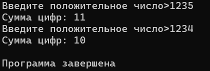
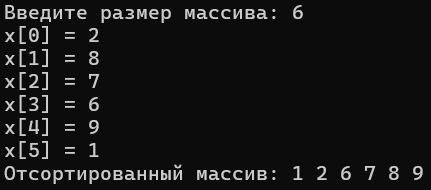
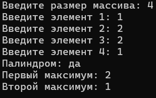

# Практическая работа № 1

## Задача 1. Организация циклов. Условные конструкции
## Постановка задачи
Вычислить, используя цикл for, координаты планеты Марс относительно Земли в зависимости от времени 𝑡. Распечатать на экране координаты для каждой итерации по 𝑡. Координаты планеты Марс для каждой итерации задаются формулами:

$𝑥 = 𝑟1 cos(𝜔1 𝑡) − 𝑟2 cos(𝜔2 𝑡)$
$𝑦 = 𝑟1 sin(𝜔1 𝑡) − 𝑟2 sin(𝜔2 𝑡)$
$𝜔1 = 2𝜋 / 𝑇1$
$𝜔2 = 2𝜋 / 𝑇2$

где: 
• 𝑟1 — радиус орбиты Марса, 
• 𝑟2 — радиус орбиты Земли, 
• 𝑇1 и 𝑇2 — периоды обращения указанных планет соответственно, 
• 𝑡 — каждый заданный момент времени внутри цикла по времени. 

Подумайте и подберите подходящие единицы измерения для времени и расстояния, чтобы получающиеся числа были небольшими при распечатке на экране.

## Математическая модель
$𝑥 = 𝑟1 cos(𝜔1 𝑡) − 𝑟2 cos(𝜔2 𝑡)$
$𝑦 = 𝑟1 sin(𝜔1 𝑡) − 𝑟2 sin(𝜔2 𝑡)$
$𝜔1 = 2𝜋 / 𝑇1$
$𝜔2 = 2𝜋 / 𝑇2$

## Код программы
```c
#include <stdio.h>
#include <windows.h>
#include <math.h>
#include <corecrt_math_defines.h>
int main()
{
    SetConsoleOutputCP(1251);
    SetConsoleCP(1251);
    const int N = 10;
    int t;
    double x, y, r1, r2, w1, w2, T1, T2;
    r1 = 227.9;
    r2 = 149.6;
    T1 = 686.98;
    T2 = 365.25;

    w1 = (2 * M_PI) / T1;
    w2 = (2 * M_PI) / T2;

    printf("Введите t\n");
    scanf_s("%d", &t);
    for (int i = 0; i < t; i++)
    {

        x = r1 * cos(w1 * i) - r2 * cos(w2 * i);


        y = r1 * sin(w1 * i) - r2 * sin(w2 * i);

        printf("\nx = %.2f млн км, y = %.2f млн км, i = %d сут", x, y, i);
    }
    return 0;
}
```
## Результат работы программы


## Задача 2. Численное интегрирование
## Постановка задачи
Вычислить определённый интеграл от заданной функции методами трапеций и Симпсона:

Функция 𝑓(𝑥) может быть выбрана самостоятельно. Результат интегрирования сравнить с вычисленным вручную и убедиться в корректности результата.

## Математическая модель


## Код программы
```c
#include <stdio.h>
#include <windows.h>
#include <math.h>
#include <corecrt_math_defines.h>
int main()
{
    SetConsoleOutputCP(1251);
    SetConsoleCP(1251);
    double a, b;
    int n;

    printf("Введите a, b и n (число разбиений): ");
    scanf_s("%lf %lf %d", &a, &b, &n);

    double I_exact = exp(b + 2.0) - exp(a + 2.0);

    // Метод трапеций
    double h = (b - a) / n;
    double sum = 0.5 * (exp(a + 2.0) + exp(b + 2.0));
    for (int i = 1; i < n; ++i) {
        double x = a + i * h;
        sum += exp(x + 2.0);
    }
    double I_trap = sum * h;

    // Метод Симпсона
    int nS = (n % 2 == 0) ? n : n + 1;
    if (nS != n) printf("(Предупреждение: для Симпсона взято чётное n = %d)\n", nS);
    double hS = (b - a) / nS;
    double S = exp(a + 2.0) + exp(b + 2.0);
    for (int i = 1; i < nS; ++i) {
        double x = a + i * hS;
        S += (i % 2 ? 4.0 : 2.0) * exp(x + 2.0);
    }
    double I_simp = S * hS / 3.0;

    printf("\nТочное значение            : %.12f\n", I_exact);
    printf("Метод трапеций (n=%d)        : %.12f \n", n, I_trap);
    printf("Метод Симпсона (n=%d)        : %.12f \n", nS, I_simp);
    return 0;
}
```
## Результат работы программы


## Задача 3. Числовые последовательности
## Постановка задачи
Организовать и распечатать последовательность чисел Падована, не превосходящих число 𝑚, введенное с клавиатуры. Числа Падована представлены следующим рядом:

$1, 1, 1, 2, 2, 3, 4, 5, 7, 9, 12, 16, 21, 28, 37, 49, 65, 86, 114, 151, 200, 265, …$

Использовать конструкцию for и простые варианты условной конструкции if else. Для этих чисел заданы формулы:

$𝑃 (0) = 𝑃 (1) = 𝑃 (2) = 1, 𝑃 (𝑛) = 𝑃 (𝑛 − 2) + 𝑃 (𝑛 − 3)$

## Математическая модель
$𝑃 (0) = 𝑃 (1) = 𝑃 (2) = 1, 𝑃 (𝑛) = 𝑃 (𝑛 − 2) + 𝑃 (𝑛 − 3)$

## Код программы
```c
#include <stdio.h>
#include <windows.h>
#include <math.h>
int main()
{
    SetConsoleOutputCP(1251);
    SetConsoleCP(1251);
    int m;
    int const N = 200;

    int x[N] = { 1,1,1 };

    printf("Введите число m>");
    scanf_s("%d", &m);

    printf("%d, %d, %d, ", x[0], x[1], x[2]);
    for (int i = 3; i < N; i++)
    {

        x[i] = x[i - 2] + x[i - 3];
        if (x[i] > m)
        {
            printf("\n элемент стал выше элемента m");
            break;
        }
        else
        {
            printf("%d, ", x[i]);
        }
    }

    return 0;
}
```
## Результат работы программы


## Задача 4. Сумма цифр положительного числа
## Постановка задачи
С клавиатуры вводится произвольное целое положительное число, считается сумма его цифр. Если сумма цифр числа больше 10, то вводится следующее число, если сумма меньше либо равна 10 — программа завершается.

1. Ввод числа: 
    • Ввести положительное целое число num с клавиатуры. 
    • Проверить, что num положительное. 
2. Вычисление суммы цифр: 
   • Инициализировать переменную sum нулём. 
    • Пока num больше нуля: 
        – Добавить к sum остаток от деления num на 10 (последняя цифра числа). 
        – Разделить num на 10 без остатка (убрать последнюю цифру). 
3. Проверка суммы цифр: 
    • Если сумма цифр sum больше 10, повторить ввод следующего числа (перейти к шагу 1). 
    • Если сумма цифр sum меньше либо равна 10, завершить программу.

## Код программы
```c
#include <stdio.h>
#include <windows.h>
#include <math.h>
int main()
{
    SetConsoleOutputCP(1251);
    SetConsoleCP(1251);
    int num;
    int sum;

    do
    {
        printf("Введите положительное число>");
        scanf_s("%d", &num);

        if (num <= 0)
        {
            printf("\nnum меньше или равен нулю\n");
            sum = 11;
            continue;
        } // if

        sum = 0;
        int n = num;
        while (n > 0)
        {
            sum += n % 10;
            n /= 10;
        } // while
        printf("Сумма цифр: %d\n", sum);

    } while (sum > 10);

    printf("\nПрограмма завершена\n");

    return 0;
}
```
## Результат работы программы



## Задача 5.1. Массивы - основы
## Постановка задачи
Для заданного числового вектора 𝑋, введённого с клавиатуры, выполнить следующие действия: 
1. Вычислить вектор 𝑌, где каждый элемент 𝑦𝑖 = 𝑥**2 𝑖 .
2. Найти среднее арифметическое элементов вектора 𝑌.
3. Определить количество элементов вектора 𝑌, превышающих найденное среднее значение

## Код программы
```c
#include <stdio.h>
#include <stdlib.h>
#include <Windows.h>
int main()
{
    SetConsoleOutputCP(1251);
    SetConsoleCP(1251);

    printf("Введите количество точек вектора: ");
    int N, sum = 0, above = 0;
    scanf_s("%d", &N);

    int *x = (int*)malloc(N * sizeof(int));
    int *Y = (int*)malloc(N * sizeof(int));

    for (int i = 0; i < N; i++) {
        printf("Введите элемент вектора %d: ", i + 1);
        scanf_s("%d", &x[i]);
        Y[i] = x[i] * x[i];
        sum += Y[i];
    }

    sum /= N;
    for (int i = 0; i < N; i++) {
        if (Y[i] > sum)
            above += 1;
    }
    
    for (int i = 0; i < N; i++) {
        printf("\n%d элемент вектора Y: %d", i+1, Y[i]);

    }
    printf("\nКол-во элементов вектора Y, превышающих среднее значение : % d\n", above);

    free(x);
    free(Y);
    return 0;
}
```
## Результат работы программы
]()


## Задача 5.2.
## Постановка задачи
Для некоторого числового массива 𝑋, введённого с клавиатуры поэлементно, изменить порядок элементов на обратный и распечатать результат на экране

## Код программы
```c
#include <stdio.h>
#include <stdlib.h>
#include <Windows.h>
int main()
{
    SetConsoleOutputCP(1251);
    SetConsoleCP(1251);

    printf("Введите количество элементов массива: ");
    int N;
    scanf_s("%d", &N);

    int* arr = (int*)malloc(N * sizeof(int));

    for (int i = 0; i < N; i++)
    {
        printf("Введите элемент(%d) массива: ", i + 1);
        scanf_s("%d", &arr[i]);
    }

    for (int i = 0; i < N / 2; i++)
    {
        int temp = arr[i];
        arr[i] = arr[N - i - 1];
        arr[N - i - 1] = temp;
    }

    printf("Массив в обратном порядке: ");
    for (int i = 0; i < N; i++)
    {
        printf("%d ", arr[i]);
    }
    printf("\n");

    free(arr);
    return 0;
}
```
## Результат работы программы


## Задача 5.3. 
## Постановка задачи
Транспонировать матрицу:


## Код программы
```c
#include <stdio.h>
#include <windows.h>

int main() {
    SetConsoleOutputCP(1251);
    SetConsoleCP(1251);

    int mx[3][3] = {
{1,2,3},
{4,5,6},
{7,8,9}
    };

    for (int i = 0; i < 3; i++)
    {
        for (int j = i + 1; j < 3; j++)
        {
            int temp = mx[i][j];
            mx[i][j] = mx[j][i];
            mx[j][i] = temp;
        }
    }
    for (int i = 0; i < 3; i++)
    {
        for (int j = 0; j < 3; j++)
        {
            printf("%d\t", mx[i][j]);
        }
        printf("\n");
    }
    return 0;
}
```
## Результат работы программы


## Задача 5.4. 
## Постановка задачи
Реализовать самостоятельно алгоритм сортировки вставками (без создания своих функций, внутри функции main).

## Код программы
```c
#include <stdio.h>
#include <windows.h>
#include <stdlib.h>

int main() {
    SetConsoleOutputCP(1251);
    SetConsoleCP(1251);

    int N;
    printf("Введите размер массива: ");
    scanf_s("%d", &N);

    int* x = (int*)malloc(N * sizeof(int));

    for (int i = 0; i < N; i++) {
        printf("x[%d] = ", i);
        scanf_s("%d", &x[i]);
    }

    for (int i = 1; i < N; i++) {
        int current = x[i];
        int j = i - 1;

        while (j >= 0 && x[j] > current) {
            x[j + 1] = x[j];
            j--;
        }
        x[j + 1] = current;
    }

    printf("Отсортированный массив: ");
    for (int i = 0; i < N; i++) {
        printf("%d ", x[i]);
    }
    printf("\n");

    free(x);
    return 0;
}
```
## Результат работы программы



## Задача 5.5. 
## Постановка задачи
Дан массив целых чисел 𝐴, введённый с клавиатуры. Требуется: 
1. Определить, является ли массив палиндромом.
   • Массив называется палиндромом, если он читается одинаково слева направо и справа налево.
3. Найти второй по величине элемент в массиве.
   • Если все элементы одинаковы, вывести соответствующее сообщение.

## Код программы
```c
#include <stdio.h>
#include <windows.h>
#include <stdlib.h>

int main()
{
    SetConsoleOutputCP(1251);
    SetConsoleCP(1251);

    int N;
    printf("Введите размер массива: ");
    scanf_s("%d", &N);

    int* arr = (int*)malloc(N * sizeof(int));

    for (int i = 0; i < N; i++)
    {
        printf("Введите элемент %d: ", i + 1);
        scanf_s("%d", &arr[i]);
    }

    int pal = 1;
    for (int i = 0; i < N / 2; i++)
    {
        if (arr[i] != arr[N - i - 1])
        {
            pal = 0;
            break;
        }
    }

    int max1 = arr[0];
    int max2 = arr[0];

    for (int i = 1; i < N; i++)
    {
        if (arr[i] > max1)
        {
            max2 = max1;
            max1 = arr[i];
        }
        else if (arr[i] > max2 && arr[i] != max1)
        {
            max2 = arr[i];
        }
    }

    int same = 1;
    for (int i = 1; i < N; i++)
    {
        if (arr[i] != arr[0])
        {
            same = 0;
            break;
        }
    }

    printf("Палиндром: %s\n", pal ? "да" : "нет");

    if (same)
        printf("Все элементы одинаковы\n");
    else if (max1 == max2)
        printf("Второго максимума нет\n");
    else
        printf("Первый максимум: %d\nВторой максимум: %d\n", max1, max2);

    free(arr);
    return 0;
}
```
## Результат работы программы
